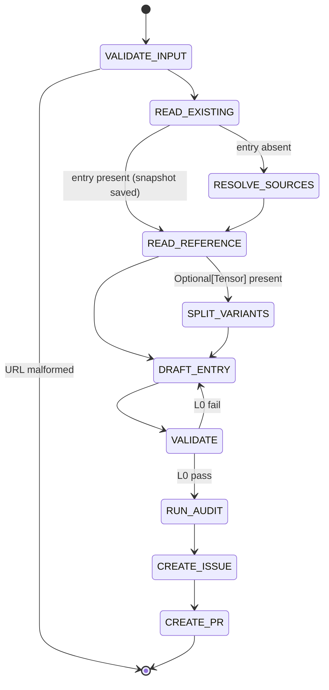

## Arguments

| Argument  | Required | Description                                                                      |
| --------- | -------- | -------------------------------------------------------------------------------- |
| `op_path` | Yes      | Op file path (e.g., `tileops/ops/conv1d.py`).                                    |
| `ref_url` | Yes      | HTTPS docs URL for the Tensor op. Must match `^https://[A-Za-z0-9./_-]+\.html$`. |

## Contract

The skill is **idempotent**: invoking it twice with the same arguments produces the same entry. Whether the entry already exists is not a flag — it's just whether `READ_EXISTING` finds anything.

### Field protection

| Field                                                            | Source                                                   | Notes                                                         |
| ---------------------------------------------------------------- | -------------------------------------------------------- | ------------------------------------------------------------- |
| `signature.{inputs,outputs,params}`                              | reference docs                                           | rewritten on every invocation                                 |
| `signature.shape_rules`                                          | reference docs                                           | rewritten                                                     |
| `signature.dtype_combos`                                         | reference docs                                           | rewritten                                                     |
| `roofline.{flops,bytes,vars}` (well-known op)                    | reference docs                                           | rewritten                                                     |
| `family`                                                         | existing entry, else RESOLVE_SOURCES                     | preserved if entry exists                                     |
| `ref_api`                                                        | existing entry, else canonical id derived from `ref_url` | preserved if entry exists                                     |
| `workloads`                                                      | existing entry, else `[]`                                | preserved verbatim                                            |
| `parity_opt_out`                                                 | existing entry (if present), else omitted                | preserved verbatim                                            |
| `source.{kernel,op,test,bench,kernel_map,bench_manifest_driven}` | existing entry, else RESOLVE_SOURCES                     | preserved verbatim                                            |
| `status`                                                         | existing entry, else `spec-only`                         | preserved verbatim — only `align-op@FLIP_STATUS` flips status |
| Adjacent comments                                                | existing entry                                           | preserved best-effort                                         |

### Termination

- **Success**: draft PR created.
- **BLOCKED**: invalid URL; inference impossible (e.g., roofline not derivable for an unknown op); ambiguous reference mapping.

### Constraints

- MUST NOT edit op / kernel / test / bench code.
- MUST NOT invent params outside the referenced API.
- MUST NOT flip `status`.
- Ambiguous reference-API mapping → STOP, ask user.

## Workflow



## Steps

### 1. VALIDATE_INPUT

Reject `ref_url` not matching the regex.

### 2. READ_EXISTING

Look up `<op_name>` in `tileops/ops_manifest.yaml` (op_name derived from `op_path` + variant suffix in Step 4). If present, snapshot in memory: `family`, `ref_api`, `workloads`, `parity_opt_out` (if present), `source.{kernel,op,test,bench,kernel_map,bench_manifest_driven}` (each present), `status`, adjacent comments. Used by DRAFT_ENTRY to preserve human-curated fields verbatim.

If absent, proceed to RESOLVE_SOURCES.

### 3. RESOLVE_SOURCES (only when entry is absent)

| Source | Path                                            |
| ------ | ----------------------------------------------- |
| kernel | search `tileops/kernels/` for matching basename |
| op     | `op_path`                                       |
| test   | `tests/ops/test_<name>.py`                      |
| bench  | `benchmarks/ops/bench_<name>.py`                |

Missing files: record absent, continue.

`family`: copy verbatim from a sibling manifest entry whose `source.kernel` matches by path / parent dir / basename. Never invent.

### 4. READ_REFERENCE

`WebFetch(ref_url)`. The page is the sole source of truth for the op's signature.

| Reference param kind | Goes to                                |
| -------------------- | -------------------------------------- |
| Tensor               | `signature.inputs` (positional order)  |
| Optional[Tensor]     | flag for SPLIT_VARIANTS                |
| non-Tensor           | `signature.params` (`type`, `default`) |
| return               | `signature.outputs`                    |

Names match the reference verbatim. Include every reference param even if the kernel ignores it. Exclude `float64` and `complex32/64/128` from dtypes (TileOPs is a GPU-only library).

If the entry was absent in READ_EXISTING, derive `ref_api` from `ref_url` (e.g., `torch.cumsum` for `https://docs.pytorch.org/.../torch.cumsum.html`). If the entry was present, `ref_api` is preserved from the snapshot.

### 5. SPLIT_VARIANTS

Skip if no `Optional[Tensor]`. Otherwise emit two entries (PascalCase per `docs/ops-design-reference.md`):

| Entry   | Key                 | Inputs                | Extra                   |
| ------- | ------------------- | --------------------- | ----------------------- |
| primary | `<Op>FwdOp`         | required Tensors only | —                       |
| variant | `<Op><Suffix>FwdOp` | required + optional   | `variant_of: <Op>FwdOp` |

`<Suffix>` = PascalCase of the optional input name. Variants share `source.kernel` and `source.op`; each gets its own `signature` / `workloads` / `roofline`. Multiple `Optional[Tensor]`: follow `docs/manifest.md` decision tree.

### 6. DRAFT_ENTRY

Auto-derivable (always rewritten from the reference):

- `signature.inputs`: ordered dict, in the reference's positional order. Per input: `dtype` = supported set joined with `|` (reference dtypes minus `float64` and complex types); `shape` only if fixed rank; `layout` only if non-default; `constraints` if applicable.
- `signature.outputs`: same shape as inputs. Use `same_as(<ref>)` where applicable.
- `signature.params`: ordered dict, each `{type, default}`.
- `signature.shape_rules`: Python expressions for derived dims and inter-tensor constraints.
- `signature.dtype_combos`: only if supported set ⊂ Cartesian product; else omit.
- `roofline`: required by L0. Well-known op (conv / pool / matmul / norm / reduction): standard formula. Fixed-rank: shape names auto-bind, use `elem_bytes`. Arbitrary-rank: `vars` mapping. Not derivable from the reference docs alone → BLOCKED `evidence_needed: roofline.flops|bytes for <op>`.

Human-curated (preserved from READ_EXISTING if entry was present, else defaulted):

- `family`: snapshot, else from RESOLVE_SOURCES.
- `ref_api`: snapshot, else derived from `ref_url`.
- `status`: snapshot, else `spec-only`.
- `workloads`: snapshot, else `[]`.
- `parity_opt_out`: snapshot if present, else omitted.
- `source`: snapshot, else paths from RESOLVE_SOURCES + `bench_manifest_driven: false`.

### 7. VALIDATE

```bash
python scripts/validate_manifest.py --check-op <op_name>
```

L0 must pass. On fail: edit entry, rerun. L1–L4 failures go to the follow-up issue, not blocking.

### 8. RUN_AUDIT

Invoke `audit-family` for the op's family → `.foundry/migrations/<family>.json`.

### 9. CREATE_ISSUE

Invoke `foundry:creating-issue`. Per `semantic_gap` op, body MUST contain:

- Kernel feasibility (cite specific kernel code; classify each missing param as `trivial` / `kernel-change` / `blocked`).
- Class-structure impact (does variant split fit the inheritance hierarchy?).
- Effort per gap item (same three-way classification).
- Family dependencies (do changes cascade?).

Body MUST also list outstanding human decisions (`workloads`, `roofline`) and resolution path (which spec-pipeline steps apply).

MUST NOT duplicate validator-reported facts. Record the issue URL.

### 10. CREATE_PR

Invoke `foundry:creating-pull-request` (draft):

| Entry was                | Title                                                  | Branch                                   |
| ------------------------ | ------------------------------------------------------ | ---------------------------------------- |
| absent at READ_EXISTING  | `[Maintain][Manifest] Add <Op> manifest entries`       | `maintain/manifest/<op-slug>-entries`    |
| present at READ_EXISTING | `[Refactor][Manifest] Re-align <Op> spec to <ref_api>` | `refactor/manifest/regenerate-<op-slug>` |

Body: entries written, fields rewritten vs. preserved, validator results, `Related: #<issue from step 9>`. Title and branch must match `.claude/conventions/types.sh`.

## Guardrails

- Non-URL `ref_url` → abort.
- Never edit op / kernel / test / bench files.
- Never invent params outside the referenced API.
- `status` is preserved when an entry exists; defaults to `spec-only` for new entries. Never set `implemented`.
- Ambiguous reference-API mapping → STOP, ask user.
- Mapping clearly wrong → STOP, explain.
