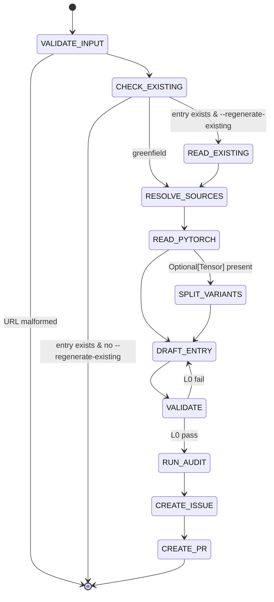

## Arguments

| Argument                | Required | Description                                                                                                   |
| ----------------------- | -------- | ------------------------------------------------------------------------------------------------------------- |
| `op_path`               | Yes      | Op file path (e.g., `tileops/ops/conv1d.py`).                                                                 |
| `torch_api`             | Yes      | URL matching `^https://(docs\.)?pytorch\.org/docs/stable/generated/.*\.html$`.                                |
| `--regenerate-existing` | No       | Overwrite an existing entry's auto-derivable fields. Without this flag the skill refuses if the entry exists. |

## Contract

### Field protection

| Field                                                            | Greenfield  | Regenerate            |
| ---------------------------------------------------------------- | ----------- | --------------------- |
| `signature.{inputs,outputs,params}`                              | written     | rewritten             |
| `signature.shape_rules`                                          | written     | rewritten             |
| `signature.dtype_combos`                                         | written     | rewritten             |
| `roofline.{flops,bytes,vars}` (well-known op)                    | written     | rewritten             |
| `family`                                                         | written     | preserved             |
| `ref_api`                                                        | written     | preserved             |
| `workloads`                                                      | `[]`        | preserved verbatim    |
| `parity_opt_out`                                                 | omitted     | preserved if present  |
| `source.{kernel,op,test,bench,kernel_map,bench_manifest_driven}` | written     | preserved verbatim    |
| `status`                                                         | `spec-only` | preserved verbatim    |
| Adjacent comments                                                | n/a         | preserved best-effort |

### Termination

- **Success**: draft PR created.
- **BLOCKED**: invalid URL; entry exists without `--regenerate-existing`; inference impossible (e.g., roofline not derivable for an unknown op).

### Constraints

- MUST NOT edit op / kernel / test / bench code.
- MUST NOT invent params outside PyTorch API.
- MUST NOT flip `status` (only `align-op@FLIP_STATUS`).
- Ambiguous PyTorch mapping → STOP, ask user.

## Workflow



## Steps

### 1. VALIDATE_INPUT

Reject `torch_api` not matching the regex.

### 2. CHECK_EXISTING

Look up `<op_name>` in `tileops/ops_manifest.yaml` (op_name derived from `op_path` + variant suffix in Step 5):

- Not present → greenfield.
- Present + `--regenerate-existing` → regenerate.
- Present + no flag → BLOCKED: `"<op_name> already in manifest; pass --regenerate-existing or use fix-manifest for single-field patches"`.

### 2b. READ_EXISTING (regenerate only)

Snapshot from the existing entry, in memory: `family`, `workloads`, `parity_opt_out` (if present), `source.{kernel,op,test,bench,kernel_map,bench_manifest_driven}` (each present), `status`, adjacent comments. Merged back at DRAFT_ENTRY.

### 3. RESOLVE_SOURCES (greenfield only)

| Source | Path                                            |
| ------ | ----------------------------------------------- |
| kernel | search `tileops/kernels/` for matching basename |
| op     | `op_path`                                       |
| test   | `tests/ops/test_<name>.py`                      |
| bench  | `benchmarks/ops/bench_<name>.py`                |

Missing files: record absent, continue.

`family`: copy verbatim from a sibling manifest entry whose `source.kernel` matches by path / parent dir / basename. Never invent.

Skipped in regenerate mode (`family` and `source.*` from READ_EXISTING).

### 4. READ_PYTORCH

`WebFetch(torch_api)`. Sole source of truth.

| PyTorch param    | Goes to                                |
| ---------------- | -------------------------------------- |
| Tensor           | `signature.inputs` (positional order)  |
| Optional[Tensor] | flag for SPLIT_VARIANTS                |
| non-Tensor       | `signature.params` (`type`, `default`) |
| return           | `signature.outputs`                    |

Names match PyTorch verbatim. Include every PyTorch param even if the kernel ignores it. Exclude `float64`, `complex32/64/128`.

### 5. SPLIT_VARIANTS

Skip if no `Optional[Tensor]`. Otherwise emit two entries (PascalCase per `docs/ops-design-reference.md`):

| Entry   | Key                 | Inputs                | Extra                   |
| ------- | ------------------- | --------------------- | ----------------------- |
| primary | `<Op>FwdOp`         | required Tensors only | —                       |
| variant | `<Op><Suffix>FwdOp` | required + optional   | `variant_of: <Op>FwdOp` |

`<Suffix>` = PascalCase of the optional input name. Variants share `source.kernel` and `source.op`; each gets its own `signature` / `workloads` / `roofline`. Multiple `Optional[Tensor]`: follow `docs/manifest.md` decision tree.

### 6. DRAFT_ENTRY

Auto-derivable (always rewritten):

- `signature.inputs`: ordered dict, PyTorch positional order. Per input: `dtype` = supported set joined with `|` (PyTorch dtypes minus `float64` and complex types); `shape` only if fixed rank; `layout` only if non-default; `constraints` if applicable.
- `signature.outputs`: same shape as inputs. Use `same_as(<ref>)` where applicable.
- `signature.params`: ordered dict, each `{type, default}`.
- `signature.shape_rules`: Python expressions for derived dims and inter-tensor constraints.
- `signature.dtype_combos`: only if supported set ⊂ Cartesian product; else omit.
- `roofline`: required by L0. Well-known op (conv / pool / matmul / norm / reduction): standard formula. Fixed-rank: shape names auto-bind, use `elem_bytes`. Arbitrary-rank: `vars` mapping. Not derivable from PyTorch docs alone → BLOCKED `evidence_needed: roofline.flops|bytes for <op>`.

Human-curated:

- Greenfield: `family` from RESOLVE_SOURCES; `status: spec-only`; `workloads: []`; `parity_opt_out` omitted; `source` from RESOLVE_SOURCES + `bench_manifest_driven: false`.
- Regenerate: all five fields preserved verbatim from READ_EXISTING.

### 7. VALIDATE

```bash
python scripts/validate_manifest.py --check-op <op_name>
```

L0 must pass. On fail: edit entry, rerun. L1–L4 failures go to the follow-up issue, not blocking.

### 8. RUN_AUDIT

Invoke `audit-family` for the op's family → `.foundry/migrations/<family>.json`.

### 9. CREATE_ISSUE

Invoke `foundry:creating-issue`. Per `semantic_gap` op, body MUST contain:

- Kernel feasibility (cite specific kernel code; classify each missing param as `trivial` / `kernel-change` / `blocked`).
- Class-structure impact (does variant split fit the inheritance hierarchy?).
- Effort per gap item (same three-way classification).
- Family dependencies (do changes cascade?).

Body MUST also list outstanding human decisions (`workloads`, `roofline`) and resolution path (which spec-pipeline steps apply).

MUST NOT duplicate validator-reported facts. Record the issue URL.

### 10. CREATE_PR

Invoke `foundry:creating-pull-request` (draft):

| Mode       | Title                                                          | Branch                                   |
| ---------- | -------------------------------------------------------------- | ---------------------------------------- |
| greenfield | `[Maintain][Manifest] Add <Op> manifest entries`               | `maintain/manifest/<op-slug>-entries`    |
| regenerate | `[Refactor][Manifest] Re-align <Op> spec to PyTorch <ref_api>` | `refactor/manifest/regenerate-<op-slug>` |

Body: entries written, fields rewritten vs. preserved (regenerate), validator results, `Related: #<issue from step 9>`. Title and branch must match `.claude/conventions/types.sh`.

## Guardrails

- Non-URL `torch_api` → abort.
- Never edit op / kernel / test / bench files.
- Never invent params outside PyTorch API.
- `status`: greenfield = `spec-only`; regenerate = preserved. Never set `implemented`.
- Regenerate preserves `workloads`, `source.*`, `parity_opt_out`, `family`, `ref_api` verbatim.
- Ambiguous PyTorch mapping → STOP, ask user.
- Mapping clearly wrong → STOP, explain.
