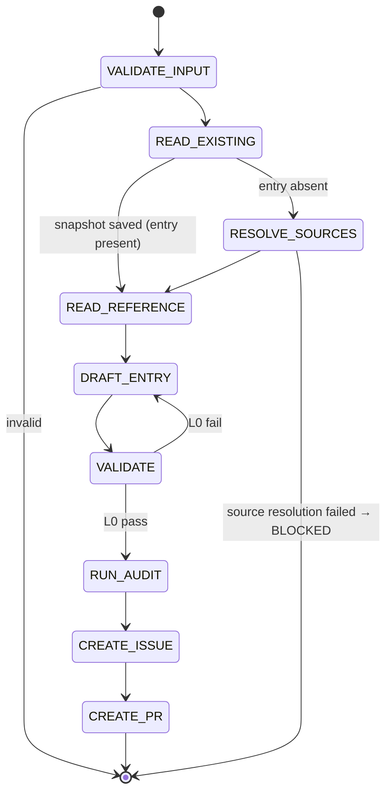

## Arguments

| Argument  | Required | Description                                                                                                                                                             |
| --------- | -------- | ----------------------------------------------------------------------------------------------------------------------------------------------------------------------- |
| `op_name` | Yes      | Manifest key (e.g., `RMSNormFwdOp`). The caller decides which key to write — skill does not derive it. For variants, the caller invokes the skill once per emitted key. |
| `ref_url` | Yes      | HTTPS docs URL for the Tensor op. Must match `^https://[A-Za-z0-9./_-]+\.html$`.                                                                                        |

## Contract

**One entry per invocation.** No splitting, no variant orchestration. If the reference declares `Optional[Tensor]` inputs and the caller wants both primary and variant entries, the caller invokes this skill twice — once with the primary `op_name`, once with the variant `op_name`.

**Idempotent.** Auto-derivable fields are rewritten from the reference; human-curated fields are preserved if the entry exists, defaulted otherwise.

| Auto-derivable (always rewritten from reference) | Human-curated (preserved if entry exists, else default)                                                                           |
| ------------------------------------------------ | --------------------------------------------------------------------------------------------------------------------------------- |
| `signature.{inputs,outputs,params}`              | `family` (default: from sibling-entry copy)                                                                                       |
| `signature.shape_rules`                          | `ref_api` (default: derived from `ref_url`'s last path segment)                                                                   |
| `signature.dtype_combos`                         | `workloads` (default: `[]`)                                                                                                       |
| `roofline.{flops,bytes,vars}` (well-known op)    | `parity_opt_out` (default: omit)                                                                                                  |
|                                                  | `source.{kernel,op,test,bench,kernel_map,bench_manifest_driven}` (default: from RESOLVE_SOURCES + `bench_manifest_driven: false`) |
|                                                  | `status` (default: `spec-only`)                                                                                                   |
|                                                  | Adjacent comments (best-effort)                                                                                                   |

**Termination**: draft PR created → success. Invalid URL / un-derivable roofline / source-path resolution failure → BLOCKED.

**Constraints**: never edit op / kernel / test / bench code. Never invent params outside the reference. Never set `status: implemented` (that is `align-op@FLIP_STATUS`).

**Caller responsibility**: `op_name` and `ref_url` must point at the same op. The skill does only minimal sanity checking (Step 1) and writes whatever the caller specifies — pairing the wrong reference with an `op_name` will silently produce a broken manifest entry.

## Workflow



## Steps

### 1. VALIDATE_INPUT

- Reject `ref_url` not matching the regex.
- Reject `op_name` not matching `^[A-Z][A-Za-z0-9]+(Fwd|Bwd)Op$`.
- **PyTorch-only sanity check** (skip otherwise). If `ref_url` host is `(docs.)?pytorch.org`: extract the last `.<word>.html` segment from the URL → `<ref_name>`; compute `<expected> = snake_case(op_name without Fwd/Bwd Op suffix)`. Require `<expected> == <ref_name>` OR `<expected>.startswith(<ref_name> + "_")` (the second branch covers variants whose op_name extends the primary's). Mismatch → BLOCKED with both names. For non-PyTorch URLs, no automatic check — caller is responsible.

### 2. READ_EXISTING

Look up `op_name` directly in `tileops/ops_manifest.yaml`.

- **Present** → snapshot the human-curated fields listed in the Contract table. Source paths are read directly from the existing `source.*` (no further resolution needed). Proceed to READ_REFERENCE.
- **Absent** → greenfield. Proceed to RESOLVE_SOURCES.

### 3. RESOLVE_SOURCES (greenfield only)

Derive source paths from `op_name`. The op file MUST exist on disk; if it doesn't, the caller is expected to scaffold it first.

1. Convert `op_name` to snake_case `<name>`. Strip the trailing `FwdOp` / `BwdOp` first; PascalCase → snake_case via standard rules; uppercase abbreviations stay one cluster (e.g., `RMSNormFwdOp` → `rms_norm`, `Conv1dBiasFwdOp` → `conv1d_bias`).
1. Search `tileops/ops/**/<name>.py`. Exactly one match → `source.op` is that path. Zero matches → BLOCKED `"op file <name>.py not found under tileops/ops/; scaffold the op file first or rename per convention"`. Multiple matches → BLOCKED with the list.
1. From `source.op`'s parent dir (e.g., `tileops/ops/norm/`), search `tileops/kernels/<same-leaf-dir-or-file>/<name>.py` for `source.kernel`. Same one-match rule. Zero matches → record absent (kernel not yet implemented), continue.
1. `source.test = tests/ops/test_<name>.py`; `source.bench = benchmarks/ops/bench_<name>.py`. Missing files: record absent, continue.
1. `family`: copy verbatim from a sibling manifest entry whose `source.kernel` matches by path / parent dir / basename. Never invent.

### 4. READ_REFERENCE

`WebFetch(ref_url)`. Sole source of truth.

| Reference param kind | Goes to                                |
| -------------------- | -------------------------------------- |
| Tensor               | `signature.inputs` (positional order)  |
| non-Tensor           | `signature.params` (`type`, `default`) |
| return               | `signature.outputs`                    |

Names match the reference verbatim. Include every reference param even if the kernel ignores it. Exclude `float64` and `complex32/64/128` from dtypes (TileOPs is GPU-only).

If the reference page documents `Optional[Tensor]` inputs, the caller has decided which slice corresponds to `op_name` (primary = required Tensors only, variant = primary + chosen optional). The skill emits inputs accordingly and trusts `op_name` is what the caller wants.

### 5. DRAFT_ENTRY

Per the Contract table:

- Snapshot present (re-align) → preserve all human-curated fields verbatim from snapshot.
- Snapshot absent (greenfield) → human-curated fields take Contract defaults.

Auto-derivable fields are always rewritten from the reference:

- `signature.inputs`: ordered dict in the reference's positional order. Per input: `dtype` = supported set joined with `|` (reference dtypes minus `float64` and complex types); `shape` only if fixed rank; `layout` only if non-default; `constraints` if applicable.
- `signature.outputs`: same shape as inputs. Use `same_as(<ref>)` where applicable.
- `signature.params`: ordered dict, each `{type, default}`.
- `signature.shape_rules`: Python expressions for derived dims and inter-tensor constraints.
- `signature.dtype_combos`: only if supported set ⊂ Cartesian product; else omit.
- `roofline`: required by L0. Well-known op (conv / pool / matmul / norm / reduction): standard formula. Fixed-rank: shape names auto-bind, use `elem_bytes`. Arbitrary-rank: `vars` mapping. Not derivable → BLOCKED `evidence_needed: roofline.flops|bytes for <op_name>`.

### 6. VALIDATE

```bash
python scripts/validate_manifest.py --check-op <op_name>
```

L0 must pass. On fail: edit entry, rerun. L1–L4 failures go to the follow-up issue, not blocking.

### 7. RUN_AUDIT

Invoke `audit-family` for the op's family → `.foundry/migrations/<family>.json`.

### 8. CREATE_ISSUE

Invoke `foundry:creating-issue`. Per `semantic_gap` op the body MUST contain: kernel feasibility (cite kernel code; classify each missing param `trivial` / `kernel-change` / `blocked`); class-structure impact; effort per gap item; family dependencies. MUST also list outstanding human decisions (`workloads`, `roofline`) and resolution path. MUST NOT duplicate validator-reported facts. Record the issue URL.

### 9. CREATE_PR

Invoke `foundry:creating-pull-request` (draft):

| Snapshot at READ_EXISTING | Title                                                       | Branch                                   |
| ------------------------- | ----------------------------------------------------------- | ---------------------------------------- |
| absent                    | `[Maintain][Manifest] Add <op_name>`                        | `maintain/manifest/<op-slug>`            |
| present                   | `[Refactor][Manifest] Re-align <op_name> spec to <ref_api>` | `refactor/manifest/regenerate-<op-slug>` |

Body: which fields were rewritten vs. preserved, validator results, `Related: #<issue from step 8>`. Title and branch must match `.claude/conventions/types.sh`.
