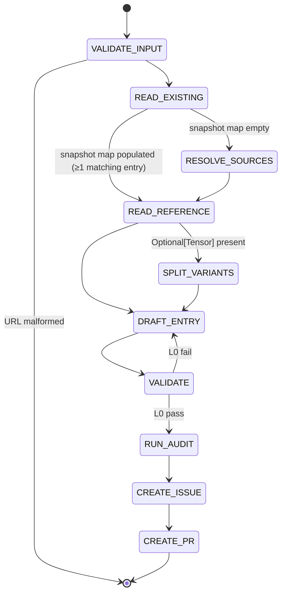

## Arguments

| Argument  | Required | Description                                                                      |
| --------- | -------- | -------------------------------------------------------------------------------- |
| `op_path` | Yes      | Op file path (e.g., `tileops/ops/conv1d.py`).                                    |
| `ref_url` | Yes      | HTTPS docs URL for the Tensor op. Must match `^https://[A-Za-z0-9./_-]+\.html$`. |

## Contract

**Idempotent.** Auto-derivable fields are rewritten from the reference; human-curated fields are preserved if an entry exists, defaulted otherwise.

| Auto-derivable (always rewritten from reference) | Human-curated (preserved if entry exists, else default)                                                                           |
| ------------------------------------------------ | --------------------------------------------------------------------------------------------------------------------------------- |
| `signature.{inputs,outputs,params}`              | `family` (default: from RESOLVE_SOURCES)                                                                                          |
| `signature.shape_rules`                          | `ref_api` (default: derived from `ref_url`)                                                                                       |
| `signature.dtype_combos`                         | `workloads` (default: `[]`)                                                                                                       |
| `roofline.{flops,bytes,vars}` (well-known op)    | `parity_opt_out` (default: omit)                                                                                                  |
|                                                  | `source.{kernel,op,test,bench,kernel_map,bench_manifest_driven}` (default: from RESOLVE_SOURCES + `bench_manifest_driven: false`) |
|                                                  | `status` (default: `spec-only`)                                                                                                   |
|                                                  | Adjacent comments (best-effort)                                                                                                   |

**Termination**: draft PR created → success. Invalid URL / un-derivable roofline / ambiguous reference → BLOCKED.

**Constraints**: never edit op / kernel / test / bench code. Never invent params outside the reference. Never set `status: implemented` (that is `align-op@FLIP_STATUS`).

## Workflow



## Steps

### 1. VALIDATE_INPUT

Reject `ref_url` not matching the regex.

### 2. READ_EXISTING

Scan `tileops/ops_manifest.yaml` for **every** entry whose `source.op == op_path`. Variants share `source.op` with their primary, so this captures the primary AND any variant entry in one pass without depending on Step 5's not-yet-known suffix.

For each match, snapshot the human-curated fields listed in the Contract table. Build a map `entry_key → snapshot`. DRAFT_ENTRY (Step 6) consults this map per emitted key — found → preserve verbatim; not found → default.

If the map is empty, the op is greenfield. Proceed to RESOLVE_SOURCES.

### 3. RESOLVE_SOURCES (greenfield only — map empty)

| Source | Path                                            |
| ------ | ----------------------------------------------- |
| kernel | search `tileops/kernels/` for matching basename |
| op     | `op_path`                                       |
| test   | `tests/ops/test_<name>.py`                      |
| bench  | `benchmarks/ops/bench_<name>.py`                |

Missing files: record absent, continue. `family`: copy verbatim from a sibling manifest entry whose `source.kernel` matches by path / parent dir / basename. Never invent.

### 4. READ_REFERENCE

`WebFetch(ref_url)`. Sole source of truth.

| Reference param kind | Goes to                                |
| -------------------- | -------------------------------------- |
| Tensor               | `signature.inputs` (positional order)  |
| Optional[Tensor]     | flag for SPLIT_VARIANTS                |
| non-Tensor           | `signature.params` (`type`, `default`) |
| return               | `signature.outputs`                    |

Names match the reference verbatim. Include every reference param even if the kernel ignores it. Exclude `float64` and `complex32/64/128` (TileOPs is GPU-only).

### 5. SPLIT_VARIANTS

Skip if no `Optional[Tensor]`. Otherwise emit two entries (PascalCase per `docs/ops-design-reference.md`):

| Entry   | Key                 | Inputs                | Extra                   |
| ------- | ------------------- | --------------------- | ----------------------- |
| primary | `<Op>FwdOp`         | required Tensors only | —                       |
| variant | `<Op><Suffix>FwdOp` | required + optional   | `variant_of: <Op>FwdOp` |

`<Suffix>` = PascalCase of the optional input name. Variants share `source.kernel` and `source.op`; each gets its own `signature` / `workloads` / `roofline`. Multiple `Optional[Tensor]`: follow `docs/manifest.md` decision tree.

### 6. DRAFT_ENTRY

For each entry emitted in Step 5 (primary, plus variant if any), look up the entry's key in the READ_EXISTING snapshot map. Found → use snapshot for the human-curated fields. Not found → use defaults from the Contract table (a partial-greenfield case is possible: e.g., primary already exists but variant is new).

Auto-derivable details:

- `signature.inputs`: ordered dict in the reference's positional order. Per input: `dtype` = supported set joined with `|` (reference dtypes minus `float64` and complex types); `shape` only if fixed rank; `layout` only if non-default; `constraints` if applicable.
- `signature.outputs`: same shape as inputs. Use `same_as(<ref>)` where applicable.
- `signature.params`: ordered dict, each `{type, default}`.
- `signature.shape_rules`: Python expressions for derived dims and inter-tensor constraints.
- `signature.dtype_combos`: only if supported set ⊂ Cartesian product; else omit.
- `roofline`: required by L0. Well-known op (conv / pool / matmul / norm / reduction): standard formula. Fixed-rank: shape names auto-bind, use `elem_bytes`. Arbitrary-rank: `vars` mapping. Not derivable → BLOCKED `evidence_needed: roofline.flops|bytes for <op>`.

### 7. VALIDATE

```bash
python scripts/validate_manifest.py --check-op <op_name>
```

L0 must pass. On fail: edit entry, rerun. L1–L4 failures go to the follow-up issue, not blocking.

### 8. RUN_AUDIT

Invoke `audit-family` for the op's family → `.foundry/migrations/<family>.json`.

### 9. CREATE_ISSUE

Invoke `foundry:creating-issue`. Per `semantic_gap` op the body MUST contain: kernel feasibility (cite kernel code; classify each missing param `trivial` / `kernel-change` / `blocked`); class-structure impact; effort per gap item; family dependencies. MUST also list outstanding human decisions (`workloads`, `roofline`) and resolution path. MUST NOT duplicate validator-reported facts. Record the issue URL.

### 10. CREATE_PR

Invoke `foundry:creating-pull-request` (draft):

| Snapshot map | Title                                                  | Branch                                   |
| ------------ | ------------------------------------------------------ | ---------------------------------------- |
| empty        | `[Maintain][Manifest] Add <Op> manifest entries`       | `maintain/manifest/<op-slug>-entries`    |
| populated    | `[Refactor][Manifest] Re-align <Op> spec to <ref_api>` | `refactor/manifest/regenerate-<op-slug>` |

Body: entries written, fields rewritten vs. preserved, validator results, `Related: #<issue from step 9>`. Title and branch must match `.claude/conventions/types.sh`.
