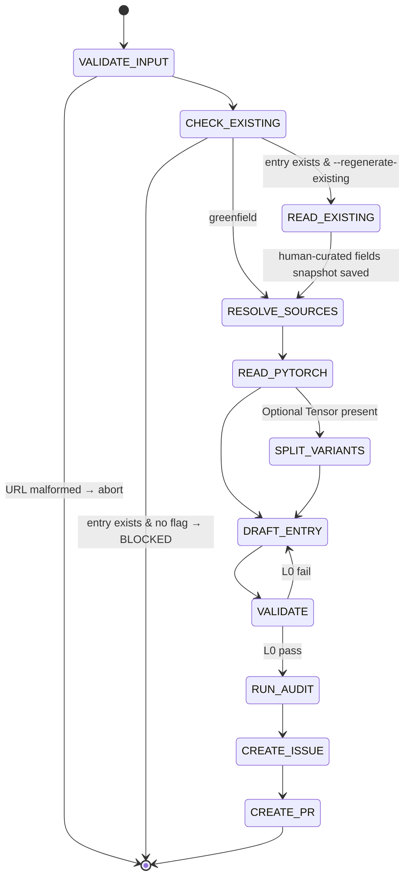

## Arguments

| Argument                | Required | Description                                                                                                                                                        |
| ----------------------- | -------- | ------------------------------------------------------------------------------------------------------------------------------------------------------------------ |
| `op_path`               | Yes      | Op file path relative to project root (e.g., `tileops/ops/conv1d.py`).                                                                                             |
| `torch_api`             | Yes      | PyTorch docs URL matching `^https://(docs\.)?pytorch\.org/docs/stable/generated/.*\.html$`.                                                                        |
| `--regenerate-existing` | No       | Rewrite the auto-derivable fields of an existing entry instead of refusing. Without this flag, the skill refuses to overwrite an existing entry (greenfield-only). |

## Contract

Two modes — greenfield (default) and regenerate (`--regenerate-existing`).

### Field protection (both modes)

| Field                                                                 | Greenfield  | Regenerate                                                        |
| --------------------------------------------------------------------- | ----------- | ----------------------------------------------------------------- |
| `signature.{inputs, outputs, params}`                                 | written     | **rewritten from PyTorch**                                        |
| `signature.shape_rules`                                               | written     | **rewritten from PyTorch**                                        |
| `signature.dtype_combos`                                              | written     | **rewritten from PyTorch**                                        |
| `roofline.{flops, bytes, vars}` (well-known op)                       | written     | **rewritten**                                                     |
| `family`                                                              | written     | preserved                                                         |
| `ref_api`                                                             | written     | preserved (already aligns with `torch_api`; rewriting is no-op)   |
| `workloads`                                                           | `[]`        | **preserved verbatim** (human decision)                           |
| `parity_opt_out`                                                      | omitted     | **preserved verbatim** if present                                 |
| `source.{kernel, op, test, bench, kernel_map, bench_manifest_driven}` | written     | **preserved verbatim**                                            |
| `status`                                                              | `spec-only` | **preserved verbatim** (only `align-op@FLIP_STATUS` flips status) |
| Adjacent comments                                                     | n/a         | preserved when feasible                                           |

### Termination

- **Success**: draft PR created.
- **BLOCKED**: input invalid, inference impossible, or `--regenerate-existing` not passed when entry already exists.

### Other constraints

- **MUST NOT** edit op / kernel / test / bench code.
- **MUST NOT** invent params outside PyTorch API.
- **MUST NOT** flip `status` (only `align-op@FLIP_STATUS`).
- Ambiguous PyTorch mapping → STOP, ask user.

## Workflow



## Steps

### 1. VALIDATE_INPUT

`torch_api` must match `^https://(docs\.)?pytorch\.org/docs/stable/generated/.*\.html$`. Else abort.

### 2. CHECK_EXISTING

Look up `<op_name>` in `tileops/ops_manifest.yaml` (op_name derived from `op_path` + variant suffix in Step 4):

- Entry **does not exist** → greenfield mode. Proceed to RESOLVE_SOURCES.
- Entry **exists** + `--regenerate-existing` flag passed → regenerate mode. Proceed to READ_EXISTING.
- Entry **exists** + no flag → BLOCKED: `"<op_name> already in manifest; pass --regenerate-existing to rewrite auto-derivable fields, or fix-manifest for single-field patches"`.

### 2b. READ_EXISTING (regenerate mode only)

Snapshot the human-curated fields from the existing entry into memory:

- `family`
- `workloads` (verbatim, even if `[]`)
- `parity_opt_out` (if present)
- `source.{kernel, op, test, bench, kernel_map, bench_manifest_driven}` (each that is present)
- `status`
- Comments adjacent to the entry (best-effort)

These will be merged back in DRAFT_ENTRY without modification.

### 3. RESOLVE_SOURCES

Greenfield only — locate from `op_path`:

| Source | Path                                                  |
| ------ | ----------------------------------------------------- |
| kernel | search under `tileops/kernels/` for matching basename |
| op     | `op_path`                                             |
| test   | `tests/ops/test_<name>.py`                            |
| bench  | `benchmarks/ops/bench_<name>.py`                      |

Missing files: record absent, continue.

**Set `family` by copying from a sibling manifest entry** (matching `source.kernel` path / parent dir / basename). Never invent a new `family` value.

In regenerate mode this step is skipped — `family` and `source.*` come from READ_EXISTING.

### 4. READ_PYTORCH

`WebFetch` `torch_api`. The page is the **sole source of truth**:

| PyTorch param kind | Goes to                                     |
| ------------------ | ------------------------------------------- |
| Tensor             | `signature.inputs` (positional order)       |
| Optional[Tensor]   | flag for SPLIT_VARIANTS                     |
| non-Tensor         | `signature.params` (with `type`, `default`) |
| return             | `signature.outputs`                         |

Names match PyTorch exactly. Include every PyTorch param even if the kernel ignores it. Exclude `float64` and `complex32/64/128` from dtypes.

### 5. SPLIT_VARIANTS

Skip if no `Optional[Tensor]` input. Otherwise emit two entries (PascalCase per `docs/ops-design-reference.md`):

| Entry   | Key                 | Inputs                | Extra                   |
| ------- | ------------------- | --------------------- | ----------------------- |
| primary | `<Op>FwdOp`         | required Tensors only | —                       |
| variant | `<Op><Suffix>FwdOp` | required + optional   | `variant_of: <Op>FwdOp` |

`<Suffix>` = PascalCase of the optional input name (e.g., `Bias`). Variants share `source.kernel` and `source.op`. Each gets its own `signature`, `workloads`, `roofline`.

Multiple `Optional[Tensor]`: follow decision tree in `docs/manifest.md`.

### 6. DRAFT_ENTRY

Per entry, assemble fields from the protection table in the contract:

**Auto-derivable (always rewritten):**

- `signature.inputs`: ordered dict, PyTorch positional order. Per input: `dtype` is the supported set (PyTorch dtypes minus `float64` and `complex32/64/128`) joined with `|`; `shape` only if fixed rank; `layout` only if non-default; `constraints` if applicable.
- `signature.outputs`: same shape as inputs. Use `same_as(<ref>)` where applicable.
- `signature.params`: ordered dict, each `{type, default}`.
- `signature.shape_rules`: Python expressions for derived dims and inter-tensor constraints.
- `signature.dtype_combos`: only if supported set ⊂ Cartesian product; else omit.
- `roofline`: required by L0 (cannot be `null` or empty). Well-known ops (conv / pool / matmul / norm / reduction): emit standard formulas. Fixed-rank: shape names auto-bind, use `elem_bytes`. Arbitrary-rank: use `vars` mapping. If not derivable from PyTorch docs alone → BLOCKED `evidence_needed: roofline.flops|bytes for <op>`. **Never guess.**

**Human-curated (greenfield default OR regenerate preserved):**

- `family`: greenfield = from RESOLVE_SOURCES; regenerate = from READ_EXISTING.
- `status`: greenfield = `spec-only`; regenerate = preserved from READ_EXISTING. **Never** set `implemented`.
- `workloads`: greenfield = `[]`; regenerate = preserved from READ_EXISTING.
- `parity_opt_out`: greenfield = omitted; regenerate = preserved if present.
- `source`: greenfield = paths from RESOLVE_SOURCES + `bench_manifest_driven: false`; regenerate = preserved from READ_EXISTING (including `kernel_map`).

### 7. VALIDATE

```bash
python scripts/validate_manifest.py --check-op <op_name>
```

L0 must pass. On fail: edit entry, rerun. Higher-level (L1–L4) failures are surfaced as gap items in the follow-up issue, not blocking.

### 8. RUN_AUDIT

Invoke `audit-family` for the op's family → writes `.foundry/migrations/<family>.json`.

### 9. CREATE_ISSUE

Invoke `foundry:creating-issue`. Issue body MUST contain, per `semantic_gap` op:

- **Kernel feasibility**: cite specific kernel code; classify each missing param as `trivial` / `kernel-change` / `blocked`.
- **Class structure impact**: does variant split fit the inheritance hierarchy?
- **Effort per gap item**: same three-way classification.
- **Family dependencies**: do changes cascade?

Issue body MUST also list:

- Outstanding human decisions: `workloads`, `roofline`.
- Resolution path: which spec-pipeline steps apply.

MUST NOT duplicate validator-reported facts (missing params, wrong names) — the reader has the validator.

Record the issue URL.

### 10. CREATE_PR

Invoke `foundry:creating-pull-request` (draft):

| Mode       | Title                                                          | Branch                                   |
| ---------- | -------------------------------------------------------------- | ---------------------------------------- |
| greenfield | `[Maintain][Manifest] Add <Op> manifest entries`               | `maintain/manifest/<op-slug>-entries`    |
| regenerate | `[Refactor][Manifest] Re-align <Op> spec to PyTorch <ref_api>` | `refactor/manifest/regenerate-<op-slug>` |

Body lists: entries written, fields rewritten vs. preserved (regenerate mode), validator results, `Related: #<issue from step 9>`.

Title and branch must match `.claude/conventions/types.sh`.

## Guardrails

- Non-URL `torch_api` → abort.
- Never edit op / kernel / test / bench files.
- Never invent params outside PyTorch API.
- `status` is always preserved (regenerate) or `spec-only` (greenfield); never set `implemented`.
- Regenerate mode preserves `workloads`, `source.*`, `parity_opt_out`, `family` verbatim.
- Ambiguous PyTorch mapping → STOP, ask user.
- Mapping clearly wrong → STOP, explain.
