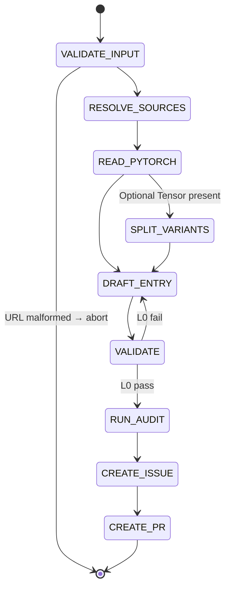

## Arguments

| Argument    | Required | Description                                                                       |
| ----------- | -------- | --------------------------------------------------------------------------------- |
| `op_path`   | Yes      | Op file path relative to project root (e.g., `tileops/ops/conv1d.py`)             |
| `torch_api` | Yes      | PyTorch docs URL matching `https://docs.pytorch.org/docs/stable/generated/*.html` |

## Contract

- **Output**: new entry in `ops_manifest.yaml` + follow-up issue + draft PR.
- **MAY write**: `ops_manifest.yaml` (new entry only).
- **MUST NOT write**: existing manifest entries, op / kernel / test / bench code.
- **Termination**: draft PR created. BLOCKED on input or inference failure.

## Workflow



## Steps

### 1. VALIDATE_INPUT

`torch_api` must match `https://docs.pytorch.org/docs/stable/generated/*.html`. Else abort.

### 2. RESOLVE_SOURCES

Locate from `op_path`:

| Source | Path                                                  |
| ------ | ----------------------------------------------------- |
| kernel | search under `tileops/kernels/` for matching basename |
| op     | `op_path`                                             |
| test   | `tests/ops/test_<name>.py`                            |
| bench  | `benchmarks/ops/bench_<name>.py`                      |

Set `family` = kernel parent dir name. Missing files: record absent, continue.

### 3. READ_PYTORCH

`WebFetch` `torch_api`. The page is the **sole source of truth**. Extract:

| PyTorch param kind | Goes to                                     |
| ------------------ | ------------------------------------------- |
| Tensor             | `signature.inputs` (positional order)       |
| Optional[Tensor]   | flag for SPLIT_VARIANTS                     |
| non-Tensor         | `signature.params` (with `type`, `default`) |
| return             | `signature.outputs`                         |

Names must match PyTorch exactly. Include every PyTorch param even if the kernel ignores it. Exclude `float64`, `complex32/64/128` from dtypes.

### 4. SPLIT_VARIANTS

Skip if no `Optional[Tensor]` input. Otherwise emit two entries (manifest keys are PascalCase per `docs/ops-design-reference.md`):

| Entry   | Key                 | Inputs                | Extra                   |
| ------- | ------------------- | --------------------- | ----------------------- |
| primary | `<Op>FwdOp`         | required Tensors only | —                       |
| variant | `<Op><Suffix>FwdOp` | required + optional   | `variant_of: <Op>FwdOp` |

`<Suffix>` = PascalCase of the optional input name (e.g., `Bias`). Variants share `source.kernel` and `source.op`. Each gets its own `signature`, `workloads`, `roofline`.

Multiple `Optional[Tensor]`: follow decision tree in `docs/manifest.md`.

### 5. DRAFT_ENTRY

Per entry, fill these fields:

- `family`: from RESOLVE_SOURCES.
- `status`: `spec-only`. Flip to `implemented` only if VALIDATE passes L0–L4.
- `signature.inputs`: ordered dict, PyTorch positional order. Per input: `dtype` is the supported set joined with `|`; `shape` only if fixed rank; `layout` only if non-default; `constraints` if applicable.
- `signature.outputs`: same shape as inputs. Use `same_as(<ref>)` where applicable.
- `signature.params`: ordered dict, each `{type, default}`.
- `signature.shape_rules`: Python expressions for derived dims and inter-tensor constraints.
- `signature.dtype_combos`: only if supported set ⊂ Cartesian product; else omit.
- `workloads`: `null` (human decision).
- `roofline`: fill for well-known ops (conv / pool / matmul) with standard formulas; `null` otherwise. **Never guess.** Fixed-rank: shape names auto-bind, use `elem_bytes`. Arbitrary-rank: use `vars` mapping.
- `source`: paths from RESOLVE_SOURCES; `bench_manifest_driven: false`.

### 6. VALIDATE

```bash
python scripts/validate_manifest.py --check-op <op_name>
```

L0 must pass. On fail: edit entry, rerun. Do not advance until L0 passes.

After L0 passes, run again without `--level`. If L1–L4 all pass, set `status: implemented`.

### 7. RUN_AUDIT

Invoke `spec-audit` for the op's family → writes `.foundry/migrations/<family>.json`.

### 8. CREATE_ISSUE

Invoke `foundry:creating-issue`. Issue body MUST contain, per `semantic_gap` op:

- **Kernel feasibility**: cite specific kernel code; classify each missing param as `trivial` / `kernel-change` / `blocked`.
- **Class structure impact**: does variant split fit the inheritance hierarchy?
- **Effort per gap item**: same three-way classification.
- **Family dependencies**: do changes cascade?

Issue body MUST also list:

- Outstanding human decisions: `workloads`, `roofline`.
- Resolution path: which spec-pipeline steps apply.

MUST NOT duplicate validator-reported facts (missing params, wrong names) — the reader has the validator.

Record the issue URL.

### 9. CREATE_PR

Invoke `foundry:creating-pull-request` (draft).

| Element | Value                                                                                                             |
| ------- | ----------------------------------------------------------------------------------------------------------------- |
| title   | `[Maintain][Manifest] Add <Op> manifest entries`                                                                  |
| branch  | `maintain/manifest/<op-slug>-entries` (slug: kebab-case of `<Op>`)                                                |
| body    | manifest entries added (name, family, status); validator results (levels passed); `Related: #<issue from step 8>` |

Title and branch must match `.claude/conventions/types.sh`.

## Guardrails

- Non-URL `torch_api` → abort.
- Never edit op / kernel / test / bench files.
- Never invent params outside PyTorch API.
- `status: implemented` only when L0–L4 all pass. Otherwise `spec-only`.
- Ambiguous PyTorch mapping → STOP, ask user.
- Mapping clearly wrong → STOP, explain.
