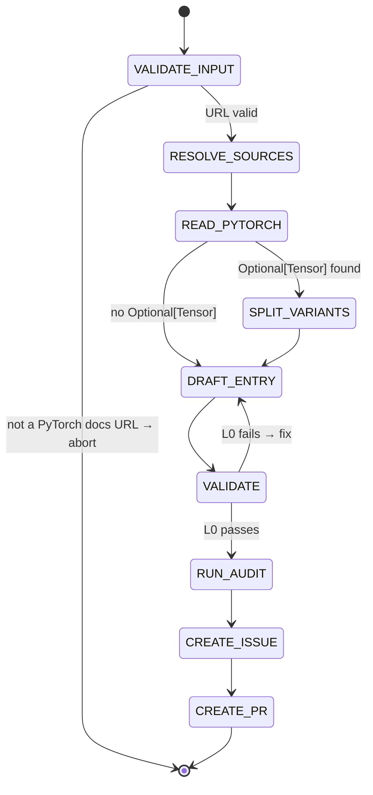

## Arguments

| Argument    | Required | Description                                                                                               |
| ----------- | -------- | --------------------------------------------------------------------------------------------------------- |
| `op_path`   | Yes      | Op file path relative to project root (e.g., `tileops/ops/conv1d.py`)                                     |
| `torch_api` | Yes      | PyTorch docs URL (e.g., `https://docs.pytorch.org/docs/stable/generated/torch.nn.functional.conv1d.html`) |

## Contract

- **Input**: op file path + PyTorch docs URL
- **Output**: `ops_manifest.yaml` entry + gap report + draft PR
- **Termination**: draft PR created via `foundry:creating-pull-request`
- **Boundary**: writes manifest only. Never modify op/kernel/test/bench code.

## Input Validation

`torch_api` must be a URL matching `https://docs.pytorch.org/docs/stable/generated/*.html`. If not, **terminate immediately** with an error message. Do not attempt to guess or resolve non-URL inputs.

## Workflow



## Steps

### 1. VALIDATE INPUT

Check `torch_api` matches `https://docs.pytorch.org/docs/stable/generated/*.html`. Abort if not.

### 2. RESOLVE SOURCES

From `op_path`, locate four source files:

| Source | Pattern                                       |
| ------ | --------------------------------------------- |
| kernel | `tileops/kernels/` — search for matching file |
| op     | `op_path` itself                              |
| test   | `tests/ops/test_<name>.py`                    |
| bench  | `benchmarks/ops/bench_<name>.py`              |

Infer `family` from kernel subdirectory (e.g., `tileops/kernels/conv/` → `conv`).

Missing files: record as absent, continue. `spec-only` tolerates missing sources.

### 3. READ PYTORCH SIGNATURE

Fetch `torch_api` URL via WebFetch. The page is the **sole source of truth** for the manifest entry. Extract:

- **Tensor params** → `inputs` (positional order preserved)
- **Optional[Tensor] params** → flag for variant split
- **Non-Tensor params** → `params` (with types and defaults)
- **Return** → `outputs`

Rules:

- Names match PyTorch exactly (R15)
- Include all PyTorch params even if kernel ignores them (R2)
- Exclude float64 and complex types (complex32, complex64, complex128) from dtypes — TileOPs GPU kernel library

### 4. SPLIT VARIANTS (R16)

Skip if no Optional[Tensor] inputs.

| Entry   | Name                | Contains                                            |
| ------- | ------------------- | --------------------------------------------------- |
| Primary | `<op>_fwd`          | Required tensors only                               |
| Variant | `<op>_fwd_<suffix>` | Required + optional tensors, `variant_of: <op>_fwd` |

`<suffix>` = descriptive name of the optional input (e.g., `bias`).

Variants share `source.kernel` and `source.op` (R18). Each gets own `signature`, `workloads`, `roofline`.

Multiple Optional\[Tensor\]: follow decision tree in `docs/manifest.md`.

### 5. DRAFT ENTRY

Generate per entry:

**`family`**: from step 2.

**`status`**: default `spec-only`. Set to `implemented` only if `--check-op` passes L0–L4 in step 6.

**`signature.inputs`**: ordered dict, PyTorch positional order.

- `dtype`: PyTorch-supported dtypes minus float64, `|`-separated
- `shape`: explicit named dimensions if fixed rank (R6); omit if arbitrary rank (R7)
- `layout`: only if non-default (R19)
- `constraints`: if applicable (R10)

**`signature.outputs`**: same format. Use `same_as(ref)` where applicable (R8).

**`signature.params`**: ordered dict with `type` and `default`.

**`signature.shape_rules`**: Python expressions (R11) for:

- Derived dimensions (e.g., `L_out` from stride/padding/kernel_size)
- Inter-tensor constraints (e.g., `C_in_g == C_in // groups`)

**`signature.dtype_combos`**: only if supported set ⊂ Cartesian product (R4). Otherwise omit.

**`workloads`**: `null`. Human decision.

**`roofline`**: fill for well-known ops (conv, pool, matmul) with standard FLOPs/bytes formulas. `null` if uncertain. Do not guess.

- Fixed-rank: shape names auto-bind as variables (R14). Use `elem_bytes` for primary input byte size.
- Arbitrary-rank: use `vars` mapping.

**`source`**: paths from step 2. `bench_manifest_driven: false`.

### 6. VALIDATE

```bash
python scripts/validate_manifest.py --check-op <op_name>
```

L0 must pass. If it fails: fix the entry, re-run. Do not proceed until L0 passes.

If L0 passes, run full validation (`--check-op` without `--level`). If L1–L4 all pass: set `status: implemented`.

### 7. RUN SPEC-AUDIT

Invoke `spec-audit` for the op's family → `.foundry/migrations/<family>.json`.

### 8. CREATE FOLLOW-UP ISSUE

Invoke `foundry:creating-issue` to create a remediation issue.

The issue must go beyond surface-level diffs (validator already reports those). Focus on **semantic analysis** that a human or spec-pipeline agent needs to make decisions:

**Required analysis per `semantic_gap` op:**

- **Kernel feasibility**: read the kernel code. Can it support the missing params (e.g., `dilation`, `groups`) with config changes, or does it need architectural rework? Cite specific kernel code that proves the assessment.
- **Class structure impact**: does the variant split (R16) fit the current inheritance hierarchy? Does a base class need to be introduced or modified?
- **Effort classification per gap item**: `trivial` (rename, add passthrough default) vs `kernel-change` (new TileLang program logic) vs `blocked` (fundamental architecture mismatch)
- **Dependencies**: do changes to this op cascade to other ops in the same family?

**Required sections in issue body:**

- Semantic gap analysis (above)
- Outstanding human decisions: `workloads`, `roofline` review
- Resolution path: which spec-pipeline steps apply (`spec-test` → `spec-implement` → `spec-bench`)

Do not list information that `validate_manifest.py` already reports (missing params, wrong names). The issue reader has access to the validator.

Record the issue URL for step 9.

### 9. CREATE DRAFT PR

Invoke `foundry:creating-pull-request` to create a **draft** PR.

**Title format**: must pass `validate-pr-title` CI. Use types from `.claude/conventions/types.sh`:

- Pattern: `[Type][Scope] description` or `[Type] description`
- Valid types: `Bench|BugFix|Chore|CI|Doc|Enhancement|Feat|Fix|Maintain|Perf|Refactor|Style|Test`
- For manifest additions use: `[Maintain][Manifest] Add <op> manifest entries`

**Branch naming**: must match `.claude/conventions/types.sh`:

- Pattern: `<prefix>/<scope>/<slug>`
- For manifest additions use: `maintain/manifest/<op>-entries`

**PR body** must:

- List manifest entries added (op names, family, status)
- List validation results (which levels passed/failed)
- **Link the follow-up issue** from step 8 (e.g., `Related: #N`)

## Guardrails

- `torch_api` must be a `docs.pytorch.org` URL. Non-URL input → abort.
- Never modify op/kernel/test/bench code.
- Never invent parameters outside PyTorch API (R15).
- Only set `status: implemented` when `--check-op` passes L0–L4. Default is `spec-only`.
- Ambiguous PyTorch mapping → stop, ask user.
- Mapping clearly wrong upon inspection → stop, explain.

## Evolution

- **Phase 1** (current): manifest generation for legacy ops.
- **Phase 2** (future): spec legality checker for human-written specs.
- Introspect after each run: capture surprising findings, missing rules, new checks.
