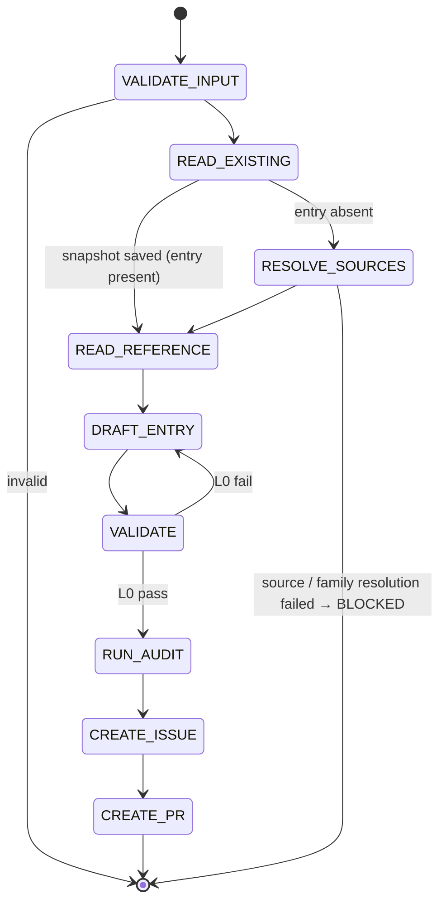

## Arguments

| Argument  | Required | Description                                                                                                             |
| --------- | -------- | ----------------------------------------------------------------------------------------------------------------------- |
| `op_name` | Yes      | Manifest key (e.g., `RMSNormFwdOp`). Caller-supplied, never derived. For variants, caller invokes once per emitted key. |
| `ref_url` | Yes      | HTTPS docs URL for the Tensor op. Must match `^https://[A-Za-z0-9./_-]+\.html$`.                                        |

## Contract

**One entry per invocation.** No splitting, no variant orchestration. For primary + variant, caller invokes the skill twice with different `op_name`s.

**Idempotent.** Auto-derivable fields are rewritten from the reference; human-curated fields are preserved if the entry exists, defaulted otherwise.

| Auto-derivable (always rewritten from reference) | Human-curated (preserved if entry exists, else default)                                                                           |
| ------------------------------------------------ | --------------------------------------------------------------------------------------------------------------------------------- |
| `signature.{inputs,outputs,params}`              | `family` (default: from sibling-entry copy or BLOCKED)                                                                            |
| `signature.shape_rules`                          | `ref_api` (default: derived from `ref_url`'s last path segment)                                                                   |
| `signature.dtype_combos`                         | `workloads` (default: `[]`)                                                                                                       |
| `roofline.{flops,bytes,vars}` (well-known op)    | `parity_opt_out` (default: omit)                                                                                                  |
|                                                  | `source.{kernel,op,test,bench,kernel_map,bench_manifest_driven}` (default: from RESOLVE_SOURCES + `bench_manifest_driven: false`) |
|                                                  | `status` (default: `spec-only`)                                                                                                   |
|                                                  | Adjacent comments (best-effort)                                                                                                   |

**Termination**: draft PR created → success. Invalid URL / un-derivable roofline / source-path or family resolution failure → BLOCKED.

**Constraints**: never edit op / kernel / test / bench code. Never invent params outside the reference. Never set `status: implemented` (that is `align-op@FLIP_STATUS`).

**Caller responsibility**: `op_name` and `ref_url` must point at the same op. The skill does not enforce alignment between them — TileOPs identity may legitimately differ from any reference's naming (e.g., `MultiHeadAttentionFwdOp` ↔ `torch.nn.functional.scaled_dot_product_attention`). Wrong pairing produces a broken manifest entry silently.

## Workflow



## Steps

### 1. VALIDATE_INPUT

Reject `ref_url` not matching the regex. Reject `op_name` not matching `^[A-Z][A-Za-z0-9]+(Fwd|Bwd)Op$`.

### 2. READ_EXISTING

Look up `op_name` in `tileops/ops_manifest.yaml`.

- **Present** → snapshot the human-curated fields per the Contract table. Source paths come from the existing `source.*`. Proceed to READ_REFERENCE.
- **Absent** → greenfield. Proceed to RESOLVE_SOURCES.

### 3. RESOLVE_SOURCES (greenfield only)

Lookup is **class-based**, not filename-based — many TileOPs ops share a file (e.g., `SumFwdOp` and `MeanFwdOp` both in `tileops/ops/reduction/reduce.py`).

1. **`source.op`**: scan `tileops/ops/**/*.py` for `class <op_name>(...)` (AST or `grep -rlE "^class <op_name>\(" tileops/ops/`).
   - Exactly one match → that file path.
   - Zero matches → true greenfield. Default to `tileops/ops/<snake_name>.py` (use a family subdirectory if a sibling-family entry suggests one). `<snake_name>` = `op_name` minus trailing `FwdOp` / `BwdOp`, snake_cased (`RMSNormFwdOp` → `rms_norm`). File may not exist yet; caller scaffolds afterward.
   - Multiple → BLOCKED disambiguation.
1. **`source.kernel`** (required by L0; `fix-manifest` cannot fill it later):
   - If `source.op` was found by class lookup: read its imports for a `Kernel` subclass; apply class-lookup under `tileops/kernels/**/*.py`. One match → that file. Multiple → BLOCKED disambiguation.
   - No kernel import (kernel-less op) → `source.kernel = source.op`.
   - Otherwise → BLOCKED `evidence_needed: source.kernel for <op_name>`.
1. `source.test = tests/ops/test_<snake_name>.py`; `source.bench = benchmarks/ops/bench_<snake_name>.py`. Missing files: record absent.
1. **`family`** (required by L0; cannot be empty):
   - Copy from a sibling manifest entry whose `source.op` parent-dir or basename overlaps.
   - No matching sibling → BLOCKED `evidence_needed: family for <op_name>`. Never invent.

### 4. READ_REFERENCE

`WebFetch(ref_url)`. Sole source of truth.

| Reference param kind | Goes to                                |
| -------------------- | -------------------------------------- |
| Tensor               | `signature.inputs` (positional order)  |
| non-Tensor           | `signature.params` (`type`, `default`) |
| return               | `signature.outputs`                    |

Names match the reference verbatim. Include every reference param even if the kernel ignores it. Exclude `float64` and `complex32/64/128` (TileOPs is GPU-only).

For references with `Optional[Tensor]` inputs, the caller has decided which slice corresponds to `op_name` (primary = required only; variant = primary + chosen optional). The skill emits inputs accordingly.

### 5. DRAFT_ENTRY

Snapshot present (re-align) → preserve human-curated fields verbatim. Snapshot absent (greenfield) → use Contract defaults. Auto-derivable fields:

- `signature.inputs`: ordered dict in the reference's positional order. Per input: `dtype` = supported set joined with `|` (reference dtypes minus `float64` and complex types); `shape` only if fixed rank; `layout` only if non-default; `constraints` if applicable.
- `signature.outputs`: same shape as inputs. Use `same_as(<ref>)` where applicable.
- `signature.params`: ordered dict, each `{type, default}`.
- `signature.shape_rules`: Python expressions for derived dims and inter-tensor constraints.
- `signature.dtype_combos`: only if supported set ⊂ Cartesian product; else omit.
- `roofline`: required by L0. Well-known op (conv / pool / matmul / norm / reduction): standard formula. Fixed-rank: shape names auto-bind, use `elem_bytes`. Arbitrary-rank: `vars` mapping. Not derivable → BLOCKED `evidence_needed: roofline.flops|bytes for <op_name>`.

### 6. VALIDATE

```bash
python scripts/validate_manifest.py --check-op <op_name>
```

L0 must pass. On fail: edit entry, rerun. L1–L4 failures go to the follow-up issue, not blocking.

### 7. RUN_AUDIT

Invoke `audit-family` for the op's family → `.foundry/migrations/<family>.json`.

### 8. CREATE_ISSUE

Invoke `foundry:creating-issue`. Per `semantic_gap` op the body MUST contain: kernel feasibility (cite kernel code; classify each missing param `trivial` / `kernel-change` / `blocked`); class-structure impact; effort per gap item; family dependencies. MUST also list outstanding human decisions (`workloads`, `roofline`) and resolution path. MUST NOT duplicate validator-reported facts. Record the issue URL.

### 9. CREATE_PR

Invoke `foundry:creating-pull-request` (draft):

| Snapshot at READ_EXISTING | Title                                                       | Branch                                   |
| ------------------------- | ----------------------------------------------------------- | ---------------------------------------- |
| absent                    | `[Maintain][Manifest] Add <op_name>`                        | `maintain/manifest/<op-slug>`            |
| present                   | `[Refactor][Manifest] Re-align <op_name> spec to <ref_api>` | `refactor/manifest/regenerate-<op-slug>` |

Body: which fields were rewritten vs. preserved, validator results, `Related: #<issue from step 8>`. Title and branch must match `.claude/conventions/types.sh`.
