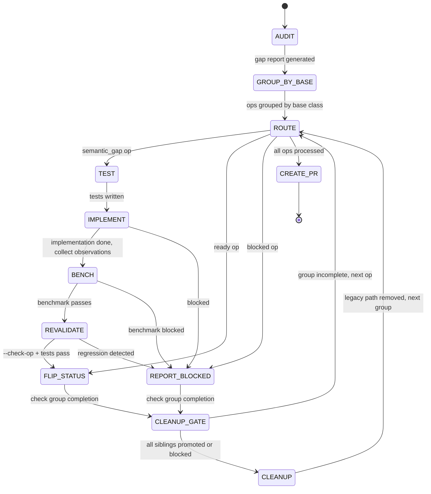

## Arguments

Family name from `ops_manifest.yaml` (e.g., `reduction`, `norm`, `attention`).

## Contract

- **Input**: `family` name
- **Output**: PR URL + final report
- **Termination**: all ops promoted or blocked, PR created

## Trust Model

- test-op agent ≠ implement-op agent (separate invocations)
- Only the orchestrator modifies `ops_manifest.yaml` status
- implement-op must not modify tests; bench-op must not modify Op code

## Workflow



## Orchestrator Discipline

### Clean worktree between sub-agents

After each sub-agent returns and before dispatching the next, verify:

```bash
test -z "$(git status --porcelain)"
```

This catches tracked changes, staged changes, AND untracked files. If not clean: the sub-agent's commit failed (pre-commit hook, staging issue) or left new files uncommitted. Orchestrator commits on behalf, then proceeds. Every agent must start with a clean worktree.

### Dual-path is acceptable during migration

When implement-op rewrites a base class, it may create a dual-path `__init__` (legacy + spec) to keep unmigrated sibling tests passing. This is correct temporary debt — the cleanup gate removes it.

**Dual-path definition**: a class `__init__` with runtime branching to support two incompatible construction interfaces, and `forward` dispatching to two execution paths. Not polymorphism — same semantics, temporary interface coexistence.

## Steps

### 1. AUDIT

```
/audit-family <family>
```

Gap report written to `.foundry/migrations/<family>.json`.

### 2. GROUP_BY_BASE

Group ops by `base_class` from the gap report. Each group is a set of sibling ops sharing a base class. Process groups in order; within each group, process ops in order (first op likely fixes the base class, subsequent ops validate).

`base_class` is a required field in the gap report. audit-family must populate it for every op entry. If an op inherits `Op` directly (no intermediate base class), its `base_class` is `"Op"` — these ops form a single group but are independent (no shared base class to rewrite, so cleanup gate is a no-op for this group).

Track group completion: a group is complete when all its ops are `promoted` or `blocked`.

### 3. ROUTE

Read gap report. For each op, extract params from the entry and dispatch:

| Classification | Action                                                |
| -------------- | ----------------------------------------------------- |
| `ready`        | → FLIP_STATUS                                         |
| `semantic_gap` | → TEST → IMPLEMENT → BENCH → REVALIDATE → FLIP_STATUS |
| `blocked`      | → REPORT_BLOCKED                                      |

### 4. TEST (per op)

Invoke test-op as a **separate agent** (trust model):

```
test-op(op_name, manifest_signature, pytorch_equivalent, source_test)
```

### 5. IMPLEMENT (per op)

Invoke implement-op as a **separate agent** (trust model):

```
implement-op(op_name, manifest_signature, source_op, source_test)
```

Collect `observations` from return.

### 6. BENCH (per op)

Invoke bench-op:

```
bench-op(op_name, source_bench, source_op)
```

Requires local GPU.

### 7. REVALIDATE (per op)

Final gate after benchmark edits. Re-run validation to confirm no regressions:

```bash
python scripts/validate_manifest.py --check-op <op_name>
python -m pytest <source_test> -v
```

Both must pass. If not → REPORT_BLOCKED (benchmark change introduced regression).

### 8. FLIP_STATUS

Orchestrator (not a sub-skill) changes manifest:

- `status: spec-only` → `status: implemented`
- Commit the manifest change
- Update gap report: add `promoted_at` timestamp (keep `classification` unchanged)

### 9. CLEANUP_GATE

After each terminal per-op outcome (FLIP_STATUS or REPORT_BLOCKED), check group completion:

- All siblings in the current base-class group are `promoted` or `blocked`? → trigger CLEANUP
- Otherwise → continue to next op (ROUTE)

### 10. CLEANUP

Remove dual-path legacy code from the base class. This step fires once per base-class group, after all siblings are done.

Actions:

1. Remove legacy `__init__` branch (`if M is not None and N is not None` path)
1. Remove `_legacy` flag and `_forward_legacy` method
1. Remove `M`, `N` keyword-only parameters from `__init__`
1. Run tests and `--check-op` for **promoted ops only** (blocked ops' tests may legitimately fail)
1. Commit cleanup changes

If any promoted op's test fails after cleanup → REPORT_BLOCKED (cleanup regression). Do not proceed with broken state.

**Timeout policy for blocked ops**: if a group has blocked ops that prevent cleanup gate from firing for an extended period, the orchestrator may force cleanup — remove legacy path and mark blocked ops' tests as `xfail`. This is a human decision, not automatic.

### 11. CREATE_PR

After all ops processed:

- Collect all observations from implement-op calls
- Create PR with:
  - Migration summary (promoted / blocked counts)
  - Per-op change table
  - Observations for human doc review
  - Blocked ops with reasons
