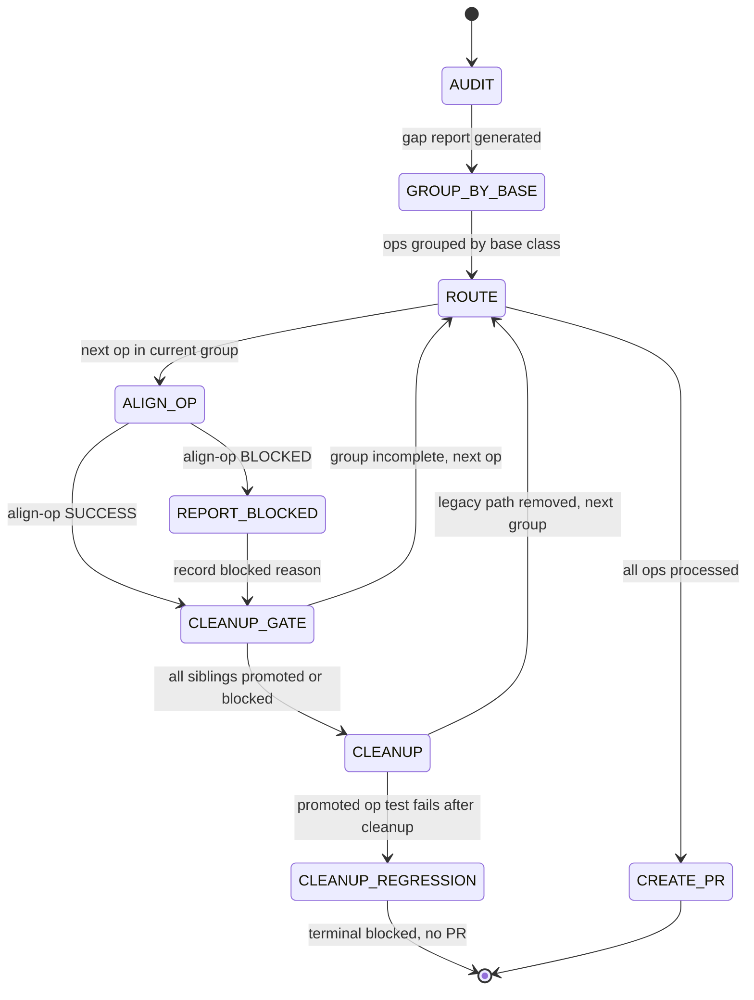

## Arguments

Family name from `ops_manifest.yaml` (e.g., `reduction`, `norm`, `attention`).

## Contract

- **Input**: `family` name
- **Output** (two terminal outcomes):
  - **SUCCESS**: PR URL + final report — all ops processed via `align-op` (promoted or blocked), cleanup succeeds, PR opens.
  - **BLOCKED**: blocked report (no PR) — reached when CLEANUP detects a regression in a promoted op's tests after dual-path removal; see `CLEANUP_REGRESSION` terminal in the state diagram. Distinct from the non-terminal per-op `REPORT_BLOCKED` state.
- **Termination**: all ops processed (promoted or blocked via `align-op`) and either (a) CLEANUP + CREATE_PR succeed, or (b) a promoted op's tests fail after CLEANUP's dual-path removal, causing the run to exit via `CLEANUP_REGRESSION` with the regression recorded. (`REPORT_BLOCKED` is the non-terminal per-op blocked state and never terminates the run.)

## Trust Model

- `align-family` delegates every per-op stage to `align-op`, invoked as a **separate sub-agent** per op. The family orchestrator never runs any atomic per-op skill directly — those live inside `align-op`'s contract.

- `align-family` does **not** write `ops_manifest.yaml`. After the refactor, `align-op` is the sole manifest writer (at its own FLIP_STATUS step); `align-family` observes status transitions via `align-op`'s SUCCESS return. No `align-family` stage edits, modifies, or flips the manifest.

- Directly-invoked sub-skills of `align-family` are exactly two: `audit-family` (in AUDIT) and `align-op` (per op).

  | Stage    | Sub-skill      |
  | -------- | -------------- |
  | AUDIT    | `audit-family` |
  | ALIGN_OP | `align-op`     |

## Workflow



## Orchestrator Discipline

### Clean worktree between sub-agents

After each sub-agent returns and before dispatching the next, verify:

```bash
test -z "$(git status --porcelain)"
```

This catches tracked changes, staged changes, AND untracked files. If not clean: the sub-agent's commit failed (pre-commit hook, staging issue) or left new files uncommitted. Orchestrator commits on behalf, then proceeds. Every agent must start with a clean worktree.

### Dual-path is acceptable during migration

When `align-op` rewrites a base class during its per-op pipeline, it may create a dual-path `__init__` (legacy + spec) to keep unmigrated sibling tests passing. This is correct temporary debt — the cleanup gate removes it.

**Dual-path definition**: a class `__init__` with runtime branching to support two incompatible construction interfaces, and `forward` dispatching to two execution paths. Not polymorphism — same semantics, temporary interface coexistence.

## Steps

### 1. AUDIT

```
/audit-family <family>
```

Gap report written to `.foundry/migrations/<family>.json`.

### 2. GROUP_BY_BASE

Group ops by `base_class` from the gap report. Each group is a set of sibling ops sharing a base class. Process groups in order; within each group, process ops in order (first op likely fixes the base class, subsequent ops validate).

`base_class` is a required field in the gap report. audit-family must populate it for every op entry. If an op inherits `Op` directly (no intermediate base class), its `base_class` is `"Op"` — these ops form a single group but are independent (no shared base class to rewrite, so cleanup gate is a no-op for this group).

Track group completion: a group is complete when all its ops are `promoted` or `blocked`.

### 3. ALIGN_OP (per op)

For each op in the current group, invoke `align-op` as a **separate sub-agent**:

```
align-op <op_name>
```

`align-op` owns the entire per-op pipeline internally — its internal stages (classify, dispatch on case, test / implement / bench, revalidate, flip status, cleanup, report) are `align-op`'s contract, not `align-family`'s. See [`align-op/SKILL.md`](../align-op/SKILL.md) for the authoritative stage list and the conditional-IMPLEMENT rule. `align-family` does not manage or observe `align-op`'s internal stages; the only interface between them is `align-op`'s SUCCESS / BLOCKED return.

Per-op outcome:

- `align-op` returns SUCCESS → op is `promoted` (manifest status already flipped by `align-op`'s FLIP_STATUS). Record the returned report. Proceed to CLEANUP_GATE.
- `align-op` returns BLOCKED → op is `blocked`. Capture `align-op`'s BLOCKED reason verbatim as the per-op result. Proceed to CLEANUP_GATE.

`align-family` MUST NOT re-flip manifest status or re-run per-op validation on its own; `align-op`'s SUCCESS return is the single source of truth that the manifest was flipped.

### 4. CLEANUP_GATE

After each `align-op` invocation returns (SUCCESS or BLOCKED), check group completion:

- All siblings in the current base-class group are `promoted` or `blocked`? → trigger CLEANUP
- Otherwise → continue to next op (ROUTE → ALIGN_OP)

### 5. CLEANUP

Remove dual-path legacy code from the base class. This step fires once per base-class group, after all siblings have gone through `align-op` (SUCCESS or BLOCKED).

Actions:

1. Remove legacy `__init__` branch (`if M is not None and N is not None` path)
1. Remove `_legacy` flag and `_forward_legacy` method
1. Remove `M`, `N` keyword-only parameters from `__init__`
1. Run tests and `--check-op` for **promoted ops only** (blocked ops' tests may legitimately fail)
1. Commit cleanup changes

If any promoted op's test fails after cleanup → transition to `CLEANUP_REGRESSION` (terminal): record the regression, skip `CREATE_PR`, exit with `blocked` status. Do not proceed with a broken state.

**Two distinct blocked states**, split so the diagram has one meaning per state:

- **`REPORT_BLOCKED`** — per-op `align-op` returned BLOCKED. Records the reason, returns to `CLEANUP_GATE`, continues with sibling ops. Non-terminal.
- **`CLEANUP_REGRESSION`** — a promoted op's tests fail after CLEANUP's dual-path removal. Terminal: the family migration exits without opening a PR. The blocked report becomes the run's final artefact.

**Timeout policy for blocked ops**: if a group has blocked ops that prevent the cleanup gate from firing for an extended period, the orchestrator may force cleanup — remove legacy path and mark blocked ops' tests as `xfail`. This is a human decision, not automatic.

### 6. CREATE_PR

After all ops processed:

- Collect all per-op reports returned by `align-op`
- Create PR with:
  - Migration summary (promoted / blocked counts)
  - Per-op change table (derived from `align-op` reports)
  - Observations surfaced by `align-op` (e.g., `needs_kernel_work`, `needs_human_decision`) for human doc review
  - Blocked ops with `align-op`'s BLOCKED reasons
