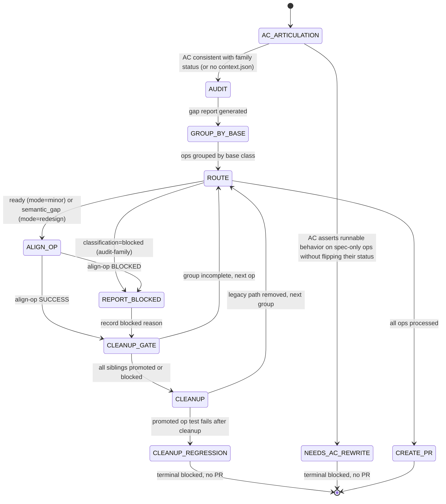

## Arguments

Family name from `tileops/manifest/` (e.g., `reduction`, `norm`, `attention`).

## Contract

- **Input**: `family` name
- **Output** (three terminal outcomes):
  - **SUCCESS**: PR URL + final report — all ops processed via `align-op` (promoted or blocked), cleanup succeeds, PR opens.
  - **BLOCKED — `CLEANUP_REGRESSION`**: blocked report (no PR), reached when CLEANUP detects a regression in a promoted op's tests after dual-path removal. Distinct from the non-terminal per-op `REPORT_BLOCKED` state.
  - **BLOCKED — `NEEDS_AC_REWRITE`**: blocked report (no PR), reached when AC_ARTICULATION (Step 0) detects an AC asserting runnable behavior on `spec-only` ops without a flip step in the plan. Exits before any per-op work runs.
- **Termination**: either (a) AC_ARTICULATION fires `NEEDS_AC_REWRITE`, or (b) all ops processed via `align-op` and CLEANUP + CREATE_PR succeed, or (c) a promoted op's tests fail after CLEANUP's dual-path removal, causing the run to exit via `CLEANUP_REGRESSION`. (`REPORT_BLOCKED` is the non-terminal per-op blocked state and never terminates the run.)

## Trust Model

- `align-family` delegates every per-op stage to `align-op`, invoked as a **separate sub-agent** per op. The family orchestrator never runs any atomic per-op skill directly — those live inside `align-op`'s contract.

- `align-family` does **not** write `tileops/manifest/`. After the refactor, `align-op` is the sole manifest writer (at its own FLIP_STATUS step); `align-family` observes status transitions via `align-op`'s SUCCESS return. No `align-family` stage edits, modifies, or flips the manifest.

- Directly-invoked sub-skills of `align-family` are exactly two: `audit-family` (in AUDIT) and `align-op` (per op).

  | Stage    | Sub-skill      |
  | -------- | -------------- |
  | AUDIT    | `audit-family` |
  | ALIGN_OP | `align-op`     |

## Workflow



`NEEDS_AC_REWRITE` and `CLEANUP_REGRESSION` are distinct terminal states:
`NEEDS_AC_REWRITE` exits before any per-op work runs because the AC is
unimplementable as written; `CLEANUP_REGRESSION` exits after work has
landed because dual-path removal broke a promoted op's tests.

## Orchestrator Discipline

### Clean worktree between sub-agents

After each sub-agent returns and before dispatching the next, verify:

```bash
test -z "$(git status --porcelain)"
```

This catches tracked changes, staged changes, AND untracked files. If not clean: the sub-agent's commit failed (pre-commit hook, staging issue) or left new files uncommitted. Orchestrator commits on behalf, then proceeds. Every agent must start with a clean worktree.

### Dual-path is acceptable during migration

When `align-op` rewrites a base class during its per-op pipeline, it may create a dual-path `__init__` (legacy + spec) to keep unmigrated sibling tests passing. This is correct temporary debt — the cleanup gate removes it.

**Dual-path definition**: a class `__init__` with runtime branching to support two incompatible construction interfaces, and `forward` dispatching to two execution paths. Not polymorphism — same semantics, temporary interface coexistence.

## Steps

<a id="ac_articulation"></a>### 0. AC_ARTICULATION (AC-vs-family-status gate)

If `align-family` is invoked through a foundry pipeline run (i.e. `FOUNDRY_RUN_DIR` set and `$FOUNDRY_RUN_DIR/context.json` contains `acceptance_criteria[]`), articulate every incoming AC against the family's per-op manifest `status` BEFORE running AUDIT. This catches the **AC-asserts-runnable-but-AC-does-not-flip-status** contradiction shape behind PR #1229's family-scope fake-impl (cleanup tracked in #1237). Asserting runnable behavior on `spec-only` ops while leaving their status untouched is impossible without faking outputs.

For each AC in `context.json`:

- **Source A**: AC text (cite `context.json:acceptance_criteria[<n>]`)
- **Source B**: per-op manifest `status` for every op in `family` (cite `<manifest_yaml>:<line>` of each op's `status:` field). The trust-model contract that gates `spec-only → implemented` flips lives in [`docs/design/manifest.md`](../../../docs/design/manifest.md) `R13` (status gating).
- **Choice**: A | B | merge | `none + propose alternative`
- **Reasoning**: citation-grounded; not paraphrase

BLOCK with `NEEDS_AC_REWRITE` only when **all three** hold:

1. At least one op in the family has `status: spec-only` at run start;
1. The AC requires runnable artifacts (impl / runnable test / bench numbers) for those ops;
1. The AC + plan do **not** include a `spec-only → implemented` flip step for them (no language like "flip to `implemented`", "promote", or `FLIP_STATUS`).

`align-family`'s normal migration use case (drives `align-op` per op, each running its own `FLIP_STATUS`) trivially satisfies (3) and is **not** blocked. The gate fires only on PR #1229's shape: AC promises runnable behavior while the work plan never promotes the ops.

When the gate fires, `Choice` MUST be `none + propose alternative` with two alternatives surfaced: (a) narrow the AC to "manifest entries valid + validator clean for spec-only ops; runnable artifacts required only for already-`implemented` ops"; (b) extend the AC + plan with explicit per-op flip steps. `align-family` records both in `.foundry/migrations/<family>-ac-articulation.json` and transitions to `NEEDS_AC_REWRITE` (terminal) — no per-op work runs.

If no `context.json` or no `acceptance_criteria[]` field, skip this step. align-family invoked standalone (CLI) trusts the caller.

Schema reference: [`AIGCIC/foundry#27`](https://github.com/AIGCIC/foundry/pull/27). Until that PR merges, the inline rules above are authoritative. Citations MUST be specific (file:line, doc:section), not paraphrase.

### 1. AUDIT

```
/audit-family <family>
```

Gap report written to `.foundry/migrations/<family>.json`.

### 2. GROUP_BY_BASE

Group ops by `base_class` from the gap report. Each group is a set of sibling ops sharing a base class. Process groups in order; within each group, process ops in order (first op likely fixes the base class, subsequent ops validate).

`base_class` is a required field in the gap report. audit-family must populate it for every op entry. If an op inherits `Op` directly (no intermediate base class), its `base_class` is `"Op"` — these ops form a single group but are independent (no shared base class to rewrite, so cleanup gate is a no-op for this group).

Track group completion: a group is complete when all its ops are `promoted` or `blocked`.

### 3. ROUTE

Read the gap report from AUDIT. For each op in the current group, route by `classification` (the field `audit-family` populates):

| Gap-report `classification` | Action                                                 | Why                                                                                                                                                                                                                                                                                                                                                                                           |
| --------------------------- | ------------------------------------------------------ | --------------------------------------------------------------------------------------------------------------------------------------------------------------------------------------------------------------------------------------------------------------------------------------------------------------------------------------------------------------------------------------------- |
| `ready`                     | → ALIGN_OP with `--mode=minor`                         | Existing code already conforms; align-op's minor path runs the spec tests (DONE_SKIP since they pass), then the shared downstream + flip.                                                                                                                                                                                                                                                     |
| `semantic_gap`              | → ALIGN_OP with `--mode=redesign`                      | Family-scoped historical migration treats every `semantic_gap` op as a structural redesign by default — legacy code is being replaced wholesale. For per-op `semantic_gap` cases that are actually minor manifest deltas, use single-op `align-op <op> --mode=minor` directly instead of `align-family`. A future `recommended_mode` gap-report field could refine the routing automatically. |
| `blocked`                   | → REPORT_BLOCKED with audit's `reason`. Skip align-op. | Audit determined the op cannot be migrated autonomously (no `pytorch_equivalent`, kernel-layer change required, etc.). No per-op work to do.                                                                                                                                                                                                                                                  |

The mapping is deterministic — `align-family` MUST pass `--mode=` explicitly so `align-op` never falls into its interactive prompt branch in a batch family migration.

### 4. ALIGN_OP (per op)

For each op routed here, invoke `align-op` as a **separate sub-agent** with the mode determined in Step 3:

```
align-op <op_name> --mode=<minor|redesign>
```

`align-op` owns the entire per-op pipeline internally — its internal stages (classify, dispatch on case, test / implement / bench, revalidate, flip status, cleanup, report) are `align-op`'s contract, not `align-family`'s. See [`align-op/SKILL.md`](../align-op/SKILL.md) for the authoritative stage list and the conditional-IMPLEMENT rule. `align-family` does not manage or observe `align-op`'s internal stages; the only interface between them is `align-op`'s SUCCESS / BLOCKED return.

Per-op outcome:

- `align-op` returns SUCCESS → op is `promoted` (manifest status already flipped by `align-op`'s FLIP_STATUS). Record the returned report. Proceed to CLEANUP_GATE.
- `align-op` returns BLOCKED → op is `blocked`. Capture `align-op`'s BLOCKED reason verbatim as the per-op result. Proceed to CLEANUP_GATE.

`align-family` MUST NOT re-flip manifest status or re-run per-op validation on its own; `align-op`'s SUCCESS return is the single source of truth that the manifest was flipped.

### 5. CLEANUP_GATE

After each per-op outcome — whether `align-op` returned SUCCESS / BLOCKED or ROUTE recorded an audit-classified `blocked` op directly to `REPORT_BLOCKED` — check group completion:

- All siblings in the current base-class group are `promoted` or `blocked`? → trigger CLEANUP
- Otherwise → continue to next op (ROUTE → ALIGN_OP)

### 6. CLEANUP

Remove dual-path legacy code from the base class. This step fires once per base-class group, after all siblings have gone through `align-op` (SUCCESS or BLOCKED).

Actions:

1. Remove legacy `__init__` branch (`if M is not None and N is not None` path)
1. Remove `_legacy` flag and `_forward_legacy` method
1. Remove `M`, `N` keyword-only parameters from `__init__`
1. Run tests and `--check-op` for **promoted ops only** (blocked ops' tests may legitimately fail)
1. Commit cleanup changes

If any promoted op's test fails after cleanup → transition to `CLEANUP_REGRESSION` (terminal): record the regression, skip `CREATE_PR`, exit with `blocked` status. Do not proceed with a broken state.

**Two distinct blocked states**, split so the diagram has one meaning per state:

- **`REPORT_BLOCKED`** — per-op `align-op` returned BLOCKED. Records the reason, returns to `CLEANUP_GATE`, continues with sibling ops. Non-terminal.
- **`CLEANUP_REGRESSION`** — a promoted op's tests fail after CLEANUP's dual-path removal. Terminal: the family migration exits without opening a PR. The blocked report becomes the run's final artefact.

**Timeout policy for blocked ops**: if a group has blocked ops that prevent the cleanup gate from firing for an extended period, the orchestrator may force cleanup — remove legacy path and mark blocked ops' tests as `xfail`. This is a human decision, not automatic.

### 7. CREATE_PR

After all ops processed:

- Collect all per-op reports returned by `align-op`
- Create PR with:
  - Migration summary (promoted / blocked counts)
  - Per-op change table (derived from `align-op` reports)
  - Observations surfaced by `align-op` (e.g., `needs_kernel_work`, `needs_human_decision`) for human doc review
  - Blocked ops with `align-op`'s BLOCKED reasons
