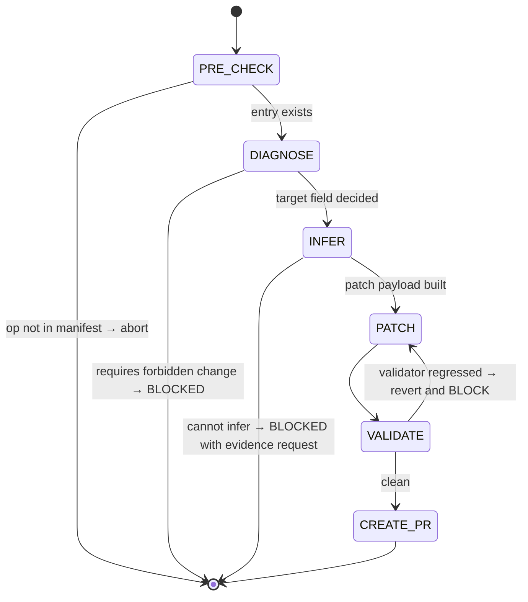

## Arguments

| Argument         | Required | Description                                                                                                                                    |
| ---------------- | -------- | ---------------------------------------------------------------------------------------------------------------------------------------------- |
| `op_name`        | Yes      | Manifest key (e.g., `RMSNormFwdOp`)                                                                                                            |
| `--field=<name>` | No       | Which field to patch. Omit to auto-detect from validator. Allowed: `kernel_map`, `static_dims`, `shape_rules`, `roofline.vars`, `dtype_combos` |
| `--dry-run`      | No       | Print the patch and the diff; do not write                                                                                                     |

## Contract

- **Input**: `op_name` must already exist in `tileops/ops_manifest.yaml`.
- **Output**: single-field patch to that entry + manifest PR.
- **Termination**: validator passes the level corresponding to the patched field, or BLOCKED with a structured reason.
- **Boundary** (intentionally narrow):
  - **MAY** patch: `kernel_map`, `static_dims`, `shape_rules`, `roofline.vars`, `dtype_combos`.
  - **MUST NOT** modify: `signature.inputs`, `signature.outputs`, `signature.params`, `status`, `family`, `ref_api`, `workloads`, `roofline.flops`, `roofline.bytes`, `roofline.func`, `source.*` (except `kernel_map`).
  - **MUST NOT** create new entries — use `add-manifest` for greenfield.
  - **MUST NOT** flip `status` — that is `align-op`'s `FLIP_STATUS` site.
  - **MUST NOT** modify op / kernel / test / bench code.

If the validator gap requires a forbidden change (e.g., `signature.params` is wrong), STOP and emit a structured BLOCKED report with the diagnosis. Do not silently widen scope.

## Workflow



## Steps

### 1. PRE_CHECK

- Resolve `op_name` in `tileops/ops_manifest.yaml`. Missing → BLOCKED ("op not in manifest; use `add-manifest` for greenfield").
- Read the current entry verbatim (preserve key order; we will round-trip it).

### 2. DIAGNOSE

Decide which field to patch:

- If `--field=` was passed: that field. Validate it is in the allowed list.
- Otherwise: run `python scripts/validate_manifest.py --check-op <op_name>`. Parse the first error.
  - Error names a field in the allowed list → patch that field.
  - Error names a forbidden field (e.g., `signature.params.dim` is missing) → BLOCKED. Report: which field, why it is forbidden, and what skill / workflow owns it (`add-manifest` for new entries, an issue + manifest review for signature changes).
  - No errors at the requested level → no-op; print "nothing to fix" and exit cleanly.

Write `.foundry/plan/<op_name>/fix-diagnosis.json` with: target field, validator output excerpt, decided action.

### 3. INFER

Derive the patch payload from authoritative evidence on disk:

| Field           | Inference source                                                                                                                                                                                                                                                                       |
| --------------- | -------------------------------------------------------------------------------------------------------------------------------------------------------------------------------------------------------------------------------------------------------------------------------------- |
| `kernel_map`    | `source.op` file. Read the op class. The mapping `<key>: <fully-qualified Kernel class>` is reconstructed from `_kernel_key` (or kernel-dispatch dict) + `_kernel_cls` (or callable used in `kernel_map`). For T1 thin wrappers: read the family base class to find the dispatch dict. |
| `static_dims`   | `signature.inputs` shape names + the op's `forward` body (which dim is the row / hidden / channel). Cross-check against `roofline.vars` if present (often the same names).                                                                                                             |
| `shape_rules`   | `signature.inputs/outputs` shape relationships. PyTorch docs (via `ref_api`) are the tiebreaker.                                                                                                                                                                                       |
| `roofline.vars` | `static_dims` keys + any extra dims used in `roofline.flops` / `roofline.bytes` expressions.                                                                                                                                                                                           |
| `dtype_combos`  | Existing tests (`source.test`) — if tests parametrize over dtypes, those are the supported combos.                                                                                                                                                                                     |

If inference is impossible from on-disk evidence, BLOCKED with a structured "evidence needed" report listing what the human must decide. Do not guess.

### 4. PATCH

Apply the inferred payload to the entry. Preserve YAML formatting:

- Insert `kernel_map` directly under `source.kernel`.
- Insert `static_dims` directly under `signature.params` (or `signature.outputs` if no `params`).
- Other fields per their canonical position in [`docs/manifest.md`](../../../docs/manifest.md).
- Preserve comments adjacent to the target section.
- Do not reorder unrelated keys.

### 5. VALIDATE

```bash
python scripts/validate_manifest.py --check-op <op_name>
```

Must pass at least the level the patch targets:

| Patched field   | Required passing level |
| --------------- | ---------------------- |
| `kernel_map`    | L0 (structural)        |
| `static_dims`   | L1                     |
| `shape_rules`   | L2                     |
| `roofline.vars` | L3                     |
| `dtype_combos`  | L1                     |

If the validator now reports a *new* error not present before the patch, revert and BLOCKED. The patch must monotonically improve.

### 6. CREATE_PR

Invoke `foundry:creating-pull-request` with:

- **Title**: `[Maintain][Manifest] fix <field> for <op_name>` (or `[Fix][Manifest] …` if patching an entry that the validator was actively rejecting).
- **Branch**: `maintain/manifest/fix-<op-slug>-<field>`.
- **Body**:
  - Single-field patch summary (which field, why missing, evidence used to infer).
  - Validator output before vs. after.
  - Explicit **scope guard**: list what was NOT touched (signature, status, sources).
  - If `--dry-run` was passed: no PR; print the diff and exit.

## Guardrails

- Never bundle two field fixes in one invocation. Run twice.
- Never edit op / kernel / test / bench files.
- Never invent values that have no source on disk. Inference must trace back to a file in the repo or to `ref_api` PyTorch docs.
- Never flip `status`. If the entry currently says `spec-only` and the patch makes it conformant, leave the status alone — `align-op` flips it after code is aligned.
- If the validator output is ambiguous (multiple possible fixes), STOP and ask.

## Relation to other skills

- **`add-manifest`** — greenfield: op exists, manifest entry does not. `fix-manifest` refuses on missing entries and points the user there.
- **`align-op`** — code-side alignment. `align-op` PRE_CHECK requires `kernel_map`; `fix-manifest --field=kernel_map` is the standard prerequisite when PRE_CHECK BLOCKS for that reason.
- **Trust model** — `fix-manifest` is the second authorized writer of `ops_manifest.yaml` after `align-op`'s `FLIP_STATUS`. Their write scopes do not overlap: `align-op` writes only the `status` field; `fix-manifest` writes everything in the allowed list except `status`. `add-manifest` adds whole new entries.
