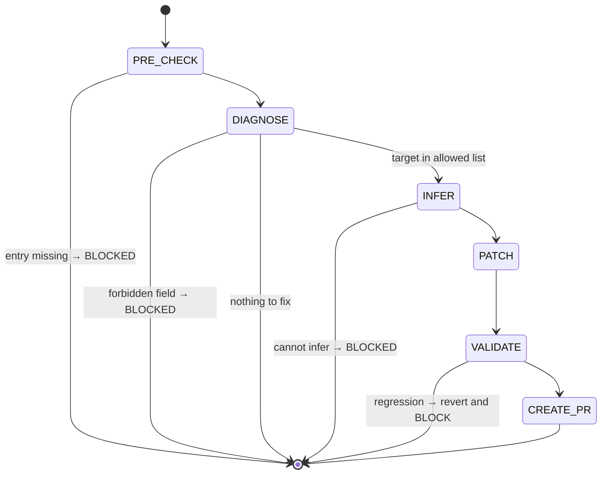

## Arguments

| Argument         | Required | Description                                                                                                             |
| ---------------- | -------- | ----------------------------------------------------------------------------------------------------------------------- |
| `op_name`        | Yes      | One manifest key, or a comma-separated list (e.g., `RMSNormFwdOp` or `SumFwdOp,MeanFwdOp,VarFwdOp`).                    |
| `--field=<name>` | No       | One of `kernel_map`, `static_dims`, `shape_rules`, `roofline.vars`, `dtype_combos`. Omit to auto-detect from validator. |
| `--dry-run`      | No       | Print diff and exit; no write, no PR                                                                                    |

When `op_name` is a list, the same `--field=<name>` is applied to every op (DIAGNOSE / INFER / PATCH / VALIDATE run per op). Mixing fields requires separate invocations. Use this when N sibling ops share the same gap (e.g., a family migration adding `kernel_map` to every spec-only entry); the resulting commit groups them together for a single review.

## Contract

- **MAY write** in `ops_manifest.yaml`: `kernel_map`, `static_dims`, `shape_rules`, `roofline.vars`, `dtype_combos`.
- **MUST NOT write**: `signature.{inputs,outputs,params}`, `status`, `family`, `ref_api`, `workloads`, `roofline.flops|bytes|func`, `source.{kernel,op,test,bench,bench_manifest_driven}`. (Note: `signature.static_dims`, `signature.shape_rules`, `signature.dtype_combos`, and `source.kernel_map` ARE in the allowed write set above.)
- **MUST NOT** create new entries (use `add-manifest`).
- **MUST NOT** flip `status` (that is `align-op@FLIP_STATUS`).
- **MUST NOT** edit op / kernel / test / bench code.
- **One field per invocation.** Multi-op is allowed (same field across many ops); multi-field is not.
- **Termination**: every patched op's validator output is **monotonic** — no error category is added by the patch — or BLOCKED. Pre-existing errors on `spec-only` entries (the common case) are not blockers; that is precisely why those entries are `spec-only`.

## Workflow



## Steps

### 1. PRE_CHECK

Resolve `op_name` in `tileops/ops_manifest.yaml`. Missing → BLOCKED with message `op not in manifest; use add-manifest for greenfield`.

### 2. DIAGNOSE

Decide the target field. The validator does NOT flag every missing allowed field for spec-only entries (e.g., `source.kernel_map` is only warned when `status == implemented`). When `--field=` is omitted, run two checks in strict order — Check A first; only fall through to Check B if A finds nothing.

**Check A — `kernel_map` presence (single field only).** If `source.kernel_map` is missing or empty → target = `kernel_map`, jump to INFER. Otherwise fall through to Check B.

Do NOT extend Check A to `static_dims`, `shape_rules`, `dtype_combos`, or `roofline.vars`. `docs/manifest.md` R7 and R20 explicitly allow `static_dims` to be absent on fixed-rank ops; the other three fields are conditionally required. Patching them on absence alone would manufacture changes for valid entries (e.g., reduction-style ops).

**Check B — validator output.** Run `python scripts/validate_manifest.py --check-op <op_name>`. Parse the first error:

- Field in the allowed list above → target = that field, jump to INFER.
- Field forbidden (e.g., `signature.params.dim`) → BLOCKED. Message must name the field, why it is out of scope, and the owning workflow (`add-manifest` for new entries; manifest-review issue for `signature.{inputs,outputs,params}`).
- No errors and Check A also empty → no-op; print `nothing to fix` and exit 0.

When `--field=` IS provided: must be in the allowed list; else BLOCKED. Skip both checks.

Write `.foundry/plan/<op_name>/fix-diagnosis.json`: `{op_name, target_field, validator_excerpt, action}`.

### 3. INFER

Build the patch payload from on-disk evidence. Source per field:

| Field           | Inference source                                                                                                                                                                                                                                                                                                                                                                                                                                                                                                                                                                                                                            |
| --------------- | ------------------------------------------------------------------------------------------------------------------------------------------------------------------------------------------------------------------------------------------------------------------------------------------------------------------------------------------------------------------------------------------------------------------------------------------------------------------------------------------------------------------------------------------------------------------------------------------------------------------------------------------- |
| `kernel_map`    | The op's runtime kernel dispatch, read directly from the op file. **T2 (L1-direct)**: read `default_kernel_map()` and copy its return dict verbatim. **T1 (thin wrapper, see `docs/ops-design.md` §"Family-specific protocol variables")**: T1 family bases (e.g., `RowNormOp`, `_ReduceOpBase`) typically expose `default_kernel_map()` returning `{self._kernel_key: self._kernel_cls}` — read the family base's `default_kernel_map()` and substitute the subclass's `_kernel_key` / `_kernel_cls`. Output format per `docs/manifest.md` § kernel_map: `{<dispatch_key>: <BareKernelClassName>}` — bare class name, NOT fully-qualified. |
| `static_dims`   | `signature.inputs` shape names that the op binds at construction time (each entry in the op's `__init__` kwarg block, excluding `dtype` / `kernel_map` / `tune` / `signature.params` entries — see `docs/ops-design.md` §"Step 3"). Cross-check with `roofline.vars` if present.                                                                                                                                                                                                                                                                                                                                                            |
| `shape_rules`   | `signature.inputs/outputs` shape relationships. PyTorch docs (`ref_api`) is tiebreaker.                                                                                                                                                                                                                                                                                                                                                                                                                                                                                                                                                     |
| `roofline.vars` | `static_dims` keys + any extra dims referenced in `roofline.flops` / `roofline.bytes`.                                                                                                                                                                                                                                                                                                                                                                                                                                                                                                                                                      |
| `dtype_combos`  | `source.test`: dtypes the tests parametrize over.                                                                                                                                                                                                                                                                                                                                                                                                                                                                                                                                                                                           |

If inference impossible, BLOCKED with an `evidence_needed` report listing what the human must decide. **Do not guess.**

### 4. PATCH

Apply the payload to the entry. The target keys live at these exact YAML paths and exact relative positions (verifiable by inspecting any existing entry in `tileops/ops_manifest.yaml`):

| Field           | YAML path                | Insert location                                                                                                                  |
| --------------- | ------------------------ | -------------------------------------------------------------------------------------------------------------------------------- |
| `kernel_map`    | `source.kernel_map`      | Between `source.kernel` and `source.op` (sibling of both)                                                                        |
| `static_dims`   | `signature.static_dims`  | Between `signature.params` and `signature.shape_rules` (sibling of both); if `params` is absent, place after `signature.outputs` |
| `shape_rules`   | `signature.shape_rules`  | After `signature.static_dims` (or after `signature.params` if no `static_dims`)                                                  |
| `dtype_combos`  | `signature.dtype_combos` | After `signature.shape_rules`                                                                                                    |
| `roofline.vars` | `roofline.vars`          | First key inside `roofline:` (before `flops` / `bytes` / `func`)                                                                 |

Insertion rules:

- Insert each new key as a **sibling** of the existing keys in its parent block (NOT nested under another sibling).
- Use the canonical relative position above. If the existing entry is unusually formatted, fall back to the order documented in `docs/manifest.md`.
- Preserve adjacent comments.
- Do not reorder unrelated keys.

### 5. VALIDATE

For each patched op, capture validator output **before** the patch (from `git stash`) and **after** the patch:

```bash
python scripts/validate_manifest.py --check-op <op_name>
```

The patch is acceptable iff the set of error messages **after** is a (non-strict) subset of the set **before** — i.e., the patch is **monotonic**. If any new error category appears, revert the patch for that op and BLOCKED.

Why monotonic-only, not "validator clean": `spec-only` entries typically already have unrelated errors (the reason they are `spec-only` — e.g., `[signature]` mismatches between manifest and code). Those are out of scope for `fix-manifest`; `align-op` will close them later. Requiring a clean validator run would block this skill on every spec-only op, which is exactly the case it most often runs against.

For multi-op invocations: run the monotonic check per op independently. A single op's regression must not block patches on its siblings — revert that op's patch only.

### 6. CREATE_PR

If `--dry-run`, print the diff and exit 0. Otherwise invoke `foundry:creating-pull-request`:

| Element | Single-op value                                                                                               | Multi-op value                                                             |
| ------- | ------------------------------------------------------------------------------------------------------------- | -------------------------------------------------------------------------- |
| title   | `[Maintain][Manifest] fix <field> for <op_name>` (use `[Fix][Manifest]` if validator was actively rejecting)  | `[Maintain][Manifest] add <field> for <family> spec-only ops`              |
| branch  | `maintain/manifest/fix-<op-slug>-<field>`                                                                     | `maintain/manifest/fix-<family>-<field>`                                   |
| body    | which field, evidence used to infer; validator output before vs. after; explicit list of what was NOT touched | per-op evidence table; per-op monotonic-check result; explicit scope guard |

## Guardrails

- One field per invocation.
- Never widen scope to cover a forbidden field — emit BLOCKED instead.
- Never invent values. All payload data must trace to a file or to `ref_api`.
- Never flip `status`.
- Validator output ambiguous → STOP, ask user.
