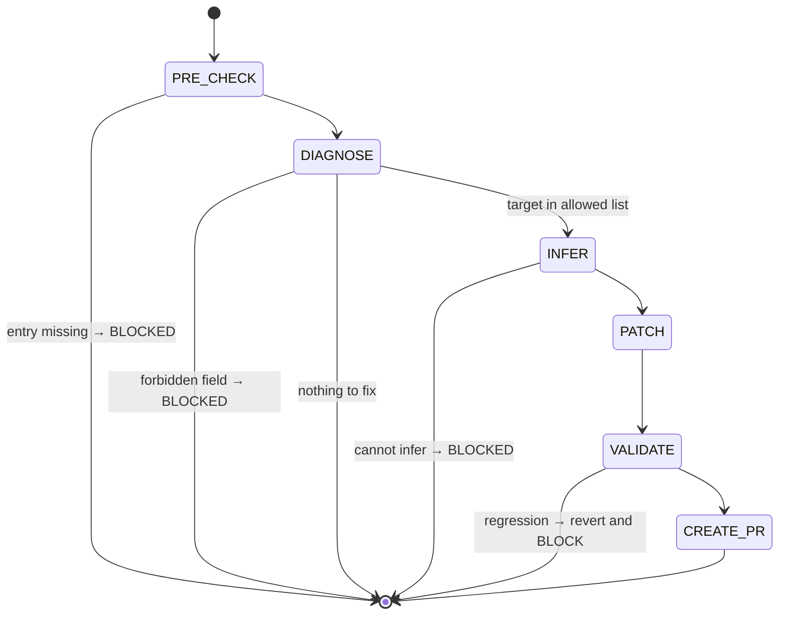

## Arguments

| Argument         | Required | Description                                                                                              |
| ---------------- | -------- | -------------------------------------------------------------------------------------------------------- |
| `op_name`        | Yes      | One manifest key, or comma-separated list (e.g., `RMSNormFwdOp` or `SumFwdOp,MeanFwdOp,VarFwdOp`).       |
| `--field=<name>` | No       | One of `kernel_map`, `static_dims`, `shape_rules`, `roofline.vars`, `dtype_combos`. Omit to auto-detect. |
| `--dry-run`      | No       | Print diff and exit; no write, no PR.                                                                    |

Multi-op: same `--field` applied to every op in the list. Multi-field is not supported — run again.

## Contract

- **MAY write** in `ops_manifest.yaml`: `kernel_map`, `static_dims`, `shape_rules`, `roofline.vars`, `dtype_combos`.
- **MUST NOT write**: `signature.{inputs,outputs,params}`, `status`, `family`, `ref_api`, `workloads`, `roofline.{flops,bytes,func}`, `source.{kernel,op,test,bench,bench_manifest_driven}`. (`signature.static_dims`, `signature.shape_rules`, `signature.dtype_combos`, `source.kernel_map` ARE allowed — they are the patch targets above.)
- **MUST NOT** create new entries (use `add-manifest`).
- **MUST NOT** flip `status` (that is `align-op@FLIP_STATUS`).
- **MUST NOT** edit op / kernel / test / bench code.
- **One field per invocation.**
- **Termination**: every patched op's validator output is **monotonic** (no new error category vs. before the patch), or BLOCKED.

## Workflow



## Steps

### 1. PRE_CHECK

Resolve `op_name` in `tileops/ops_manifest.yaml`. Missing → BLOCKED: `op not in manifest; use add-manifest for greenfield`.

### 2. DIAGNOSE

When `--field=` is provided: must be in the allowed list; else BLOCKED. Skip both checks below.

When `--field=` is omitted, run two checks in strict order:

**Check A — `kernel_map` presence.** If `source.kernel_map` is missing or empty → target = `kernel_map`, jump to INFER.

The validator only warns on missing `kernel_map` when `status == implemented`, so spec-only entries need this explicit check. Do NOT extend it to other fields — `static_dims` is legitimately optional on fixed-rank ops (`docs/manifest.md` R7, R20), and the rest are conditionally required; absence-only patching would manufacture changes for valid entries.

**Check B — validator output.** Run `python scripts/validate_manifest.py --check-op <op_name>`. Parse the first error:

- Field in allowed list → target = that field, jump to INFER.
- Field forbidden (e.g., `signature.params.dim`) → BLOCKED. Name the field, why it is out of scope, and the owning workflow (`add-manifest` for new entries; manifest-review issue for `signature.{inputs,outputs,params}`).
- No errors and Check A also empty → no-op; print `nothing to fix` and exit 0.

Write `.foundry/plan/<op_name>/fix-diagnosis.json`: `{op_name, target_field, validator_excerpt, action}`.

### 3. INFER

Build the patch payload from on-disk evidence. **Never guess** — if inference is impossible, BLOCKED with `evidence_needed: <what>`.

**`kernel_map`** — read the op file:

- T2 (L1-direct): copy `default_kernel_map()`'s return dict verbatim.
- T1 (thin wrapper, see `docs/ops-design.md` § "Family-specific protocol variables"): family bases (`RowNormOp`, `_ReduceOpBase`, …) expose `default_kernel_map()` returning `{self._kernel_key: self._kernel_cls}`. Read it; substitute the subclass's `_kernel_key` / `_kernel_cls`.
- Output format per `docs/manifest.md` § kernel_map: `{<dispatch_key>: <BareKernelClassName>}` — bare class name, NOT fully-qualified.

**`static_dims`** — `signature.inputs` shape names that the op binds at construction time (each entry in the op's `__init__` kwarg block, excluding `dtype` / `kernel_map` / `tune` / `signature.params` entries — see `docs/ops-design.md` § "Step 3"). Cross-check with `roofline.vars` if present.

**`shape_rules`** — `signature.inputs/outputs` shape relationships. PyTorch docs (`ref_api`) is tiebreaker.

**`roofline.vars`** — `static_dims` keys + any extra dims referenced in `roofline.flops` / `roofline.bytes`.

**`dtype_combos`** — dtypes the tests in `source.test` parametrize over.

### 4. PATCH

Before writing, capture the **before** validator baseline (used in step 5):

```bash
python scripts/validate_manifest.py --check-op <op_name> > /tmp/fix-manifest-<op>-before.txt
```

Do NOT use `git stash` to derive the baseline — it is unsafe on a dirty working tree (would stash unrelated user changes and make the comparison ambiguous). Capture before mutating any file.

Then insert each new key as a **sibling** of the existing keys in its parent block, at this exact position (verifiable from any sibling entry):

| Field           | YAML path                | Position                                                                                              |
| --------------- | ------------------------ | ----------------------------------------------------------------------------------------------------- |
| `kernel_map`    | `source.kernel_map`      | between `source.kernel` and `source.op`                                                               |
| `static_dims`   | `signature.static_dims`  | between `signature.params` and `signature.shape_rules`; if `params` absent, after `signature.outputs` |
| `shape_rules`   | `signature.shape_rules`  | after `signature.static_dims` (or after `signature.params` if no `static_dims`)                       |
| `dtype_combos`  | `signature.dtype_combos` | after `signature.shape_rules`                                                                         |
| `roofline.vars` | `roofline.vars`          | first key inside `roofline:` (before `flops`/`bytes`/`func`)                                          |

Preserve adjacent comments. Do not reorder unrelated keys. If the existing entry deviates from the canonical layout, fall back to the order in `docs/manifest.md`.

### 5. VALIDATE

Capture the **after** baseline and compare to the **before** baseline saved in PATCH:

```bash
python scripts/validate_manifest.py --check-op <op_name> > /tmp/fix-manifest-<op>-after.txt
diff /tmp/fix-manifest-<op>-before.txt /tmp/fix-manifest-<op>-after.txt
```

Acceptable iff the set of error messages **after** is a subset of the set **before** (monotonic). New error → revert that op's patch and BLOCKED.

For multi-op runs: per-op independent. One op's regression reverts only that op's patch; siblings proceed.

Spec-only entries usually carry pre-existing errors (the reason they are spec-only — typically `[signature]` mismatches). Those are out of scope here — `align-op` closes them later.

### 6. CREATE_PR

If `--dry-run`, print diff and exit 0. Otherwise invoke `foundry:creating-pull-request`:

| Element | Single-op                                                                                                    | Multi-op                                                          |
| ------- | ------------------------------------------------------------------------------------------------------------ | ----------------------------------------------------------------- |
| title   | `[Maintain][Manifest] fix <field> for <op_name>` (use `[Fix][Manifest]` if validator was actively rejecting) | `[Maintain][Manifest] add <field> for <family> spec-only ops`     |
| branch  | `maintain/manifest/fix-<op-slug>-<field>`                                                                    | `maintain/manifest/fix-<family>-<field>`                          |
| body    | which field, evidence, validator before/after, scope guard                                                   | per-op evidence table; per-op monotonic-check result; scope guard |

## Guardrails

- One field per invocation.
- Never widen scope to a forbidden field — emit BLOCKED.
- Never invent values; payload must trace to a file or to `ref_api`.
- Never flip `status`.
- Validator output ambiguous → STOP, ask user.
