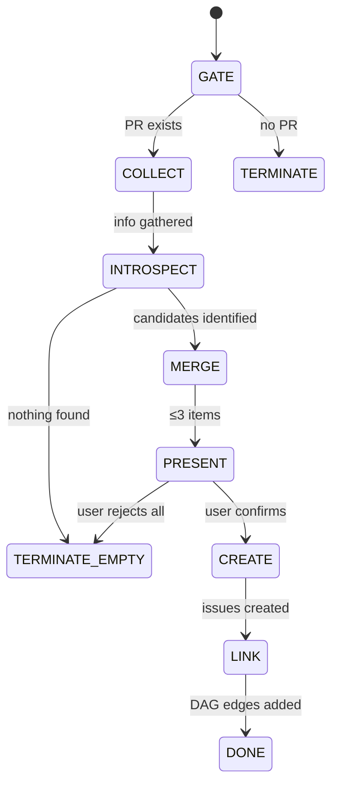

## Prerequisites

This skill must be run **within the same development session** where the PR was developed.
It relies on conversation history for introspection — without session context, it produces no useful output.

## Arguments

None. The skill derives all context from the current branch's PR and the conversation history.

## Contract

- **Input**: current branch (must have an associated PR)
- **Output**: up to 3 follow-up GitHub issues, linked to the source PR
- **Termination**: all confirmed follow-ups created, or no follow-ups identified

## Precondition (hard gate)

```bash
gh pr view --json number,title,url
```

- **Success** -> extract `PR_NUMBER`, `PR_TITLE`, `PR_URL`. Continue.
- **Failure** -> terminate with message:
  > No PR found for current branch. This skill must be run within the same session
  > where the PR was developed — it relies on conversation history for introspection,
  > not just code diff.

## Label Setup

Before creating any issue, ensure the `follow-up` label exists:

```bash
gh label create "follow-up" --description "Generated from dev session introspection" --color "c5def5" --force
```

The `--force` flag makes this idempotent (updates if exists, creates if not).

## Workflow



### Step 1: GATE

Run `gh pr view --json number,title,url,body`. If it fails, print the guard message and stop.

### Step 2: COLLECT (parallel)

Gather three sources of information:

| Source          | Command / Method                                                                                                                   | Purpose                     |
| --------------- | ---------------------------------------------------------------------------------------------------------------------------------- | --------------------------- |
| Code diff       | `git diff main...HEAD`                                                                                                             | Scope of changes in this PR |
| Session history | Scan conversation for: deferrals ("not in this PR scope"), workarounds, surprises, blocked items, observations about other modules | Development introspection   |
| In-code markers | Grep changed files for `TODO`, `FIXME`, `HACK`, `XXX`                                                                              | Explicit deferred work      |

### Step 3: INTROSPECT + CLASSIFY

From the collected information, identify follow-up candidates. Each candidate falls into one or more of these categories:

| Category             | Signal                                                                    |
| -------------------- | ------------------------------------------------------------------------- |
| **Scope deferral**   | Explicitly deferred during session ("not in this PR", "follow-up needed") |
| **Fragile coupling** | Workarounds, monkey-patches, or assumptions that may break                |
| **Coverage gap**     | Known untested cases, missing edge cases, skipped benchmarks              |
| **Spec drift**       | Other ops/modules observed to have similar issues to what was fixed       |

### Step 4: MERGE

Apply merging rules to keep issue count at **maximum 3**:

| Condition                                | Action               |
| ---------------------------------------- | -------------------- |
| Same op/module, multiple problems        | Merge into one issue |
| Same root cause, multiple locations      | Merge into one issue |
| Different modules, independently fixable | Keep separate        |

**Hard limit: 3 issues.** If after merging there are still more than 3, force-merge the smallest items into the most related existing candidate. If the session generated more than 3 clearly independent follow-ups, this signals the PR scope was too broad — note this in the output but do not create more than 3 issues.

### Step 5: PRESENT

Display all candidates to the user in a table:

```
Follow-up items from PR #<number>: <title>
──────────────────────────────────────────
1. [TYPE][SCOPE] <title>
   Category: <category>
   Summary: <1-2 sentences>

2. [TYPE][SCOPE] <title>
   Category: <category>
   Summary: <1-2 sentences>

(3. ...)

Actions: confirm all / drop items by number / edit
```

Wait for user confirmation. The user may:

- Confirm all
- Remove specific items by number
- Request edits to title or summary

### Step 6: CREATE

For each confirmed item, invoke `foundry:creating-issue` with a `--from-draft` file.

**Draft file format** (written to a temp file):

```markdown
---
type: <FEAT|BUG|PERF|REFACTOR|DOCS|TEST>
component: <affected module>
labels:
  - follow-up
target_repo: tile-ai/TileOPs
---

# [TYPE][SCOPE] <title>

## Description
### Symptom / Motivation
Discovered during PR #<PR_NUMBER> (<PR_TITLE>).

<Introspection-derived description: what was observed, why it matters>

### Root Cause Analysis
<Why this wasn't addressed in the source PR — scope boundary, complexity, risk>

### Related Files
- <file paths from the PR diff or session observations>

## Goal
<What the follow-up should achieve — one clear sentence>

## Plan
**Plan type: proposal**
1. <Inferred first step>
2. <Inferred second step>

## Constraints
- Must not regress changes from PR #<PR_NUMBER>
<Additional constraints if applicable>

## Acceptance Criteria
- [ ] AC-1: Modified files pass existing tests
<Additional criteria derived from the introspection>
```

### Step 7: LINK

After each issue is created, add a bidirectional GitHub link to the source PR:

```bash
# Comment on the source PR referencing the follow-up
gh pr comment <PR_NUMBER> --body "Follow-up: #<ISSUE_NUMBER> — <issue title>"

# The issue body already references the PR via "Discovered during PR #<PR_NUMBER>"
```

## Output

After all issues are created and linked, print a summary:

```
Follow-up issues created from PR #<number>:
  - #<issue1> [TYPE] <title>
  - #<issue2> [TYPE] <title>
  - #<issue3> [TYPE] <title>

DAG: PR #<number> → {#<issue1>, #<issue2>, #<issue3>}
```

If no follow-ups were identified:

```
No follow-up items identified for PR #<number>.
Session introspection found no deferred work, coverage gaps, or coupling concerns.
```
