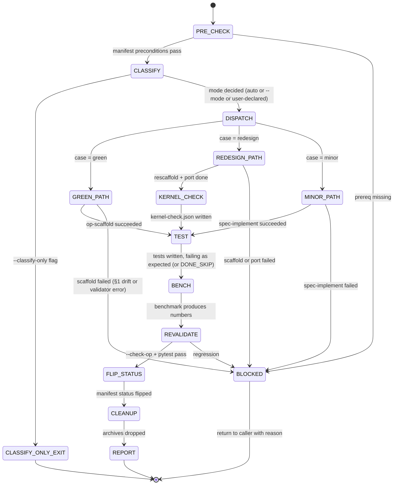

## Arguments

- `op_name` (positional) — manifest key, e.g. `CumsumFwdOp`.
- `--mode=green|redesign|minor` (optional) — override the automatic classification. When omitted, `CLASSIFY` decides (auto if unambiguous, otherwise prompt).
- `--classify-only` (optional) — stop after `CLASSIFY`; write `mode.json` and return without executing any case path. Use to ask "which case is this op in?" without side effects.

## Contract

- **Input**: `op_name` must be present in [`tileops/ops_manifest.yaml`](../../../tileops/ops_manifest.yaml) with `status: spec-only` and a non-empty `source.kernel_map` (same preconditions as op-scaffold; see [PRE_CHECK](#pre_check)).
- **Output** (SUCCESS path): op file at `source.op` aligned with the manifest; test file `source.test` aligned; `__init__.py` registrations consistent; `status` flipped `spec-only → implemented` (single commit). Side-artefacts in `.foundry/plan/<op_name>/`: `mode.json` (classification), `plan.json` (op-scaffold's §1/§2/§3 when that skill ran), `kernel-check.json` (redesign case only), `pre-rewrite/source.py` (redesign case, removed at CLEANUP on SUCCESS).
- **Termination (success)**: `python scripts/validate_manifest.py --check-op <op_name>` reports no errors + `python -m pytest <source_test> -v` passes + benchmark produces numbers + manifest status flipped.
- **Termination (blocked)**: any sub-skill returns blocked, or §1 drift in op-scaffold, or kernel mismatch discovered in redesign path that op-align cannot resolve at the op layer. Report with concrete reason. Archives are kept for post-mortem.
- **Constraints**:
  - Only op-align (and only at FLIP_STATUS) may modify `ops_manifest.yaml`. Sub-skills never touch the manifest.
  - MUST NOT modify kernel code. Kernel-layer work, if needed, is surfaced via `kernel-check.json` as a separate follow-up.
  - MUST NOT expand to multi-op scope; that is `spec-pipeline`'s role.

## Trust model

- `CLASSIFY`, `DISPATCH`, `FLIP_STATUS`, `CLEANUP`, `REPORT` are orchestrator stages (op-align itself). Every other stage delegates to an atomic skill as a **separate sub-agent invocation**:

  | Stage         | Sub-skill                             |
  | ------------- | ------------------------------------- |
  | GREEN path    | `op-scaffold`                         |
  | REDESIGN path | `op-scaffold` (after ARCHIVE + CLEAR) |
  | MINOR path    | `spec-implement`                      |
  | TEST          | `spec-test`                           |
  | BENCH         | `spec-bench`                          |

  Separate invocations preserve the per-skill contracts (e.g., op-scaffold's §1 fact-freeze; spec-implement's no-test-modification rule).

- After each sub-skill returns, op-align verifies `git status --porcelain` is empty before dispatching the next. If a sub-skill left an uncommitted change, op-align commits on its behalf with `Sub-skill [name]: [summary]` before proceeding.

## Workflow



## Steps

### <a id="pre_check"></a>1. PRE_CHECK

Preconditions identical to `op-scaffold`'s — orchestrator enforces them up front so sub-skills never see ill-formed input:

- `op_name` in `ops_manifest.yaml` → proceed; otherwise BLOCKED ("op not in manifest").
- `status: spec-only` → proceed; `implemented` → BLOCKED ("already aligned; flip status to spec-only in a manifest PR first if you intend to re-align"); missing/other → BLOCKED.
- `source.kernel_map` declared and non-empty → proceed; missing → BLOCKED with the same guidance op-scaffold uses (add in a prerequisite manifest PR).
- Every value in `source.kernel_map` resolves to an importable symbol → proceed; otherwise BLOCKED ("kernel class not found at expected path" — kernel must exist for op layer to align, regardless of case).

### 2. CLASSIFY

Decide which case applies. Machine-decidable input: does `source.op` exist?

| Input                      | Auto case | User prompt?                                                |
| -------------------------- | --------- | ----------------------------------------------------------- |
| `source.op` does not exist | `green`   | no                                                          |
| `source.op` exists         | (unknown) | yes — "redesign (rewrite + port) or minor (in-place edit)?" |

`--mode=<case>` overrides prompting. `--mode=green` is rejected if `source.op` exists (would silently delete existing code); use `--mode=redesign` instead.

Write `.foundry/plan/<op_name>/mode.json`:

```json
{
  "op_name": "CumsumFwdOp",
  "case": "redesign",
  "file_present": true,
  "kernel_class_importable": true,
  "decided_by": "user_prompt",
  "reason": "User declared: manifest _static_axes shape rewritten; structural redesign.",
  "classified_at": "2026-04-24T..."
}
```

`decided_by` is one of `auto` / `user_prompt` / `flag_override`. `reason` is free-form text.

If `--classify-only` was passed, terminate here and print the mode.json content. No other side effects.

### 3. DISPATCH — case-specific main stage

Each path produces the aligned op file under `source.op` plus whatever artefacts the sub-skill creates under `.foundry/plan/<op_name>/`.

#### 3a. GREEN path (`case = green`)

```
op-scaffold <op_name>
```

Sub-skill does PRE_CHECK → DRY_RUN (plan.json) → EMIT → REGISTER → VALIDATE → REPORT. op-align waits for SUCCESS or BLOCKED; on BLOCKED, surface the row and terminate.

#### 3b. REDESIGN path (`case = redesign`)

Sequence:

1. **ARCHIVE** — `mkdir -p .foundry/plan/<op_name>/pre-rewrite/`, copy `source.op` there as `source.py` (rename: strip family path, keep basename). The archive is the source of truth for manual porting. It persists until CLEANUP.
1. **CLEAR** — remove `source.op` from the tree; remove the op's `from .<module> import <ClassName>` line and its `__all__` entry from the package `__init__.py`. Commit as `[Chore] op-align: archive <op_name> before rescaffold`.
1. **SCAFFOLD** — `op-scaffold <op_name>`. Target now absent, PRE_CHECK passes, emits the 17 mechanical slots.
1. **PORT** — read `pre-rewrite/source.py` and port op-specific content that the scaffold cannot produce:
   - Optional hooks (`_pad_value`, `_validate_dim`, `_pre_kernel`, `_post_kernel`, `_cache_key` override).
   - Family-specific protocol variables (`_op_kind`, `_kernel_key`, `_kernel_cls`, etc.) if the op was a T1 thin wrapper.
   - Any `forward` body specifics beyond the universal pattern (kernel-specific reshape/movedim choreography).
   - Any class-level non-slot attributes the old file had that still make sense under the new spec.
     Commit as `[Feat] op-align: port business logic for <op_name> from pre-rewrite`. If the agent is uncertain whether a specific override should be ported, record an `open_questions` item in plan.json §3 (`needs_human_decision`) and port conservatively.
1. **KERNEL_CHECK** — see §5 below.

#### 3c. MINOR path (`case = minor`)

```
spec-implement <op_name>
```

Sub-skill does ANALYZE → DIAGNOSE → IMPLEMENT → VALIDATE → MARK_DONE → COMMIT. Op-align waits for SUCCESS or BLOCKED.

### 4. Skipped anchor (reserved)

### <a id="kernel_check"></a>5. KERNEL_CHECK (redesign path only)

Determine whether the kernel layer also needs work. Op-align does **not** modify kernel code; it surfaces the question.

For each Kernel class referenced in `source.kernel_map`:

1. Inspect the kernel's `__init__` / `forward` / `_build_program` signatures (wherever applicable) in its source file.
1. Compare against the new op's kernel-build call emitted by op-scaffold (`self.kernel_map[<key>](<args>)`). Specifically check:
   - Argument names and positional order.
   - Argument types.
   - Any layout / dtype expectations the kernel documents.
1. Classify per kernel:
   - `aligned` — new op's kernel invocation matches the kernel's ctor; no kernel work.
   - `signature_drift` — arg names or order differ; kernel ctor must be adjusted.
   - `semantic_drift` — the kernel expects a different data layout / dtype than the new op provides (e.g. op now passes `(M, N)` where kernel expects `(N, M)`).
   - `unknown` — cannot determine from static inspection.

Write `.foundry/plan/<op_name>/kernel-check.json`:

```json
{
  "op_name": "CumsumFwdOp",
  "checked_at": "2026-04-24T...",
  "kernels": [
    {
      "dispatch_key": "cumulative_fwd",
      "kernel_class": "CumulativeKernel",
      "kernel_source": "tileops/kernels/reduction/cumulative.py",
      "classification": "aligned",
      "op_call": "self.kernel_map['cumulative_fwd'](M, N, 'sum', self.dtype, tune=self.tune)",
      "kernel_ctor": "__init__(self, M, N, op_kind, dtype, *, tune=False)",
      "notes": "Positional and named args match; no kernel work required."
    }
  ]
}
```

Non-`aligned` entries surface in REPORT as `needs_kernel_work` follow-ups. Op-align itself continues to TEST — the downstream path may still pass if the kernel drift only affects performance (not correctness), or fail fast if the kernel mismatch causes runtime errors, which REVALIDATE will catch.

### 6. TEST

```
spec-test <op_name>
```

Sub-skill writes tests against the new spec, confirms they fail (or DONE_SKIP if base class fix from a sibling already handles them). Reuses existing spec-test contract unchanged.

### 7. BENCH

```
spec-bench <op_name>
```

Produces numbers. Sub-skill unchanged. If BLOCKED and reason is not kernel-related, propagate blocked.

### 8. REVALIDATE

```bash
python scripts/validate_manifest.py --check-op <op_name>
python -m pytest <source_test> -v
```

Both must pass. Regression after benchmark changes → BLOCKED.

### 9. FLIP_STATUS

Orchestrator (not a sub-skill) edits the manifest:

- `ops.<op_name>.status: spec-only` → `status: implemented`
- Commit as `[Refactor][Manifest] promote <op_name> to implemented`.

This is the only manifest write in the entire workflow.

### 10. CLEANUP

On SUCCESS path:

- Delete `.foundry/plan/<op_name>/pre-rewrite/` (redesign case only; archive purpose is served).
- Keep `mode.json`, `plan.json`, `kernel-check.json` as audit trail — they are under `.foundry/plan/` which is gitignored but persists in the local worktree.

On BLOCKED path: keep all artefacts for post-mortem.

### 11. REPORT

Single-page summary printed to stdout. Always includes:

```
Status: SUCCESS | BLOCKED
Op: <op_name>
Case: green | redesign | minor
Mode decided by: auto | user_prompt | flag_override
File: <source.op> (<lines>)

Sub-skills run:
  - op-scaffold: <SUCCESS|BLOCKED|skipped>
  - spec-implement: <...>
  - spec-test: <...>
  - spec-bench: <...>

Plan artefacts (.foundry/plan/<op_name>/):
  - mode.json
  - plan.json (if op-scaffold ran)
  - kernel-check.json (if redesign path)
  - pre-rewrite/ (redesign path, cleaned on SUCCESS)

Status flipped: spec-only → implemented (commit <sha>)

Follow-ups:
  - <needs_kernel_work for kernel X> (from kernel-check.json non-aligned entries)
  - <needs_doc_fix for slot S21> (from plan.json §3)
  - <needs_human_decision about port of _pad_value> (from port observations)
```

On BLOCKED, replace "Status flipped" line with the blocking error and list remaining follow-ups.

## Interaction with `spec-pipeline`

`spec-pipeline` remains the family-scoped orchestrator. Its per-op inner loop (`TEST → IMPLEMENT → BENCH → REVALIDATE → FLIP_STATUS`) can be refactored to call `op-align` instead of managing the per-op stages itself. That refactor is out of scope for this PR — current spec-pipeline stays functional; a follow-up can consolidate.

Until consolidated:

- Use `op-align <op>` for per-op work (redesign or minor delta, or green field when a manifest PR added a new entry).
- Use `spec-pipeline <family>` for family-scoped historical migration of many ops at once.

They do not conflict. `op-align` never manages cross-op cleanup gates; that remains `spec-pipeline`'s.

## Non-goals

- **Kernel scaffolding / kernel-layer edits.** Op-align surfaces kernel work as a follow-up via `kernel-check.json`; a separate (future) `kernel-scaffold` / `kernel-align` skill will own that layer.
- **Family-level cleanup.** Cross-op dual-path removal lives in `spec-pipeline` and is not a concern of per-op alignment.
- **Auto-detecting "redesign vs minor."** The distinction is a design judgement; op-align prompts or accepts `--mode`.
- **Manifest changes (other than FLIP_STATUS).** Per the trust model, manifest changes live in separate manifest PRs.
