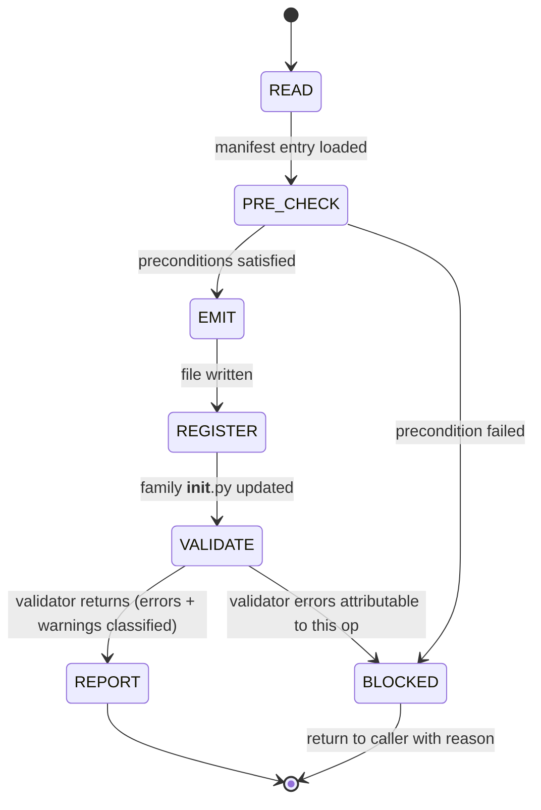

## Arguments

`op_name` (positional) — manifest key for the op to scaffold, equal to the target `cls.__name__` (e.g. `CumsumFwdOp`).

## Contract

- **Input**: `op_name` must be present in [`tileops/ops_manifest.yaml`](../../../tileops/ops_manifest.yaml).
- **Output**: new file at `tileops/ops/{family}/{snake_case_name}.py` containing the 17 scaffold slots; one-line `from .<module> import <ClassName>` added to `tileops/ops/{family}/__init__.py` with a matching `__all__` entry.
- **Termination (success)**: `python scripts/validate_manifest.py` reports **no new errors** attributable to this op. Warnings are allowed and passed through to the final summary.
- **Termination (blocked)**: any validator error for `op_name` that the scaffold cannot fix by re-reading the playbook's slot rules. Do NOT commit; report with the failing rows from the validator.
- **Constraints**:
  - MUST NOT emit family-specific protocol variables (`_op_kind`, `_kernel_key`, `_kernel_cls`, `_kernel_handles_padding`, `_op_name`, `kernel_cls`).
  - MUST NOT emit optional hooks (`_pad_value`, `_validate_dim`, `_pre_kernel`, `_post_kernel`, `_cache_key` override).
  - MUST NOT implement the kernel itself.
  - MUST NOT modify `ops_manifest.yaml`, tests, benchmarks, or any existing op file.
  - MUST NOT extend scope to a T1 (family-base) subclass — the scaffold is T2 only.

## Workflow



## Scope boundary

The scaffold emits **exactly** the 17 slots defined in [`docs/ops-design-reference.md` § Slot Rules](../../../docs/ops-design-reference.md#slot-rules): S1-S7 (file header, imports, class, docstring), S12-S13 (`__init__` signature and body), S14-S16 (`default_kernel_map`, `forward`), S17-S19 (`_infer_output_shapes`, `_validate_dtypes`, `eval_roofline`), S20 (package registration), S21 (`_static_axes`). S8-S11 are intentionally skipped (reserved from slot iteration for T1 thin-wrapper slots).

Explicitly **out of scope** — leave empty, do not invent:

- **Family-specific protocol variables** (e.g. `_op_kind` for reduction, `_op_name` for elementwise). Kernel-dispatch-convention-dependent; cannot be derived from the manifest. See [Family-Base Protocol (Appendix)](../../../docs/ops-design-reference.md#base-class-protocol).
- **Optional hooks** (`_pad_value`, `_validate_dim`, `_pre_kernel`, `_post_kernel`). Op-specific business logic; no manifest derivation.
- **`_cache_key` override**. Required when `_static_axes` is empty, but the override logic depends on kernel math.
- **Kernel implementations**. The scaffold only references the Kernel classes named in `source.kernel_map`; their implementation is out of scope.
- **Tests and benchmarks**. Downstream skills (`spec-test`, `spec-bench`) own these.

These gaps are expected and acceptable. The resulting scaffold will raise `NotImplementedError` or trigger validator warnings when invoked beyond the 17 slots' coverage; that is the intended hand-off to `spec-implement` and the family-refactoring skill.

## Steps

### 1. READ

Load the manifest entry for `op_name`:

```bash
python -c "
import yaml
with open('tileops/ops_manifest.yaml') as f:
    m = yaml.safe_load(f)
entry = m['ops']['$op_name']
print(entry)
"
```

Extract: `family`, `status`, `signature.inputs`, `signature.outputs`, `signature.params`, `signature.static_dims`, `signature.shape_rules`, `source.kernel_map`, `source.op`, `source.kernel`, `roofline.vars`, `roofline.flops`, `roofline.bytes`.

Derive the target file path from `source.op` (e.g. `tileops/ops/reduction/cumsum.py`). Family is `source.op`'s parent directory name. Module filename is `source.op`'s basename without `.py`.

### 2. PRE_CHECK

- `op_name` present in `ops_manifest.yaml` → proceed; otherwise BLOCKED ("op not in manifest").
- `status` is `spec-only` or absent → proceed; `status: implemented` → BLOCKED ("op already implemented; use spec-implement to migrate").
- Target file `source.op` does NOT exist → proceed; exists → BLOCKED ("target file already present; scaffold would overwrite").
- Every value in `source.kernel_map` resolves to an importable symbol → proceed; otherwise BLOCKED ("kernel class not found at expected path").

BLOCKED terminations return without writing any file.

### 3. EMIT

Follow [`docs/ops-design.md` § Scaffolding an Op from a Manifest Entry](../../../docs/ops-design.md#scaffolding-an-op-from-a-manifest-entry) Steps 1-7 in order. For each scaffold slot, read the authoritative rule at `docs/ops-design-reference.md#slot-sN` before emitting.

Key slot pointers (follow the reference, do not re-derive):

| Playbook step | Slots          | Reference anchor                                                                                                                                                    |
| ------------- | -------------- | ------------------------------------------------------------------------------------------------------------------------------------------------------------------- |
| Step 1        | S1, S2, S3, S4 | [S1](../../../docs/ops-design-reference.md#slot-s1)-[S4](../../../docs/ops-design-reference.md#slot-s4)                                                             |
| Step 2        | S5, S6, S7     | [S5](../../../docs/ops-design-reference.md#slot-s5)-[S7](../../../docs/ops-design-reference.md#slot-s7)                                                             |
| Step 3        | S21, S12, S13  | [S21](../../../docs/ops-design-reference.md#slot-s21), [S12](../../../docs/ops-design-reference.md#slot-s12), [S13](../../../docs/ops-design-reference.md#slot-s13) |
| Step 4        | S14, S15, S16  | [S14](../../../docs/ops-design-reference.md#slot-s14)-[S16](../../../docs/ops-design-reference.md#slot-s16)                                                         |
| Step 5        | S17, S18       | [S17](../../../docs/ops-design-reference.md#slot-s17), [S18](../../../docs/ops-design-reference.md#slot-s18)                                                        |
| Step 6        | S19            | [S19](../../../docs/ops-design-reference.md#slot-s19)                                                                                                               |
| Step 7        | S20            | [S20](../../../docs/ops-design-reference.md#slot-s20)                                                                                                               |

If a slot's rule is ambiguous for the given manifest entry (e.g. multi-kernel `kernel_map`, multiple independent dtype axes, fixed-rank vs arbitrary-rank branching), STOP and surface the ambiguity in the final report instead of guessing. Do not expand scope.

### 4. REGISTER

Append to `tileops/ops/{family}/__init__.py`:

1. One `from .<module> import <ClassName>` line placed under the family's grouping comment (`# --- <KernelName> ops ---`). Create the comment block if the family doesn't have one yet.
1. A matching `<ClassName>` entry added to the module-level `__all__` list, preserving grouping order if `__all__` is commented into sections.

### 5. VALIDATE

Run the manifest validator on the full manifest (the validator filters by op internally):

```bash
python scripts/validate_manifest.py
```

Classify every line in the output that mentions `op_name`:

- **ERROR** attributable to `op_name` → BLOCKED. Do not commit. Copy the full error row into the report. If the error is a parity failure (L2 or L3 per PR #1005), re-check the emitted `_infer_output_shapes` or `_validate_dtypes` against the manifest's `shape_rules` / `dtype` / `dtype_combos` before classifying as BLOCKED — the scaffold may have mis-emitted.
- **ERROR** not attributable to `op_name` (pre-existing, other ops) → ignore, not blocking.
- **WARNING** attributable to `op_name` → pass through to the report unchanged.

Do NOT edit the manifest to silence an error. Do NOT set `parity_opt_out` to silence a parity error. If the scaffold cannot produce a body that satisfies the manifest, BLOCKED is the correct outcome.

### 6. REPORT

Print a concise summary in this format:

```
Status: SUCCESS | BLOCKED
Op: <op_name>
File: <path> (<lines>)
Package registration: tileops/ops/<family>/__init__.py (+1 import, +1 __all__)

Validator: <N errors, M warnings>
<if BLOCKED, list each blocking error row verbatim>

Warnings (not blocking):
  - <warning 1>
  - <warning 2>

Not filled (out of scope; hand-off to downstream):
  - Kernel implementation: <source.kernel>
  - Optional hooks: <list hook names if the family-base appendix documents any for this family>
  - Family protocol variables: <list if this family uses any, e.g. reduction's _op_kind>
  - _cache_key override: required if _static_axes is empty
```

On SUCCESS, commit the new file + `__init__.py` update with message `[Feat][OPS] scaffold <op_name>`. On BLOCKED, leave the working tree dirty and return without committing — caller inspects and decides.

## Calibration against the playbook

The scaffold's behaviour must stay in sync with `docs/ops-design.md` and `docs/ops-design-reference.md`. If you discover during EMIT or VALIDATE that a slot rule is internally inconsistent or cannot be mechanically followed, file a follow-up documentation issue and BLOCK; do NOT paper over by inventing slot behaviour.

## Non-goals

- Not a codegen engine. This skill is an agent-executable procedure. A future real codegen script can replace the EMIT step; the skill's input/output contract is designed to be codegen-compatible.
- Not a migration driver. If `op_name` already exists with `status: implemented`, use `spec-implement` (or `spec-pipeline`) instead.
- Not a kernel scaffold. Kernel-side scaffolding is a separate concern.
