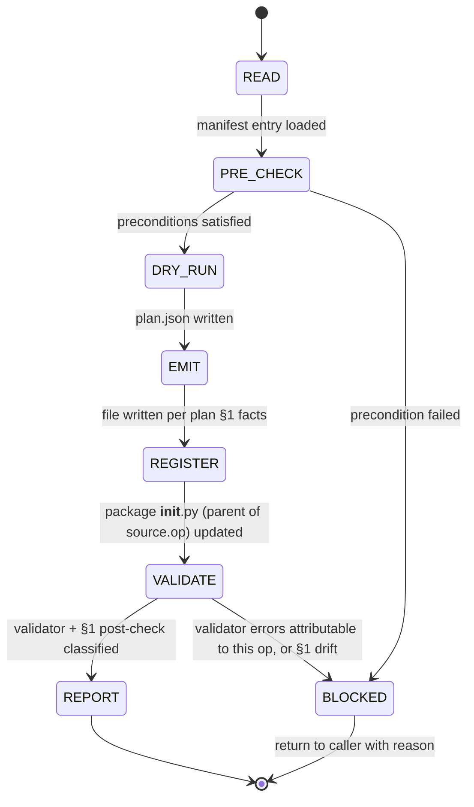

## Arguments

`op_name` (positional) — manifest key for the op to scaffold, equal to the target `cls.__name__` (e.g. `CumsumFwdOp`).

## Contract

- **Input**: `op_name` must be present in [`tileops/manifest/`](../../../tileops/manifest/) with `status: spec-only` and a non-empty `source.kernel_map`. `source.kernel_map` is manifest-level source of truth for Op→Kernel dispatch and cannot be derived by the scaffold (dispatch keys are kernel-internal conventions); adding it for a spec-only entry is a prerequisite manifest PR.
- **Output**: new file at the exact path declared by manifest `source.op` (e.g., `tileops/ops/reduction/cumsum.py`), containing the 17 scaffold slots; one-line `from .<module> import <ClassName>` added to the package `__init__.py` at that path's parent directory (e.g., `tileops/ops/reduction/__init__.py`) with a matching `__all__` entry. Note: the filesystem package directory (parent of `source.op`) is not always the same as the manifest `family` field — for example, `CumsumFwdOp` has `family: scan` but lives under `tileops/ops/reduction/`. Always key paths off `source.op`, never off `family`. Plus a side-artefact at `.foundry/plan/<op_name>/plan.json` carrying the DRY_RUN self-audit (not tracked in git).
- **Termination (success)**: `python scripts/validate_manifest.py --check-op <op_name>` reports **no errors** for this op. Warnings are allowed and passed through to the final summary.
- **Termination (blocked)**: any validator error for `op_name` that the scaffold cannot fix by re-reading the playbook's slot rules. Do NOT commit; report with the failing rows from the validator.
- **Constraints**:
  - MUST NOT emit family-specific protocol variables (`_op_kind`, `_kernel_key`, `_kernel_cls`, `_kernel_handles_padding`, `_op_name`, `kernel_cls`).
  - MUST NOT emit optional hooks (`_pad_value`, `_validate_dim`, `_pre_kernel`, `_post_kernel`, `_cache_key` override).
  - MUST NOT implement the kernel itself.
  - MUST NOT modify `tileops/manifest/`, tests, benchmarks, or any existing op file.
  - MUST NOT extend scope to a T1 (family-base) subclass — the scaffold is T2 only.

## Workflow



`DRY_RUN` is the skill's self-audit before codegen: agent freezes manifest-sourced facts as a JSON contract (`plan.json` §1), records its own judgement calls (§2), and tags open questions (§3). `VALIDATE` re-parses the emitted file and diffs it against §1 — any drift means the skill (agent) deviated from its own frozen contract, not that the manifest or docs are wrong.

## Scope boundary

The scaffold emits **exactly** the 17 slots defined in [`docs/ops-design-reference.md` § Slot Rules](../../../docs/ops-design-reference.md#slot-rules): S1-S7 (file header, imports, class, docstring), S12-S13 (`__init__` signature and body), S14-S16 (`default_kernel_map`, `forward`), S17-S19 (`_infer_output_shapes`, `_validate_dtypes`, `eval_roofline`), S20 (package registration), S21 (`_static_axes`). S8-S11 are intentionally skipped (reserved from slot iteration for T1 thin-wrapper slots).

Explicitly **out of scope** — leave empty, do not invent:

- **Family-specific protocol variables** (e.g. `_op_kind` for reduction, `_op_name` for elementwise). Kernel-dispatch-convention-dependent; cannot be derived from the manifest. See [Family-Base Protocol (Appendix)](../../../docs/ops-design-reference.md#base-class-protocol).
- **Optional hooks** (`_pad_value`, `_validate_dim`, `_pre_kernel`, `_post_kernel`). Op-specific business logic; no manifest derivation.
- **`_cache_key` override**. Recommended for cache efficiency under dynamic shapes when `_static_axes` is empty — the `Op._cache_key` default is correctness-preserving (it keys by all non-static axis sizes) but may over-fragment under dynamic shapes and emits a once-per-type `UserWarning` to surface the missing override. The override logic depends on kernel math and is out of scope for scaffolding.
- **Kernel implementations**. The scaffold only references the Kernel classes named in `source.kernel_map`; their implementation is out of scope.
- **Tests and benchmarks**. Downstream skills (`test-op`, `bench-op`) own these.

These gaps are expected and acceptable. The resulting scaffold will raise `NotImplementedError` or trigger validator warnings when invoked beyond the 17 slots' coverage; that is the intended hand-off to `implement-op` and the family-refactoring skill.

## Steps

### 1. READ

Load the manifest entry for `op_name`:

Before running the snippet, substitute `<op_name>` with the requested manifest key (the skill's positional argument — agent literal substitution, not shell interpolation):

```bash
python - "<op_name>" <<'PY'
import sys
from tileops.manifest import load_manifest

op_name = sys.argv[1]
entry = load_manifest()[op_name]
print(entry)
PY
```

Extract: `family`, `status`, `signature.inputs`, `signature.outputs`, `signature.params`, `signature.static_dims`, `signature.shape_rules`, `source.kernel_map`, `source.op`, `source.kernel`, `roofline.vars`, `roofline.flops`, `roofline.bytes`.

Derive the target file path from `source.op` (e.g. `tileops/ops/reduction/cumsum.py`). The **filesystem package directory** is `source.op`'s parent (e.g. `tileops/ops/reduction/`). Do not use the manifest `family` field to compute paths — it is a semantic label, and some ops have `family` distinct from their filesystem parent (e.g., `CumsumFwdOp` has `family: scan` but lives under `reduction/`). Module filename is `source.op`'s basename without `.py`.

### 2. PRE_CHECK

- `op_name` present in `tileops/manifest/` → proceed; otherwise BLOCKED ("op not in manifest").
- `status` field explicitly set to `spec-only` → proceed; `status: implemented` → BLOCKED ("op already implemented; use implement-op to migrate"); missing `status` or any other value → BLOCKED ("manifest entry must declare a valid top-level `status`; the validator treats `status` as required").
- `source.kernel_map` declared and non-empty → proceed; missing or empty → BLOCKED ("manifest entry needs `source.kernel_map` before scaffolding — add the dispatch map in a separate manifest PR per the trust model; the scaffold cannot invent dispatch keys because they are kernel-internal conventions"). Note: per `docs/manifest.md`, `source.kernel_map` is only required when `status: implemented`, so many existing `spec-only` entries lack it — these are the cases that need the manifest-PR prerequisite before scaffolding can run.
- Every value in `source.kernel_map` resolves to an importable symbol → proceed; otherwise BLOCKED ("kernel class not found at expected path").
- Target file `source.op` does NOT exist → proceed; exists → BLOCKED ("target file already present; scaffold would overwrite").

BLOCKED terminations return without writing any file.

### 3. DRY_RUN

Before any code is emitted, produce a self-audit plan at `.foundry/plan/<op_name>/plan.json`. This is the skill's own contract — it freezes manifest-sourced facts so that later EMIT cannot silently drift, and it lets the agent record its own judgement calls and observations.

The file has three top-level keys: `locked_facts`, `agent_notes`, `open_questions`.

**`locked_facts` (§1) — non-negotiable, machine-diffed at VALIDATE**

Verbatim extraction from the manifest entry. If the emitted file disagrees with any field here, VALIDATE raises a hard error (skill bug, not a manifest or doc issue).

```json
{
  "locked_facts": {
    "op_name": "CumsumFwdOp",
    "class_name": "CumsumFwdOp",
    "family": "scan",
    "module_path": "tileops/ops/reduction/cumsum.py",
    "parent_class": "Op",
    "kernel_imports": [
      {"module": "tileops.kernels.reduction.cumulative", "symbol": "CumulativeKernel"}
    ],
    "kernel_map": {"cumulative_fwd": "CumulativeKernel"},
    "init_kwargs": [
      {"name": "N", "source": "static_dims", "type": "int", "default": null},
      {"name": "dtype", "source": "dtype", "type": "torch.dtype", "default": null},
      {"name": "dim", "source": "signature.params.dim", "type": "int", "default": -1}
    ],
    "forward_inputs": ["x"],
    "forward_outputs": ["y"],
    "dtype_unions": {"x": ["float32", "float16", "bfloat16"]},
    "dtype_combos": null,
    "shape_rules": ["-x.ndim <= dim < x.ndim", "y.shape == x.shape"],
    "static_dims": {"N": "x.shape[dim]"},
    "roofline": {
      "vars": {
        "M": "product(x.shape[:dim % x.ndim]) * product(x.shape[dim % x.ndim + 1:])",
        "N": "x.shape[dim % x.ndim]"
      },
      "flops": "M * N",
      "bytes": "2 * M * N * elem_bytes"
    }
  }
}
```

**`agent_notes` (§2) — agent discretion, NOT diffed at VALIDATE**

Judgement calls and codebase observations that inform EMIT without being locked. Record them so the reasoning is auditable but not brittle.

```json
{
  "agent_notes": {
    "docstring_summary": "Cumulative sum operator: y = cumsum(x, dim=-1).",
    "kernel_ctor_signature_observed": "CumulativeKernel(M, N, op_kind, dtype, tune=False)",
    "helper_state_on_self": ["N_padded = align_up(N, DEFAULT_ALIGNMENT)", "_kernel_cache = {}"],
    "forward_reshape_strategy": "movedim(dim, -1) + reshape to (M, N); restore via movedim(-1, dim)",
    "codebase_references_consulted": [
      "tileops/ops/reduction/cumsum.py (for helper-var names like N_padded)",
      "tileops/kernels/reduction/cumulative.py (kernel ctor signature)"
    ]
  }
}
```

**`open_questions` (§3) — tagged observations for post-run iteration, NOT blocking**

Ambiguities the agent had to judgement-call through, plus anything that smells like it needs human or doc attention. This section does NOT block DRY_RUN or EMIT — the skill proceeds with the agent's best judgement. These items are surfaced in the final REPORT for follow-up.

Each item carries a tag driving the follow-up action:

- `needs_doc_fix` — design docs (`ops-design.md`, `ops-design-reference.md`, `roofline.md`, `manifest.md`) don't cover the case encountered. Follow-up: file a doc issue.
- `needs_manifest_fix` — the op's manifest entry is missing or ambiguous (not a general-doc gap, this specific entry). Follow-up: file a manifest-PR.
- `needs_human_decision` — a legitimate design call that's neither doc nor manifest's fault; this op needs a human to look at it. Follow-up: route to reviewer.

```json
{
  "open_questions": [
    {
      "tag": "needs_human_decision",
      "topic": "multi-kernel dispatch selection",
      "detail": "kernel_map has 3 entries; chose 'mha_bwd' as primary. Confirm?"
    },
    {
      "tag": "needs_doc_fix",
      "topic": "fixed-rank vs arbitrary-rank in Step 3",
      "detail": "playbook Step 3 Example is arbitrary-rank; fixed-rank branching is not spelled out in ops-design-reference.md"
    }
  ]
}
```

DRY_RUN terminates by writing `plan.json` and proceeding to EMIT unconditionally. Empty `open_questions` is fine. Non-empty is fine. Only the validator and §1-drift checks in VALIDATE can BLOCK.

### 4. EMIT

Follow [`docs/ops-design.md` § Scaffolding an Op from a Manifest Entry](../../../docs/ops-design.md#scaffolding-an-op-from-a-manifest-entry) Steps 1-7 in order. For each scaffold slot, read the authoritative rule at `docs/ops-design-reference.md#slot-sN` before emitting.

Key slot pointers (follow the reference, do not re-derive):

| Playbook step | Slots          | Reference anchor                                                                                                                                                    |
| ------------- | -------------- | ------------------------------------------------------------------------------------------------------------------------------------------------------------------- |
| Step 1        | S1, S2, S3, S4 | [S1](../../../docs/ops-design-reference.md#slot-s1)-[S4](../../../docs/ops-design-reference.md#slot-s4)                                                             |
| Step 2        | S5, S6, S7     | [S5](../../../docs/ops-design-reference.md#slot-s5)-[S7](../../../docs/ops-design-reference.md#slot-s7)                                                             |
| Step 3        | S21, S12, S13  | [S21](../../../docs/ops-design-reference.md#slot-s21), [S12](../../../docs/ops-design-reference.md#slot-s12), [S13](../../../docs/ops-design-reference.md#slot-s13) |
| Step 4        | S14, S15, S16  | [S14](../../../docs/ops-design-reference.md#slot-s14)-[S16](../../../docs/ops-design-reference.md#slot-s16)                                                         |
| Step 5        | S17, S18       | [S17](../../../docs/ops-design-reference.md#slot-s17), [S18](../../../docs/ops-design-reference.md#slot-s18)                                                        |
| Step 6        | S19            | [S19](../../../docs/ops-design-reference.md#slot-s19)                                                                                                               |
| Step 7        | S20            | [S20](../../../docs/ops-design-reference.md#slot-s20)                                                                                                               |

If a slot's rule is ambiguous for the given manifest entry (e.g. multi-kernel `kernel_map`, multiple independent dtype axes, fixed-rank vs arbitrary-rank branching), STOP and surface the ambiguity in the final report instead of guessing. Do not expand scope.

### 5. REGISTER

Append to the package `__init__.py` at the parent directory of `source.op` (e.g., `tileops/ops/reduction/__init__.py`):

1. One `from .<module> import <ClassName>` line, matching the file's existing style. Inspect the current `__init__.py` first:
   - **File uses grouping comments `# --- <KernelClassName> ops ---`** (e.g., `tileops/ops/reduction/__init__.py`): place the import under the matching kernel block, where `<KernelClassName>` is the primary Kernel class name from `source.kernel_map` (the single value for single-kernel ops; for multi-kernel ops, the value shared with already-grouped siblings). If no existing block references the kernel, create a new `# --- <KernelClassName> ops ---` block at the natural position (keep groups in kernel-name alphabetical order, or follow any existing convention in the file).
   - **File uses flat imports with no grouping comments** (e.g., `tileops/ops/norm/__init__.py`, `tileops/ops/attention/__init__.py`): append the import alongside the existing package imports following the current ordering convention (alphabetical by filename is common). Do NOT introduce new block comments — match the file's existing style.
1. A matching `<ClassName>` entry added to the module-level `__all__` list. If `__all__` is commented into sections, preserve grouping order. If `__all__` is a flat list, update it flat — do not introduce new commented sections or other grouping scaffolding.

### 6. VALIDATE

Two checks in order. The first catches skill-bugs; the second catches spec disagreements.

**(a) §1 post-check (plan vs emitted)** — mechanical diff between `plan.json.locked_facts` and the facts extracted from the emitted file:

Mechanical diff across **both** emitted artefacts (the new op file and the updated package `__init__.py`), using syntax-aware and text-aware checks as appropriate:

- Parse the new file at `source.op` with `ast`. Extract class name, base class, import list, `__all__`, `__init__` kwarg names / defaults / types in order, `forward` parameter names, `default_kernel_map` dict, `_static_axes` class attribute.
- For `dirname(source.op)/__init__.py`: use **both** `ast` and raw-source text.
  - `ast`: verify the exact `from .<module> import <ClassName>` import exists and that `__all__` contains a matching `<ClassName>` entry.
  - Raw source text / token-level inspection: verify the import sits under the correct `# --- <KernelClassName> ops ---` block when the file uses grouping comments, or that a newly created block was inserted in the correct order; verify `__all__` section placement when `__all__` is sectioned. Comment-delimited placement cannot be asserted from `ast` alone because comments are not preserved in the AST. When the file is flat-style (no grouping comments), skip the block-placement check — only presence + ordering matter.
- For each field in `locked_facts`, compare against the applicable artefact using the appropriate extraction method (op-file facts from the `source.op` AST; `__init__.py` registration facts from AST plus raw-source / token inspection for comment-delimited placement). Any mismatch is a skill bug — BLOCKED with a `§1 drift: <field>` row. The agent deviated from its own frozen contract during EMIT. Do NOT rationalize; do NOT edit the plan to match. Fix the emitted op file or `__init__.py`, or if the plan itself was wrong, revert and restart DRY_RUN.

**(b) Manifest validator** — scoped to this op via `--check-op` so that L0-L4 checks run even on a freshly scaffolded `status: spec-only` entry (the default run skips L1-L4 for `spec-only`):

```bash
python scripts/validate_manifest.py --check-op <op_name>
```

Classify every line in the output:

- **ERROR** → BLOCKED. Do not commit. Copy the full error row into the report. If the error is a parity failure (L2 or L3 per PR #1005), re-check the emitted `_infer_output_shapes` or `_validate_dtypes` against the manifest's `shape_rules` / `dtype` / `dtype_combos` before classifying as BLOCKED — the scaffold may have mis-emitted.
- **WARNING** → pass through to the report unchanged.

Do NOT edit the manifest to silence an error. Do NOT set `parity_opt_out` to silence a parity error. If the scaffold cannot produce a body that satisfies the manifest, BLOCKED is the correct outcome.

### 7. REPORT

Print a concise summary in this format. The REPORT is the single surface where post-run iteration feedback leaves the skill — it is the only channel for `open_questions` to reach the caller.

```
Status: SUCCESS | BLOCKED
Op: <op_name>
File: <path> (<lines>)
Package registration: <parent-of-source.op>/__init__.py (+1 import, +1 __all__)
Plan: .foundry/plan/<op_name>/plan.json

§1 drift: <none, or list of <field>: <plan value> vs <emitted value>>
Validator: <N errors, M warnings>
<if BLOCKED, list each blocking error row verbatim>

Warnings (not blocking):
  - <warning 1>
  - <warning 2>

Open questions (post-run iteration; from plan.json §3):
  needs_doc_fix:
    - <topic>: <detail>
  needs_manifest_fix:
    - <topic>: <detail>
  needs_human_decision:
    - <topic>: <detail>

Not filled (out of scope; hand-off to downstream):
  - Kernel implementation: <source.kernel>
  - Optional hooks: <list hook names if the family-base appendix documents any for this family>
  - Family protocol variables: <list if this family uses any, e.g. reduction's _op_kind>
  - _cache_key override: recommended for cache efficiency under dynamic shapes / empty _static_axes; the default is correctness-preserving but may over-fragment
```

On SUCCESS, commit the new file + `__init__.py` update with message `[Feat][OPS] scaffold <op_name>`. On BLOCKED, leave the working tree dirty and return without committing — caller inspects and decides. In both cases, `plan.json` remains under `.foundry/plan/<op_name>/` for post-mortem / follow-up action.

## Calibration against the playbook

The scaffold's behaviour must stay in sync with `docs/ops-design.md` and `docs/ops-design-reference.md`. If you discover during EMIT or VALIDATE that a slot rule is internally inconsistent or cannot be mechanically followed, file a follow-up documentation issue and BLOCK; do NOT paper over by inventing slot behaviour.

## Non-goals

- Not a codegen engine. This skill is an agent-executable procedure. A future real codegen script can replace the EMIT step; the skill's input/output contract is designed to be codegen-compatible.
- Not a migration driver. If `op_name` already exists with `status: implemented`, use `implement-op` (or `align-family`) instead.
- Not a kernel scaffold. Kernel-side scaffolding is a separate concern.
