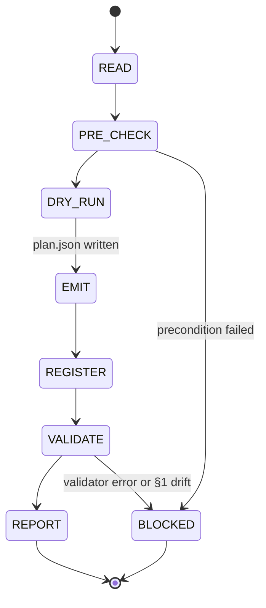

## Arguments

`op_name` (positional) — manifest key for the op to scaffold, equal to the target `cls.__name__` (e.g. `CumsumFwdOp`).

## Contract

- **Input**: `op_name` must be present in [`tileops/manifest/`](../../../tileops/manifest/) with `status: spec-only` and a non-empty `source.kernel_map`. `source.kernel_map` is manifest-level source of truth for Op→Kernel dispatch and cannot be derived by the scaffold (dispatch keys are kernel-internal conventions); adding it for a spec-only entry is a prerequisite manifest PR.
- **Output**: new file at the exact path declared by manifest `source.op` (e.g., `tileops/ops/reduction/cumsum.py`), containing the 17 scaffold slots; one-line `from .<module> import <ClassName>` added to the package `__init__.py` at that path's parent directory (e.g., `tileops/ops/reduction/__init__.py`) with a matching `__all__` entry. Note: the filesystem package directory (parent of `source.op`) is not always the same as the manifest `family` field — for example, `CumsumFwdOp` has `family: scan` but lives under `tileops/ops/reduction/`. Always key paths off `source.op`, never off `family`. Plus a side-artefact at `.foundry/plan/<op_name>/plan.json` carrying the DRY_RUN self-audit (not tracked in git).
- **Termination (success)**: `python scripts/validate_manifest.py --check-op <op_name>` reports **no errors** for this op. Warnings are allowed and passed through to the final summary.
- **Termination (blocked)**: any validator error for `op_name` that the scaffold cannot fix by re-reading the playbook's slot rules. Do NOT commit; report with the failing rows from the validator.
- **Constraints**:
  - MUST NOT emit family-specific protocol variables (`_op_kind`, `_kernel_key`, `_kernel_cls`, `_kernel_handles_padding`, `_op_name`, `kernel_cls`).
  - MUST NOT emit optional hooks (`_pad_value`, `_validate_dim`, `_pre_kernel`, `_post_kernel`, `_cache_key` override).
  - MUST NOT implement the kernel itself.
  - MUST NOT modify `tileops/manifest/`, tests, benchmarks, or any existing op file.
  - MUST NOT extend scope to a T1 (family-base) subclass — the scaffold is T2 only.

## Workflow



`DRY_RUN` writes `plan.json` to freeze manifest-sourced facts before codegen. `VALIDATE` diffs the emitted file against `plan.json` §1 — any drift is a skill bug, not a manifest issue.

## Slot scope

Emit exactly the 17 slots in [`ops-design-reference.md § Slot Rules`](../../../docs/design/ops-design-reference.md#slot-rules): S1–S7, S12–S21. S8–S11 are reserved for T1 thin-wrapper subclasses and skipped.

Out of scope — leave empty:

| Item                                                                          | Reason                                                   |
| ----------------------------------------------------------------------------- | -------------------------------------------------------- |
| Family protocol vars (`_op_kind`, `_kernel_key`, `_op_name`, …)               | Kernel-dispatch convention; not in manifest              |
| Optional hooks (`_pad_value`, `_validate_dim`, `_pre_kernel`, `_post_kernel`) | Op-specific business logic                               |
| `_cache_key` override                                                         | Recommended under dynamic shapes; depends on kernel math |
| Kernel implementations                                                        | Owned by kernel skill                                    |
| Tests / benchmarks                                                            | Owned by `test-op` / `bench-op`                          |

These gaps surface as `NotImplementedError` or validator warnings; downstream skills fill them.

## Steps

### 1. READ

Load the manifest entry for `op_name`:

Before running the snippet, substitute `<op_name>` with the requested manifest key (the skill's positional argument — agent literal substitution, not shell interpolation):

```bash
python - "<op_name>" <<'PY'
import sys
from tileops.manifest import load_manifest

op_name = sys.argv[1]
entry = load_manifest()[op_name]
print(entry)
PY
```

Extract: `family`, `status`, `signature.inputs`, `signature.outputs`, `signature.params`, `signature.static_dims`, `signature.shape_rules`, `source.kernel_map`, `source.op`, `source.kernel`, `roofline.vars`, `roofline.flops`, `roofline.bytes`.

Derive the target file path from `source.op` (e.g. `tileops/ops/reduction/cumsum.py`). The **filesystem package directory** is `source.op`'s parent (e.g. `tileops/ops/reduction/`). Do not use the manifest `family` field to compute paths — it is a semantic label, and some ops have `family` distinct from their filesystem parent (e.g., `CumsumFwdOp` has `family: scan` but lives under `reduction/`). Module filename is `source.op`'s basename without `.py`.

### 2. PRE_CHECK

- `op_name` present in `tileops/manifest/` → proceed; otherwise BLOCKED ("op not in manifest").
- `status` field explicitly set to `spec-only` → proceed; `status: implemented` → BLOCKED ("op already implemented; use implement-op to migrate"); missing `status` or any other value → BLOCKED ("manifest entry must declare a valid top-level `status`; the validator treats `status` as required").
- `source.kernel_map` declared and non-empty → proceed; missing or empty → BLOCKED ("manifest entry needs `source.kernel_map` before scaffolding — add the dispatch map in a separate manifest PR per the trust model; the scaffold cannot invent dispatch keys because they are kernel-internal conventions"). Note: per `docs/design/manifest.md`, `source.kernel_map` is only required when `status: implemented`, so many existing `spec-only` entries lack it — these are the cases that need the manifest-PR prerequisite before scaffolding can run.
- Every value in `source.kernel_map` resolves to an importable symbol → proceed; otherwise BLOCKED ("kernel class not found at expected path").
- Target file `source.op` does NOT exist → proceed; exists → BLOCKED ("target file already present; scaffold would overwrite").

BLOCKED terminations return without writing any file.

### 3. DRY_RUN

Write `.foundry/plan/<op_name>/plan.json` with three sections:

| Section               | Diffed at VALIDATE?       | Content                                                                                                                                                                                                  |
| --------------------- | ------------------------- | -------------------------------------------------------------------------------------------------------------------------------------------------------------------------------------------------------- |
| `locked_facts` (§1)   | yes (hard error on drift) | Verbatim manifest extraction (op_name, class_name, family, module_path, kernel_imports, kernel_map, init_kwargs, forward_inputs/outputs, dtype_unions, dtype_combos, shape_rules, static_dims, roofline) |
| `agent_notes` (§2)    | no                        | Judgement calls (docstring, kernel ctor signature observed, helper state, forward reshape strategy, codebase refs consulted)                                                                             |
| `open_questions` (§3) | no                        | Ambiguities tagged `needs_doc_fix` / `needs_manifest_fix` / `needs_human_decision`; surfaced in REPORT, never block                                                                                      |

Always proceed to EMIT. Empty `open_questions` is fine.

Skeleton:

```json
{
  "locked_facts": {
    "op_name": "CumsumFwdOp",
    "module_path": "tileops/ops/reduction/cumsum.py",
    "kernel_map": {"cumulative_fwd": "CumulativeKernel"},
    "init_kwargs": [{"name": "dim", "source": "signature.params.dim", "type": "int", "default": -1}],
    "forward_inputs": ["x"],
    "static_dims": {"N": "x.shape[dim]"},
    "roofline": {"flops": "M * N", "bytes": "2 * M * N * elem_bytes"}
  },
  "agent_notes": {"docstring_summary": "...", "kernel_ctor_signature_observed": "..."},
  "open_questions": [{"tag": "needs_human_decision", "topic": "...", "detail": "..."}]
}
```

### 4. EMIT

Follow [`docs/design/ops-design.md` § Scaffolding an Op from a Manifest Entry](../../../docs/design/ops-design.md#scaffolding-an-op-from-a-manifest-entry) Steps 1-7 in order. For each scaffold slot, read the authoritative rule at `docs/design/ops-design-reference.md#slot-sN` before emitting.

Key slot pointers (follow the reference, do not re-derive):

| Playbook step | Slots          | Reference anchor                                                                                                                                                                         |
| ------------- | -------------- | ---------------------------------------------------------------------------------------------------------------------------------------------------------------------------------------- |
| Step 1        | S1, S2, S3, S4 | [S1](../../../docs/design/ops-design-reference.md#slot-s1)-[S4](../../../docs/design/ops-design-reference.md#slot-s4)                                                                    |
| Step 2        | S5, S6, S7     | [S5](../../../docs/design/ops-design-reference.md#slot-s5)-[S7](../../../docs/design/ops-design-reference.md#slot-s7)                                                                    |
| Step 3        | S21, S12, S13  | [S21](../../../docs/design/ops-design-reference.md#slot-s21), [S12](../../../docs/design/ops-design-reference.md#slot-s12), [S13](../../../docs/design/ops-design-reference.md#slot-s13) |
| Step 4        | S14, S15, S16  | [S14](../../../docs/design/ops-design-reference.md#slot-s14)-[S16](../../../docs/design/ops-design-reference.md#slot-s16)                                                                |
| Step 5        | S17, S18       | [S17](../../../docs/design/ops-design-reference.md#slot-s17), [S18](../../../docs/design/ops-design-reference.md#slot-s18)                                                               |
| Step 6        | S19            | [S19](../../../docs/design/ops-design-reference.md#slot-s19)                                                                                                                             |
| Step 7        | S20            | [S20](../../../docs/design/ops-design-reference.md#slot-s20)                                                                                                                             |

If a slot's rule is ambiguous for the given manifest entry (e.g. multi-kernel `kernel_map`, multiple independent dtype axes, fixed-rank vs arbitrary-rank branching), STOP and surface the ambiguity in the final report instead of guessing. Do not expand scope.

### 5. REGISTER

Append to the `__init__.py` at `dirname(source.op)`:

| File style                                                                                     | Action                                                                                                                   |
| ---------------------------------------------------------------------------------------------- | ------------------------------------------------------------------------------------------------------------------------ |
| Grouping comments `# --- <KernelClassName> ops ---` (e.g. `tileops/ops/reduction/__init__.py`) | Place import under matching kernel block; create a new block (alphabetical) when no existing block references the kernel |
| Flat imports (e.g. `tileops/ops/norm/__init__.py`)                                             | Append alongside existing imports following file's ordering convention; do NOT introduce grouping comments               |

Add matching `<ClassName>` to `__all__`, preserving any existing sectioning.

### 6. VALIDATE

**(a) §1 post-check** — diff `plan.json.locked_facts` against the emitted artefacts:

- Parse `source.op` with `ast`: extract class name, base, imports, `__all__`, `__init__` kwargs (names / defaults / types in order), `forward` params, `default_kernel_map` dict, `_static_axes`.
- Parse `dirname(source.op)/__init__.py` with both `ast` (presence + `__all__` membership) and raw text (block placement under `# --- <KernelClassName> ops ---` when the file uses grouping comments; skip placement check on flat-style files).
- Any `locked_facts` field mismatch → BLOCKED `§1 drift: <field>`. Skill deviated from its own contract; fix the emitted file (or revert and restart DRY_RUN if the plan was wrong). Do NOT edit `plan.json` to match.

**(b) Manifest validator**:

```bash
python scripts/validate_manifest.py --check-op <op_name>
```

`--check-op` runs L0–L4 even on `status: spec-only`. Classify output:

- **ERROR** → BLOCKED. Copy the row to REPORT. For L2 / L3 parity failures, re-check the emitted `_infer_output_shapes` / `_validate_dtypes` against manifest `shape_rules` / `dtype_combos` first — likely a mis-emit.
- **WARNING** → pass through.

Never edit the manifest to silence an error. No `parity_opt_out` escape hatch. Demote to `status: spec-only` only when the implementation genuinely cannot conform.

### 7. REPORT

```
Status: SUCCESS | BLOCKED
Op: <op_name>
File: <path> (<lines>)
Package registration: <parent-of-source.op>/__init__.py (+1 import, +1 __all__)
Plan: .foundry/plan/<op_name>/plan.json

§1 drift: <none | <field>: <plan> vs <emitted>>
Validator: <N errors, M warnings>
<if BLOCKED, list each blocking error row verbatim>

Warnings:
  - <warning>

Open questions (from plan.json §3):
  needs_doc_fix:      - <topic>: <detail>
  needs_manifest_fix: - <topic>: <detail>
  needs_human_decision: - <topic>: <detail>

Not filled (downstream hand-off):
  - Kernel implementation
  - Optional hooks (family-specific)
  - Family protocol variables (family-specific)
  - _cache_key override (recommended under dynamic shapes)
```

SUCCESS → commit `[Feat][OPS] scaffold <op_name>`. BLOCKED → leave tree dirty, return. `plan.json` persists either way.

## Non-goals

- Not a codegen engine — agent procedure. The input/output contract is codegen-compatible.
- Not a migration driver — `status: implemented` ops use `implement-op` / `align-family`.
- Not a kernel scaffold.

If a slot rule is internally inconsistent or cannot be followed mechanically, file a doc issue and BLOCK; do not invent slot behaviour.
