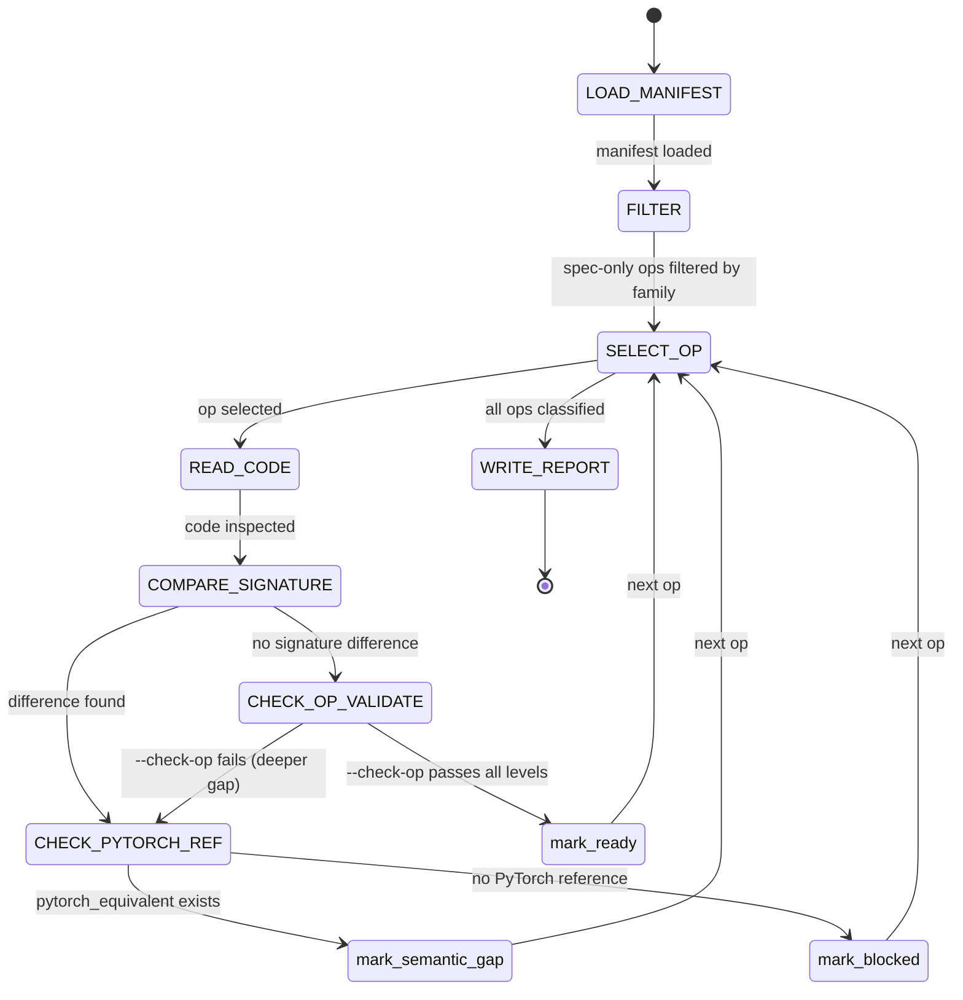

## Arguments

Family name from `ops_manifest.yaml` (e.g., `reduction`, `norm`, `attention`).

## Contract

- **Input**: `family` name
- **Output**: `.foundry/migrations/<family>.json`
- **Termination**: all ops classified. `ready` ops verified via `--check-op`.

## Workflow



Key gate: `pytorch_equivalent` determines autonomous vs human-required migration. `--check-op` confirms `ready` classification.

## Classification

| Classification | Condition                                                          | Downstream                          |
| -------------- | ------------------------------------------------------------------ | ----------------------------------- |
| `ready`        | `--check-op` passes, no signature difference                       | Orchestrator flips status directly  |
| `semantic_gap` | Manifest-code difference + `pytorch_equivalent` exists             | spec-test → spec-implement          |
| `blocked`      | Difference but no PyTorch reference; or kernel-level change needed | Terminate. `reason` field explains. |

## Gap Report Format

Location: `.foundry/migrations/<family>.json`

Top-level:

```json
{
  "family": "reduction",
  "audited_at": "2026-04-03T...",
  "total": 21,
  "summary": {"ready": 0, "semantic_gap": 21, "blocked": 0},
  "ops": { "<op_name>": { ... } }
}
```

Per-op entry. **Example — field set is not exhaustive. Add fields that aid the next step, omit those that don't.**

```json
{
  "status": "spec-only",
  "source_op": "tileops/ops/reduction/softmax.py",
  "base_class": "_SoftmaxBaseOp",
  "classification": "semantic_gap",
  "missing_params": ["dim"],
  "manifest_signature": {
    "inputs": {"x": {"dtype": "float16 | bfloat16"}},
    "outputs": {"y": {"dtype": "same_as(x)"}},
    "params": {"dim": {"type": "int", "default": -1}},
    "shape_rules": ["y.shape == x.shape"]
  },
  "manifest_param_order": ["x", "dim"],
  "pytorch_equivalent": "torch.nn.functional.softmax",
  "notes": "dim hardcoded to -1"
}
```

Required fields: `classification`, `source_op`, `manifest_signature`. Gap report is a starting point — agent reads live code and manifest during downstream skills.

`pytorch_equivalent`: corresponding PyTorch function, or `null`. Not every op has one.

## Steps

1. Read `tileops/ops_manifest.yaml`
1. Filter ops where `family == <arg>` and `status == spec-only`
1. For each op:
   a. Read source file (`source_op`), find Op class, extract `__init__` and `forward` explicit named params
   b. Compare against `manifest_signature` (inputs, params)
   c. If no difference → run `python scripts/validate_manifest.py --check-op <name>` to confirm → `ready` or deeper gap
   d. If difference → determine `pytorch_equivalent`:
   - Strip `_fwd` suffix, match against `torch.nn.functional`, `torch`, `torch.special`, `torch.linalg` → `semantic_gap`
   - `_bwd` ops → always `blocked` (PyTorch backward is autograd-internal, no public reference function for autonomous testing)
   - No match → `blocked`
1. Write gap report to `.foundry/migrations/<family>.json`
1. Print summary table
