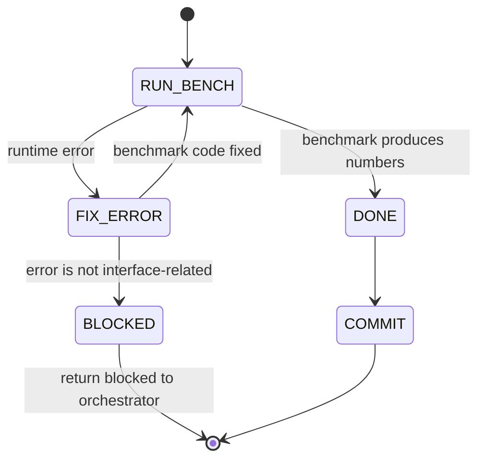

## Arguments

`op_name`, `source_bench`, `source_op` — passed by spec-pipeline orchestrator.

## Contract

- **Input**: `op_name`, `source_bench`, `source_op`
- **Output**: updated benchmark file + commit
- **Termination (success)**: benchmark runs to completion, produces numeric output (latency/TFLOPS/bandwidth)
- **Termination (blocked)**: failure is not interface-related (e.g., kernel bug). Return `blocked` with reason.
- **Constraint**: must NOT modify Op implementation or tests. Benchmark-only changes.
- **Environment**: local GPU required.

## Workflow



## Steps

### 1. RUN_BENCH

Execute the benchmark file:

```bash
python -m pytest <source_bench> -v
```

If it runs and produces numbers → DONE.

### 2. FIX_ERROR

Read the traceback. The error is the signal — typically the benchmark constructs the Op with the old interface (e.g., `Op(M, N, dtype)` instead of `Op(dim, dtype)`).

Fix the benchmark construction code to use the new Op interface. This is interactive — fix what breaks, don't predict errors in advance.

If the error is NOT about interface mismatch (e.g., kernel crash, CUDA error) → BLOCKED.

### 3. COMMIT

Commit benchmark changes only. Follow `docs/testing.md` benchmark requirements.
