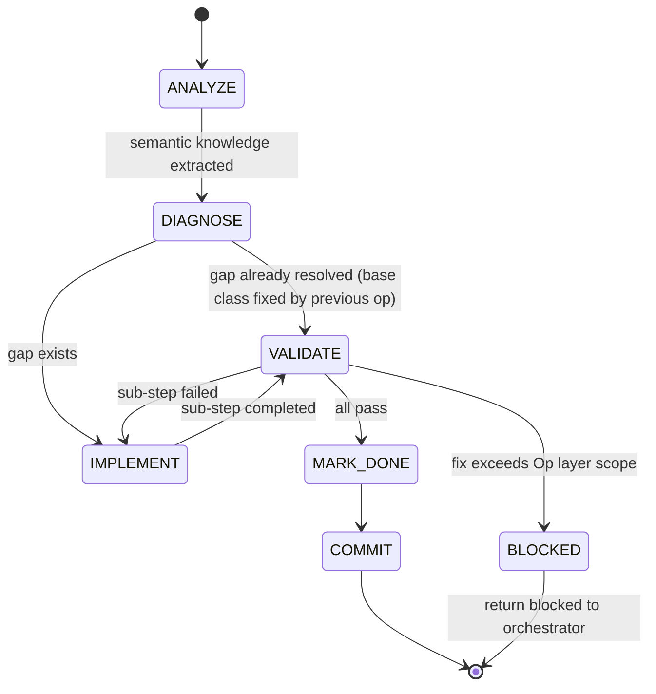

## Arguments

`op_name`, `manifest_signature`, `source_op`, `source_test` — passed by spec-pipeline orchestrator.

## Contract

- **Input**: `op_name`, `manifest_signature`, `source_op`, `source_test`
- **Output**: modified op code + commit + `observations` list (returned to orchestrator)
- **Termination (success)**: `python scripts/validate_manifest.py --check-op <name>` all levels pass + new tests pass.
- **Termination (blocked)**: fix requires changes beyond Op layer. Return `blocked` with reason.
- **Constraint**: must NOT modify `ops_manifest.yaml` (orchestrator's responsibility). Must NOT modify tests from spec-test.
- **Behavioral compatibility**: default param values (from manifest) must produce identical results to the old implementation. The old API shape (e.g., `__init__(M, N)`) is NOT preserved — the manifest defines the target interface.

## Workflow



## Dual-path policy

When rewriting a base class shared by sibling ops, it is acceptable to create a dual-path `__init__` — a runtime branch supporting both the legacy `(M, N)` interface and the new spec `(dim)` interface. This keeps unmigrated siblings' tests passing.

Dual-path is temporary debt. The orchestrator's cleanup gate removes it after all siblings are promoted or blocked. The implementer should NOT try to avoid dual-path by preemptively migrating siblings — that violates per-op scope.

## Steps

### 1. ANALYZE

Read existing code (`source_op`) to extract semantic knowledge:

- What the computation does (the algorithm)
- Where constraints are hardcoded (e.g., `dim=-1`, `reshape(-1, N)`)
- What the generalization path is

Manifest = WHAT (target interface). Existing code = HOW (computation logic). The delta is the work.

This analysis is internal — not persisted.

### 2. DIAGNOSE

Check if the gap still exists. A previous op's migration may have fixed the shared base class.

- Gap resolved → skip to VALIDATE
- Gap exists → proceed to IMPLEMENT

### 3. IMPLEMENT

Decompose into independently verifiable sub-steps. Each sub-step either succeeds or fails with precise location (→ BLOCKED). No retry loops — if a sub-step fails with the same error twice, the task is beyond current scope.

Agent determines sub-steps based on the specific gap. Do not follow a fixed recipe.

### 4. VALIDATE

Run all checks:

```bash
python scripts/validate_manifest.py --check-op <op_name>
python -m pytest <source_test> -v
```

All must pass. If not, return to IMPLEMENT.

### 5. MARK_DONE

Record `observations` — design knowledge discovered during migration:

- Patterns (e.g., "scan ops need transpose, reduction ops reshape")
- Edge cases
- Abstraction opportunities

Do NOT modify manifest or design docs. Observations are returned to orchestrator and surfaced in PR for human review.

### 6. COMMIT

Commit code changes only. Do not commit manifest changes.
