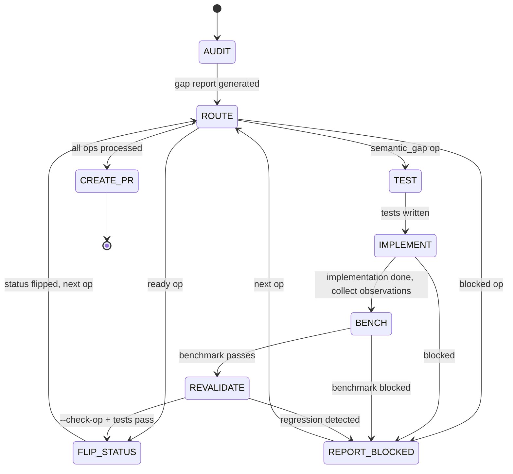

## Arguments

Family name from `ops_manifest.yaml` (e.g., `reduction`, `norm`, `attention`).

## Contract

- **Input**: `family` name
- **Output**: PR URL + final report
- **Termination**: all ops promoted or blocked, PR created

## Trust Model

- spec-test agent ≠ spec-implement agent (separate invocations)
- Only the orchestrator modifies `ops_manifest.yaml` status
- spec-implement must not modify tests; spec-bench must not modify Op code

## Workflow



## Steps

### 1. AUDIT

```
/spec-audit <family>
```

Gap report written to `.foundry/migrations/<family>.json`.

### 2. ROUTE

Read gap report. For each op, extract params from the entry and dispatch:

| Classification | Action                                                |
| -------------- | ----------------------------------------------------- |
| `ready`        | → FLIP_STATUS                                         |
| `semantic_gap` | → TEST → IMPLEMENT → BENCH → REVALIDATE → FLIP_STATUS |
| `blocked`      | → REPORT_BLOCKED                                      |

### 3. TEST (per op)

Invoke spec-test as a **separate agent** (trust model):

```
spec-test(op_name, manifest_signature, pytorch_equivalent, source_test)
```

### 4. IMPLEMENT (per op)

Invoke spec-implement as a **separate agent** (trust model):

```
spec-implement(op_name, manifest_signature, source_op, source_test)
```

Collect `observations` from return.

### 5. BENCH (per op)

Invoke spec-bench:

```
spec-bench(op_name, source_bench, source_op)
```

Requires local GPU.

### 6. REVALIDATE (per op)

Final gate after benchmark edits. Re-run validation to confirm no regressions:

```bash
python scripts/validate_manifest.py --check-op <op_name>
python -m pytest <source_test> -v
```

Both must pass. If not → REPORT_BLOCKED (benchmark change introduced regression).

### 7. FLIP_STATUS

Orchestrator (not a sub-skill) changes manifest:

- `status: spec-only` → `status: implemented`
- Commit the manifest change
- Update gap report: add `promoted_at` timestamp (keep `classification` unchanged)

### 8. CREATE_PR

After all ops processed:

- Collect all observations from spec-implement calls
- Create PR with:
  - Migration summary (promoted / blocked counts)
  - Per-op change table
  - Observations for human doc review
  - Blocked ops with reasons
