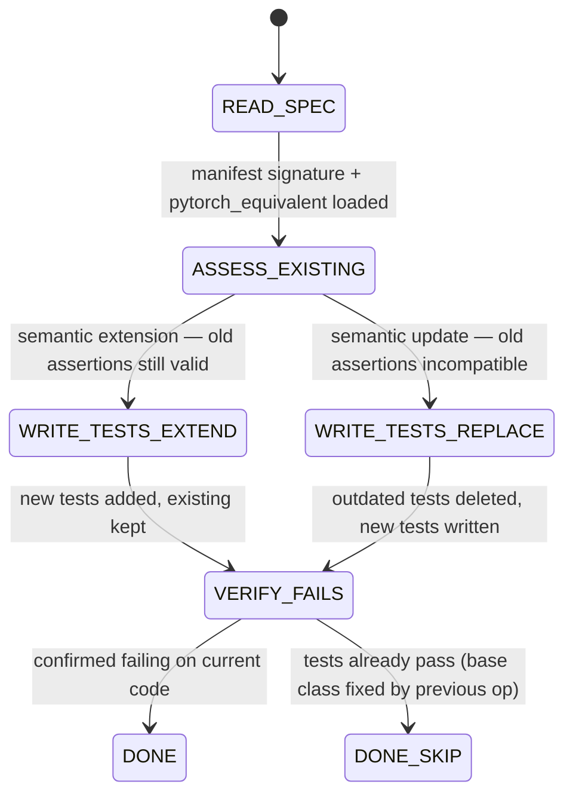

## Arguments

`op_name`, `manifest_signature`, `pytorch_equivalent`, `source_test` — passed by spec-pipeline orchestrator.

## Contract

- **Input**: `op_name`, `manifest_signature`, `pytorch_equivalent`, `source_test`
- **Output**: updated test file + commit
- **Constraint**: must NOT modify op implementation. Test-only.
- **Trust model**: this agent must be a different invocation from spec-implement.

## Workflow



## Steps

### 1. READ_SPEC

Read `manifest_signature` to determine target interface:

- `signature.inputs` → `forward()` params (tensor inputs)
- `signature.params` → `__init__()` params (configuration)
- This follows Op design convention in `docs/ops-design.md`. The manifest is the source of truth.

### 2. ASSESS_EXISTING

Read current test file (`source_test`). Compare existing test construction and assertions against the new spec:

- Old assertions still valid under new spec → **semantic extension** (keep existing tests, add new ones)
- Old assertions incompatible (e.g., construction API changes from `Op(M, N)` to `Op(dim)`) → **semantic update** (delete outdated tests, write replacements)

### 3. WRITE_TESTS

Write tests using PyTorch reference as ground truth:

```python
# Example — derive from manifest, don't copy this literally
expected = torch.nn.functional.softmax(x, dim=dim)
actual = op(x)
torch.testing.assert_close(actual, expected, rtol=rtol, atol=atol)
```

- Use `TestBase` pattern (`gen_inputs()` + `ref_program()` + `check()`). Follow `docs/testing.md`.
- Write tests in `source_test` file. No new files.
- For integer outputs (manifest `outputs.*.dtype` is int type), use `torch.equal` for exact comparison.
- Parameterize: supported dtypes (FP16, BF16), representative dim values, keepdim True/False where applicable.

### 4. VERIFY_FAILS

Run the new tests against current code:

```bash
python -m pytest <source_test> -v
```

New tests must **fail** on current code. Construction-time error counts (e.g., current `__init__` doesn't accept `dim`).

**DONE_SKIP**: if tests already pass (base class fixed by a previous op's migration), this is valid. Proceed to spec-implement.
