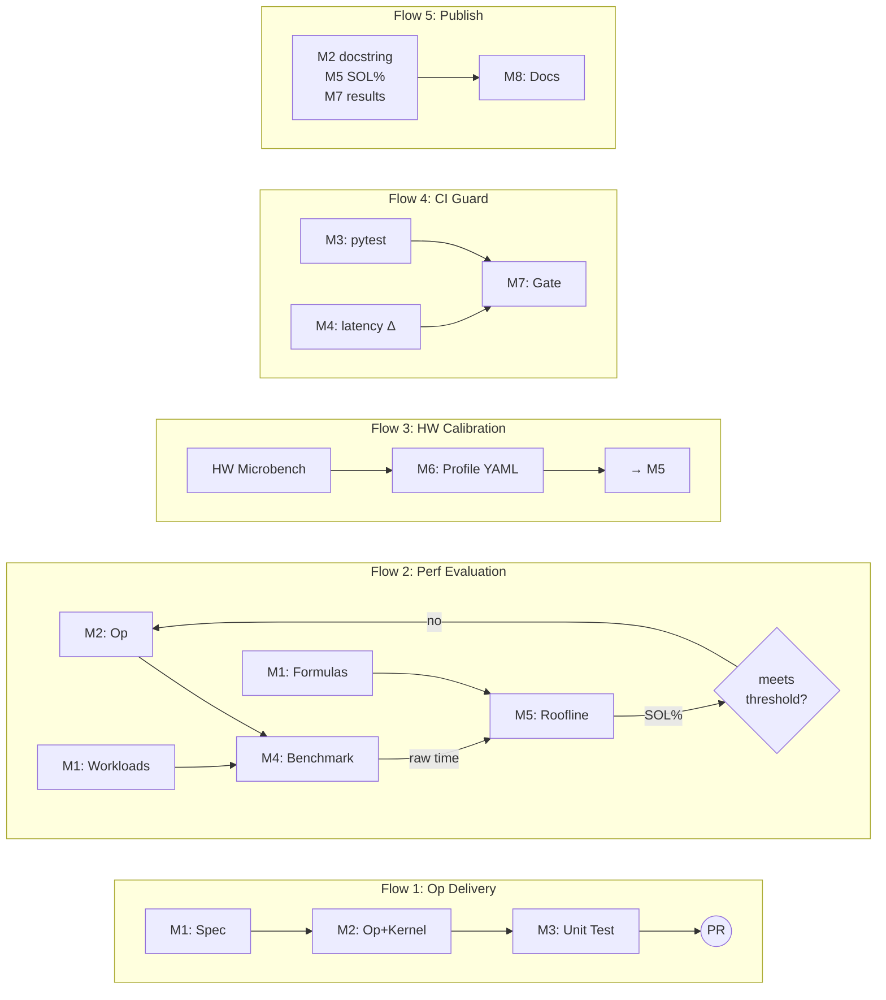

# Architecture

TileOPs is a spec-driven GPU operator platform built on TileLang. Every operator has a declarative specification in `ops_manifest.yaml` before code is written. The spec drives code generation, test validation, performance evaluation, and documentation — but the runtime interface remains plain Python imports.

## Modules

The platform consists of 8 modules (M1–M8). Five data flows connect them into end-to-end pipelines:



### Flow status

| Flow                   | Status          | What works                        | Gap                                                     |
| :--------------------- | :-------------- | :-------------------------------- | :------------------------------------------------------ |
| **1. Op Delivery**     | **done**        | manifest → code → test → CI merge | —                                                       |
| **2. Perf Evaluation** | **broken**      | M4 produces raw time              | M5 roofline tool missing; optimization loop not closed  |
| **3. HW Calibration**  | **partial**     | HBM microbench + h200 profile     | tensor core calibration missing; h100 profile missing   |
| **4. CI Guard**        | **half**        | correctness gate (gpu-smoke)      | perf regression detection missing (no baseline compare) |
| **5. Publish**         | **not started** | —                                 | no doc-gen scripts, no build system                     |

### Critical path

```
Flow 3 (HW Calibration)          Flow 2 (Perf Evaluation)
  GEMM microbench ────────┐        roofline.py ──────────┐
  h100 profile ───────────┤        formulas.py ──────────┤
  tensor core calibration ┘        optimization loop ────┘
                  │                          │
                  └──── both feed into ──────┘
                              │
                    Flow 4: perf regression
                              │
                    Flow 5: auto-gen docs
```

### Module reference

| Module              | Responsibility                                                      | Key Artifact                       |
| ------------------- | ------------------------------------------------------------------- | ---------------------------------- |
| **M1: Spec**        | Declare op interface, workloads, roofline formulas                  | `ops_manifest.yaml`                |
| **M2: Kernel + Op** | GPU kernel implementations and user-facing Python API               | `tileops/kernels/`, `tileops/ops/` |
| **M3: Correctness** | Numerical correctness against PyTorch reference                     | `tests/`                           |
| **M4: Benchmark**   | Measure raw execution time per workload                             | `benchmarks/`                      |
| **M5: Roofline**    | Hardware efficiency from raw time + formulas + HW profile           | `tileops/perf/`                    |
| **M6: HW Profile**  | GPU hardware parameters (bandwidth, FLOPS) from offline calibration | `tileops/perf/profiles/`           |
| **M7: CI Gate**     | Correctness and performance regression guard per PR                 | CI pipeline                        |
| **M8: Docs**        | Auto-generated API reference, perf tables, support matrix           | TileOPs.github.io                  |

## Data Contracts

Every arrow in the flow diagrams corresponds to one row below. If an edge has no contract, it does not exist.

| From | To  | Artifact                         | Format                                |
| ---- | --- | -------------------------------- | ------------------------------------- |
| M1   | M2  | signature, workloads             | `ops_manifest.yaml`                   |
| M1   | M4  | workloads (shapes, dtypes)       | `ops_manifest.yaml`                   |
| M1   | M5  | roofline formulas (flops, bytes) | `ops_manifest.yaml`                   |
| M2   | M3  | Op callable                      | Python import                         |
| M2   | M4  | Op callable                      | Python import                         |
| M2   | M8  | docstring                        | Google-style in source                |
| M3   | M7  | pass/fail                        | pytest exit code                      |
| M4   | M5  | raw time per workload            | JSON/CSV                              |
| M4   | M7  | pass/fail, latency delta         | pytest exit code + JUnit properties   |
| M5   | M8  | SOL%, bound type per workload    | structured output                     |
| M6   | M5  | GPU profile                      | YAML (`tileops/perf/profiles/`)       |
| M7   | M8  | gate status, benchmark results   | CI scheduled job → perf tables update |

## Two-Layer Separation (M2)

Every operator is split into exactly two layers:

| Layer  |    Name    | Description                                                                                          |
| :----: | :--------: | :--------------------------------------------------------------------------------------------------- |
| **L2** |   **Op**   | Stateless dispatcher. Hardware-agnostic entry point. Compatible with CUDA-Graph and `torch.compile`. |
| **L1** | **Kernel** | TileLang implementation optimized for specific hardware (Hopper, Ampere, etc.).                      |

The Op layer never contains TileLang code. The Kernel layer never validates user input. See [ops-design.md](ops-design.md) for the full boundary specification.

## Agent Production Loop

1. Read spec from M1 (manifest)
1. Write kernel (M2), op (M2), test (M3), docstring
1. Run tests (M3) — if fail, iterate on code
1. Run benchmark (M4) — raw time output
1. Roofline tool (M5) computes efficiency from raw time + manifest formulas + GPU profile
1. If efficiency is insufficient, optimize kernel and repeat from step 2
1. Submit PR → CI (M7) checks correctness and regression → merge → docs auto-update (M8)

## Documentation System

Documentation is an automatic output of the production pipeline, not a manually maintained artifact.

| Content                        | Data Source                    | Generation    |
| ------------------------------ | ------------------------------ | ------------- |
| API reference                  | Code docstrings (Google style) | sphinx/mkdocs |
| Performance tables             | Benchmark raw data             | Script        |
| Bound type per workload        | Roofline analysis output       | Script        |
| Support matrix (dtype × shape) | Manifest workloads             | Script        |
| Op list and status             | Manifest + test pass status    | Script        |

Design documents and tutorials are authored in TileOpsGov and published manually.

## Directory Structure

```
TileOPs/
├── ops_manifest.yaml                 # Op registry (agent entry point)
├── tileops/
│   ├── kernels/                      # L1: GPU kernel implementations
│   ├── ops/                          # L2: User-facing Op classes
│   ├── utils/
│   └── perf/                         # Roofline evaluation
│       ├── roofline.py               # efficiency = sol_bound / actual
│       ├── formulas.py               # Complex op roofline functions
│       └── profiles/                 # GPU hardware parameters
│           ├── h100.yaml
│           └── h200.yaml
├── benchmarks/
│   ├── hardware/                     # Microbench (GPU characterization)
│   │   ├── memory/
│   │   ├── compute/
│   │   └── system/
│   ├── ops/                          # Op-level benchmarks
│   └── kernels/                      # Kernel-level benchmarks
├── tests/                            # Correctness tests
├── docs/
└── scripts/
```
