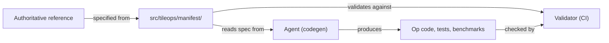

# Op Manifest Specification

The [`src/tileops/manifest/`](../../src/tileops/manifest/) package is the **source of truth** for the external contract of every public op. An entry's core is its signature: a polymorphic function type over explicitly quantified type indices. Code conforms to the manifest, and the validator checks that it does.

## Layout

One or more YAML files per family (single file by default; large families may shard). Each file is a flat mapping `op_name → entry`. The `tileops.manifest` package merges all files at load; a duplicate op name across files is an error. Algebraic data types shared by several entries live in `types.yaml`.

## Layer Boundaries



- The manifest is written against an authoritative reference, never derived from current TileOPs code. Code, tests and benchmarks follow it: a disagreement is fixed in the code, with the entry `spec-only` until it conforms, never by editing the manifest to match.
- Runtime checks, fake/meta functions and operator schemas are generated from the signature. The agent that produces an op does not write or adjust the generated checks or the validator.
- The manifest contract cases and the benchmarks take their calls from the entry's workload rows. Rows are not unit-test coverage: shapes that target kernel branches are chosen by the test ([testing.md § Test case policy](testing.md#test-case-policy)).
- Code-dependent checks are skipped for `spec-only` entries only; no check has a per-op opt-out. An entry is demoted to `spec-only` only when its implementation does not conform.

What each layer depends on, and the boundaries between layers, are in [layer-boundaries.md](layer-boundaries.md).

## Field Admission

A field enters the manifest only when all three hold:

1. It is part of a public op's external contract, or a fact a YAML-only reader needs (the validator checking a `spec-only` entry, the docs site built without torch), such as `workloads` and `roofline`.
1. At least one reader depends on it.
1. It describes the op's external behaviour. Implementation facts — source paths, kernel selection — are owned by the code and exported from it when needed.

## Entry Duties

An entry serves four duties, plus a record of a composite op's internal structure. Every duty reads the one signature: effects annotate its tensors, workload rows instantiate it, and cost formulas are written over its indices.

| No. | Duty                 | Fields                                                                                              | Section                     |
| --- | -------------------- | --------------------------------------------------------------------------------------------------- | --------------------------- |
| 1   | Type signature       | `signature`: `forall`, `params`, `inputs`, `outputs`, `types`, `let`, `shape_rules`, `dtype_combos` | [Signature](#signature)     |
| 2   | Side effects         | `mutated`, `write_only`, `buffer`, `alias` on tensors                                               | [Effects](#effects)         |
| 3   | Test-case generation | `workloads`; `values`, `requires` on tensors                                                        | [Workloads](#workloads)     |
| 4   | Cost model           | `roofline`                                                                                          | [roofline.md](roofline.md)  |
| 5   | Internal structure   | `composition`                                                                                       | [Composition](#composition) |

```yaml
<Op>:
  family: <module>
  status: implemented | spec-only
  ref_api: <qualified name>          # optional
  signature:
    forall: {<index>: <kind>}
    params: {<p>: {type, default, kw_only}}
    inputs: {<t>: {dtype, shape, optional, mutated, requires, values, ...}}
    outputs: {<t>: {dtype, shape, nullable, buffer, alias, ...}}
    types: {<Family>: {params, match, cases}}   # optional
    let: {<name>: "<expr>"}
    shape_rules: ["<refinement>"]
    dtype_combos: [{<DType index>: <dtype>}]
  workloads: [{<params and indices>, some, dtype_cases, label}]
  roofline: {flops, bytes} | {func}
  composition: {kind: composite, stages}      # optional
```

Most entries use only `forall`, tensor `shape` and `dtype`, construction parameters and simple refinements:

```yaml
SiluAndMulFwdOp:
  family: elementwise
  status: implemented
  signature:
    forall: {M: Dim, N: Dim, T: "DType[float16 | bfloat16 | float32]"}
    inputs:
      x: {dtype: T, shape: "[M, 2 * N]"}
    outputs:
      output: {dtype: T, shape: "[M, N]"}
  workloads:
  - {M: 2048, N: 14336, dtype_cases: [{T: float16}, {T: bfloat16}], label: llama-8b-swiglu-prefill}
  roofline:
    flops: "6 * M * N"
```

## Top-Level Fields

- **Key.** The Python class name of the op, `{PascalCaseName}[{Fwd|Bwd}]Op`. The validator requires `cls.__name__ == key`.
- **`family`.** The op's public module and a segment of its operator namespace: the op is importable as `tileops.<family>.<Op>`, and the family's `__all__` agrees with the manifest.
- **`status`.** Required. `implemented`: an implementation conforms to the manifest. `spec-only`: no conforming implementation exists yet; code may be absent or partial.
- **`ref_api`.** Optional qualified name of the API the op follows semantically. The validator checks its form, and that it resolves when its module imports.

## Signature

### Indices and Kinds

`forall` declares every free type index with its kind, e.g. `forall: {M: Dim, K: Dim, T: "DType[float16 | bfloat16]"}`. Indices come from three sources: `forall`; construction parameters that appear in an index position ([table 1](#t-names)); and `let`, a derived index.

- `forall` kinds are `Dim` (axis length), `Shape` (tuple of `Dim`), `DType[...]` and the value list `Seq[Int]` ([table 2](#t-forall)). A parameter's kind follows from its `type` ([table 3](#t-types)); expression kinds follow [table 4](#t-expr).
- A `Dim` may be passed where an `Int` is expected, a `Shape` where a `Seq[Int]` is.
- Every axis is an integer expression. An axis whose kind is not `Dim`, and every element of a sequence spliced with `*p`, carries the obligation to be non-negative, checked where [Call Semantics](#call-semantics) places it.
- A YAML value denotes the Python value its kind or `type` declares: a tuple for `Shape` and `tuple[...]`, a list for `Seq[Int]` and `list[...]`, a `torch.dtype` for a dtype name, an object for an ADT value ([table 5](#t-adt)).
- Within an entry, index, `let` and tensor names are distinct. `out` is reserved: no tensor, parameter or index is named `out`.

### Parameters

`signature.params` is the `__init__` parameter list: `type`, optional `default` and `kw_only`. The manifest is authoritative; for an implemented entry the validator compares it with `__init__` item by item ([table 6](#t-ctor)), and the code may add only the execution-policy parameters of [table 7](#t-policy). It also requires the signature's call-time inputs and output buffers to be the ordered prefix of `forward`'s parameters; `forward` may append code-defined execution parameters, which are not part of the signature.

Parameters enter types directly:

- An `int` parameter written into a shape forms an axis, which carries the obligation; a parameter passed to a signed primitive formal (`Int`, `Axes`) carries none of its own.
- A `list[int]` / `tuple[int, ...]` parameter is spliced as `*p`; each element carries the obligation.
- A dtype parameter (a `type` over dtype names) is written directly as a tensor `dtype`.
- An `int | None` parameter has kind `Maybe[Int]` with tag `present(v)`; its payload `v.value` is legal only on branches where `present(v)` holds. A `Maybe` value may be passed as is to a primitive that accepts it.

### Inputs and Outputs

A tensor is `{dtype: ..., shape: "..."}`, i.e. `Tensor[T, s]`. Every role — construction parameter, construction-time tensor, input, output, output buffer — with its phase and type is in [table 8](#t-roles).

- A shape is `"[" axis, ... "]"` or a type-family application; an axis is an expression, `*S` or `*primitive(...)`; `"[]"` is rank zero. Two tensors of equal shape write the same shape term.
- An entry has one signature: output names and count are fixed per call. An op whose output count follows a switch, or that takes one argument as a scalar in one form and a tensor in another, is two entries.
- An op selects its implementation from parameters and tensor presence; tensor contents are computation input only. One fact is stated in one place.

### Refinements

Each `shape_rules` item is a refinement: a predicate on index values, checked after unification.

- Shapes, `let`, type families, refinements and inline roofline share one closed expression language ([table 10](#t-lang)) with Python precedence.
- A refinement depends only on quantities available at run time. It is checked at construction when construction can evaluate it, otherwise on every call ([Call Semantics](#call-semantics)). A constraint on a metadata tensor's contents is that tensor's `requires` ([Generators](#generators)); [table 11](#t-constraints) contrasts the two.
- A guard narrows kinds in the arm it selects: `present(v)` narrows `Maybe[X]` to `X`; `x == lit` and `x in (...)` intersect `x`'s kind with the literals, `x != lit` and `x not in (...)` subtract them; narrowing composes through `not`, `and`, `or` and conditionals. A string inhabits `DType[S]` only when it names a registered member of `S`, so a comparison with literals no member of an enum or dtype set takes is rejected.
- A refinement that reads only discriminants — every name and ADT field it reads is fixed by the discriminant values, judged over the whole expression regardless of operand order — is a **domain restriction**. It is checked before a type-family branch is chosen, and values it rejects need no type-family case.
- Lists among construction parameters are available at run time and may appear anywhere. `forall` value lists appear only as generator arguments.
- Satisfiability of a refinement is the author's responsibility.
- The validator rejects rules that declare, define or test presence: `x.shape == (...)`, `x is None`, `isinstance` ([table 12](#t-rejected)).

### Dtypes

A tensor `dtype` is a dtype expression ([table 13](#t-dtype)): a `forall` `DType` index, a dtype parameter, a constant, or a dtype primitive. Without `dtype_combos`, each `DType` index ranges over its set independently.

- **`dtype_combos`.** When only some combinations of several `DType` indices are supported, the entry lists them. Each row maps `{index: dtype}`; all rows have the same keys, which may include dtype parameters; rows are distinct; every column is relevant on every branch. A call's dtype assignment must equal one row.
- **Packed dtypes.** fp4 and int4 live in carrier dtypes such as `uint8` and are written by carrier: `dtype` is the carrier, `shape` is the carrier shape PyTorch sees (e.g. `[N, K // 2]`), the logical dtype comes from a dtype parameter or the entry, and roofline counts carrier bytes.

### Presence

- An optional input is `optional: true`; inputs that must be present together share one discriminant, `optional: "<p>"`. An output that may be `None` is `nullable: "<p>"`.
- `optional` and `nullable` expressions are built from finite boolean atoms: `Bool` and enum parameters, ADT tags and finite fields, `present`.
- Optional inputs follow required ones; `forward` takes them in declaration order with default `None`. Omitting one equals passing `None`.
- Construction-time tensor presence is fixed at construction; call-time tensor presence per call.
- An index is relevant only on the branches where it appears.

### Type Families

A type family gives a shape by the value of a finite discriminant. It lives in the entry's `signature.types`, so each entry is self-contained.

```yaml
signature:
  types:
    Mat:
      params: {t: Bool, R: Dim, C: Dim}
      match: t
      cases:
      - {when: false, is: "[R, C]"}
      - {when: true, is: "[C, R]"}
  inputs:
    a: {dtype: T, shape: "Mat[trans_a, M, K]"}
```

- `match` takes a finite discriminant — `Bool`, enum, ADT, `present` — or a tuple of them; a tuple's `when` is a list.
- `cases` are exhaustive and disjoint over the discriminant values the entry accepts; values a domain restriction rejects need no case.
- An ADT is matched by constructor: `{masked: _}` matches any `masked` value, `{contiguous: {metadata_kind: per_row}}` also constrains a finite field, and a constructor's own fields are readable only on its branches.
- References between type families are acyclic. Tensors applying one family take one branch together. An application's arguments bind to the family's `params` in declared order.

### Algebraic Data Types

A finite-valued parameter with fields is an ADT, defined once in `types.yaml` and shared by entries. Each constructor maps to a Python class ([table 5](#t-adt)).

```yaml
adts:
  MGroupedLayout:
    sum:
      contiguous:
        python: tileops.ops.moe.contracts.ContiguousLayoutSpec
        fields: {packing: {type: "'tight' | 'aligned'", python: ...}, alignment: Dim, ...}
        invariant: "(packing == 'tight') == (alignment == 1)"   # optional
      masked:
        python: tileops.ops.moe.contracts.MaskedLayoutSpec
        fields: {max_m: Dim}
```

- An ADT value is written as a literal `{constructor: {field: value}}`, workload rows included.
- `invariant` is an optional refinement on a constructor, checked at instantiation and at construction.
- An ADT is sealed: constructors and fields are fixed where it is declared. Adding one edits the definition; an entry that does not accept the new constructor rejects it with a domain restriction and needs no type-family change.
- Instantiation builds enum fields from their `python` class, then calls the constructor's class with keyword arguments; a test round-trips a real object per ADT.

### Derived Indices and Primitives

- `let` names a quantity computed from indices; its kind is `Dim` or a value. It is computed from the signature, at construction when construction can evaluate it and otherwise per call, and is never written in a workload row. `let` dependencies are acyclic.
- A primitive is a built-in function of the expression language. The set is fixed: general primitives in [table 13](#t-dtype) and [table 15](#t-prims), domain primitives such as `pool.out` in [table 14](#t-domain). Each gives a signature, a domain and a symbolic implementation; outside its domain it raises, naming the declaration that called it. The tables give each primitive's, generator's and predicate's name, domain and result shape; what it computes is its implementation in `tileops.manifest.primitives`. Adding a primitive changes this specification and its one implementation, which the validator, the roofline analysis and the generated code share.
- Axis-taking primitives normalize axes alike: at rank 0, `0` and `-1` name the one scalar axis and anything else raises; at rank above 0, an axis lies in `[-rank, rank)` and is taken modulo rank.

### Construction-Time Tensors, Layout and Device

- A construction-time tensor is a `params` entry with `dtype` and `shape`, optionally `optional: true`.
- A `device` parameter is declared only by an op without call-time tensor inputs ([Call Semantics](#call-semantics)).
- A tensor that must be contiguous declares `contiguous: true`; others accept any stride. A tensor that must live on the CPU declares `device: cpu`.

## Effects

An op without effect declarations reads its inputs and allocates its outputs. Effects annotate the signature's tensors and decide the operator schema and the roofline read/write count ([table 9](#t-effects)):

- `buffer: out` on an output: the caller may pass `out`, which the op writes and returns.
- `mutated: true` on an input: the op may write it; with `write_only: true` it is a required result buffer whose old contents are not read.
- `mutated: "<discriminant expr>"`: written only when the expression holds; `alias: <input>` on an output: that output is the input object.

## Workloads

### Rows

A workload row determines one call. Its keys are construction parameter names, relevant index names, `some`, `dtype_cases` and `label` ([table 16](#t-rows)).

- A row gives exactly the relevant indices that no generator determines.
- An index is relevant on a branch when that branch's shapes, dtypes, refinements, generator arguments, the `requires` of its passed tensors or its inline roofline use it, each folded at the branch first, so a refinement whose guard folds to true there makes nothing relevant; a `let` passes on what it reads. A `func` roofline makes nothing relevant. Discriminants selecting a type-family branch, presence or `nullable` are always relevant.
- **case id** is `label` followed by the row's `dtype_cases` values in `forall` order, then its dtype parameters' values in `signature.params` order, joined by `-`. It keys nightly history, so changing a `label` is breaking. `label` is non-empty `[A-Za-z0-9._-]`, and an entry's case ids are distinct.
- **Coverage.** Every optional tensor of an implemented entry is passed in at least one row and omitted in at least one, counted per input.
- **Instantiation.** A row fixes shapes, dtypes, parameters, presence and metadata values. Devices follow [Call Semantics](#call-semantics), strides are contiguous, tensors do not alias, other data is random. The validator infers the call back from the instantiated inputs and requires agreement.

### Generators

A metadata tensor's type is in the signature; its values come from a generator in its `values` field at instantiation.

```yaml
cu_seqlens_q: {dtype: int32, shape: "[B + 1]", values: "prefix_sum(q_lens)",
               requires: ["prefix_offsets(total_q)"]}
```

- The generator result is unified with the declaration; shape indices other than the generator's arguments are solved by that unification (here `B`) and are not written in the row.
- The generator set is fixed ([table 17](#t-generators)); adding one changes this specification, with its domain, seed and tests. A generated tensor declares an integer dtype, `int32` or `int64`, and its values take it; a domain violation or an overflow of the declared dtype raises. Arguments may be value-primitive calls. A row always yields the same values.
- `requires` names predicates on a metadata tensor's contents, from a closed set ([table 18](#t-predicates) and the predicates of [table 14](#t-domain)); the tensor's contents are the implicit first argument. A written argument may name another metadata tensor and stands for its contents, so one predicate relates two tensors; that tensor must be present wherever the constrained one is. A row is checked against them at instantiation; at run time they are the caller's obligation, so the validator also holds them well-formed wherever their tensor is present.
- A tensor with `requires` has `values`.

## Composition

A composite op records the sub-op classes its built-in path may hold and where its own kernels sit. When and how often an instance is built stays in code, as do scheduling and forward.

```yaml
composition:
  kind: composite
  stages:
  - {name: pre_permute, op: MoePrePermuteFwdOp}
  - {name: expert_mlp, op: MoeExpertMLPFwdOp}
  - {name: post_permute, op: MoePostPermuteFwdOp}
  - {name: indexed_small_route, op: IndexedExpertMLPFwdOp, optional: true}
```

- A stage names a manifest entry (`op`) or one of the op's kernel roles (`kernel`). A sub-op not held for every call is an `optional: true` stage; the condition stays in code.
- Whether a parent's roofline equals its stages' is not specified by this design.
- For an implemented parametric entry, the validator holds `op` stages to the class's `delegate_types` and `kernel` stages to its `kernel_types`, each in order.
- `stages` is a non-empty list; stage names are unique; `optional` is a boolean.

## Call Semantics

A call has two phases.

- **Construction** checks parameter values against their `type` — dtype parameters within range, construction-time tensors present unless optional — and ADT invariants. `Bool`, enum and ADT parameters, `Maybe` presence and construction-time tensor presence are fixed here. Parameters, ADT fields, construction-time tensor presence, the indices unified from construction-time tensors' shapes and dtypes, and the `let`s these make evaluable are available at construction; call-time tensors, their presence and what unifies from them are available per call. An obligation — an axis or spliced element non-negative, a refinement or invariant holding — is checked at construction when both what activates it (its tensor, type-family branch or guard) and its value are available there, otherwise in the call check.
- **Call.** The checks generated from the signature wrap `forward`: presence of call-time tensors, domain restrictions, type-family branches, then inference and the remaining refinements, output-buffer preconditions, the implementation, and the output checks. Any failure raises and names the declaration. `forward` may take code-defined execution parameters after the signature's prefix; the code allocates and checks them.

**Inference.** Indices are solved from the inputs by unification ([table 19](#t-unify)). Branch selection, `let` and unification form one dependency graph from which the validator derives the inference plan, independent of declaration order. Its construction-available prefix — construction-time tensor presence, shapes and dtypes, the branches they select and the `let`s they make evaluable — is solved at construction, and call inference continues the same graph with call-time facts. An index that cannot be solved, or has several solutions, rejects the entry. On a branch where it is relevant, every `Dim`, `Shape` or `DType` index is solved from an input, given by a parameter, or determined by a generator; an index appearing only in outputs is a parameter or a `let`. An output buffer fixes only its presence and is checked against the output type once known. A non-affine relation binds the physical axis to one name, derives the logical dimension with `let`, and equates the two in a refinement.

**Device.** Tensors marked `device: cpu` stay on the CPU and take no part in choosing the call device. The call device is that of the other call-time inputs, which must agree; without such inputs it is the `device` parameter when not `None`, else that of the construction-time tensors, else the choice of the explicit or process-default target among the device classes (CUDA, CPU) it declares, else the current CUDA device. When construction-time tensors decide it, they share one device. `out` and outputs are checked or allocated on the call device; construction-time tensors not marked `device: cpu` are copied there and cast to their signature dtype. Workload instantiation places tensors by the same rule.

**Symbolic shapes.** The generated checks evaluate on SymInt, discriminants being Python values. An expression that needs the truth value of a SymBool is evaluated at construction only; an op compiled with `fullgraph=True` contains none. Expression strings are parsed and checked before code generation; generated code never parses them.

## Validation

An entry's format identifies it: a legacy entry declares `source`, a parametric one does not. [`scripts/validate_manifest.py`](../../scripts/validate_manifest.py) checks every parametric entry on every combination of its discriminant values: type-family `match`, `optional`, `nullable`, `mutated`, output-buffer presence, and the quantities relevance reads. Discriminants are grouped by dependency. Combinations a domain restriction rejects skip only type-family coverage and inference-plan checks. Above a configured number of combinations (default 256) it reports an advisory diagnostic and keeps the entry whole.

1. Each name's category matches its kind, and each parameter's `type` fits the kind every use site needs.
1. Type-family cases are exhaustive and disjoint over accepted values; family references are acyclic; a family no shape applies is rejected.
1. An inference plan exists.
1. `let` dependencies are acyclic.
1. Every expression is in the language and every primitive is built in.
1. Every generator result, on every workload row, unifies with its declaration; every `requires` meets its contract on every discriminant point.
1. Every expression of a class declaring a compile boundary, which is its claim of `fullgraph=True` support, is evaluable on SymInt. The class's declaration is the source, never the test registry.
1. Every workload row instantiates.
1. For every effect branch, the operator schema, aliases and roofline read/write counts agree.

All checks are decidable; every evaluation either succeeds or names the failing declaration. Code-dependent checks are skipped for `spec-only` entries. CI runs the validator with `--strict` over the whole manifest.

- Parsing is per field: an unreadable field is reported and skipped only by the checks that read it.
- Diagnostics are a contract: the CLI, the diagnostic text and order, and the strict/advisory classification change only through a deliberate, recorded change. Every set entering a diagnostic is sorted, unknown keys by `repr`, so output does not depend on `PYTHONHASHSEED`.
- Each fixed section's legal keys are defined in one place.
- Importing an op loads the manifest leniently and succeeds on an incomplete manifest; strict checking belongs to the validator alone.

## Reference Tables

**<a id="t-names"></a>Table 1** Name categories

| No. | Category    | Definition                                                                                                                                               | Checks                                                   |
| --- | ----------- | -------------------------------------------------------------------------------------------------------------------------------------------------------- | -------------------------------------------------------- |
| 1   | index       | A name in a shape, `dtype`, type-family argument, `optional`, `nullable`, `mutated`, `let`, refinement or `values`, whose `type` is not in table 3 row 8 | kind, inference, exhaustiveness, refinements             |
| 2   | other param | Any other construction parameter, including those whose `type` is in table 3 row 8 (`eps`, `ord`, `device`)                                              | `type` and `default`; usable in refinements and roofline |

**<a id="t-forall"></a>Table 2** `forall` kinds

| No. | Kind            | Values                     | Solved from                                 | Written in a row |
| --- | --------------- | -------------------------- | ------------------------------------------- | ---------------- |
| 1   | `Dim`           | non-negative integer       | unification of inputs or generator results  | integer          |
| 2   | `Shape`         | tuple of `Dim`             | unification of inputs                       | integer list     |
| 3   | `DType[a \| b]` | one of the declared dtypes | unification of inputs                       | `dtype_cases`    |
| 4   | `Seq[Int]`      | integer list (`q_lens`)    | instantiation only, as a generator argument | integer list     |

**<a id="t-types"></a>Table 3** Parameter `type` to kind

| No. | `type`                                                               | Kind                                                                                                                |
| --- | -------------------------------------------------------------------- | ------------------------------------------------------------------------------------------------------------------- |
| 1   | `int` / `bool`                                                       | `Int` (signed) / `Bool`                                                                                             |
| 2   | union of string literals                                             | enum                                                                                                                |
| 3   | `list[X]`, `tuple[X, ...]`, `tuple[X, Y]`                            | `Seq[K]`, `K` the element type's kind by this table, `Int` or `Maybe[Int]`; a fixed-length tuple carries its length |
| 4   | `X \| None`                                                          | `Maybe[X]`                                                                                                          |
| 5   | `X \| Y`                                                             | finite union, each member mapped by this table                                                                      |
| 6   | ADT name                                                             | that ADT                                                                                                            |
| 7   | `torch.dtype`, union of dtype names                                  | `DType[...]` (a dtype parameter)                                                                                    |
| 8   | `float`, `Number`, open `str`, `dict`, `torch.Tensor`, other objects | takes no part in types; `type` and `default` only                                                                   |

**<a id="t-expr"></a>Table 4** Expression kinds

| No. | Expression                                                       | Kind                                                             |
| --- | ---------------------------------------------------------------- | ---------------------------------------------------------------- |
| 1   | `Dim` `+` / `*` `Dim`; `Dim // k`, `Dim % k` for positive `k`    | `Dim`                                                            |
| 2   | primitive call                                                   | the primitive's declared result                                  |
| 3   | arithmetic with `-`, a negative, or an `Int`; an indexed integer | `Int`                                                            |
| 4   | comparison, `and` / `or` / `not`, `in`, predicate primitive      | `Bool`                                                           |
| 5   | `a if c else b`                                                  | the common kind; `Int` when one arm is `Dim` and the other `Int` |

**<a id="t-adt"></a>Table 5** ADT and Python objects

| No. | ADT side         | Python side                                    |
| --- | ---------------- | ---------------------------------------------- |
| 1   | constructor      | the class named by `python`; an instance of it |
| 2   | constructor name | the object's `kind` attribute                  |
| 3   | field            | the attribute of the same name                 |
| 4   | enum field value | that attribute's `.value`                      |

**<a id="t-ctor"></a>Table 6** Manifest versus `__init__`

| No. | Item                        | Rule                                                                   |
| --- | --------------------------- | ---------------------------------------------------------------------- |
| 1   | parameter set               | equal; the code may add only table 7's execution-policy parameters     |
| 2   | order, `default`, `kw_only` | equal                                                                  |
| 3   | type                        | the manifest `type` governs; runtime type checks are generated from it |
| 4   | parameter kind              | positional-or-keyword, or keyword-only by `kw_only`                    |

**<a id="t-policy"></a>Table 7** Execution-policy parameters (owned by code)

| No. | Class                                | Parameters                                  |
| --- | ------------------------------------ | ------------------------------------------- |
| 1   | every op                             | `kernel_map`, `tune`, `target`              |
| 2   | injected implementation objects      | e.g. FusedMoe `prepare_finalize`, `experts` |
| 3   | configuration passed only to kernels | reserved name `config`                      |

**<a id="t-roles"></a>Table 8** Roles

| No. | Role                     | Phase        | Declared as                                        | Type                                                                                           |
| --- | ------------------------ | ------------ | -------------------------------------------------- | ---------------------------------------------------------------------------------------------- |
| 1   | construction parameter   | construction | `params.<p>`                                       | the kind of its `type` (table 3)                                                               |
| 2   | `device` parameter       | construction | `params.device`                                    | decides the call device                                                                        |
| 3   | construction-time tensor | construction | `params.<p>` with `dtype`, `shape`                 | `Tensor[T, s]`; if optional, `Maybe[Tensor[T, s]]` with tag `present(p)`, defaulting to `None` |
| 4   | required input           | call         | `inputs.<t>`                                       | `Tensor[T, s]`                                                                                 |
| 5   | optional input           | call         | `optional: true`, or `optional: "<p>"` when shared | `Maybe[Tensor[T, s]]` with tag `present(t)` or `p`                                             |
| 6   | output                   | result       | `outputs.<t>`                                      | `Tensor[T, s]`                                                                                 |
| 7   | nullable output          | result       | `nullable: "<p>"`                                  | `Maybe[Tensor[T, s]]` with tag `p`                                                             |
| 8   | output buffer            | call         | table 9's `buffer` and `write_only`                | optional: `Maybe` of the output type, tag `present(out)`; required: `Tensor[T, s]`             |

**<a id="t-effects"></a>Table 9** Effect declarations

| No. | Declaration                               | Meaning                                                                                                                                                      |
| --- | ----------------------------------------- | ------------------------------------------------------------------------------------------------------------------------------------------------------------ |
| 1   | output `buffer: out`                      | `forward` gains `out` after all inputs, in output order. Passed: the op writes and returns it; omitted: the op allocates. Same shape and dtype as the output |
| 2   | input `mutated: true`                     | the op may write it; its prior contents are read                                                                                                             |
| 3   | input `mutated: true`, `write_only: true` | a required result buffer: overwritten, the result depends on other inputs only; if the op returns `None`, `outputs` is empty                                 |
| 4   | input `mutated: "<discriminant expr>"`    | written only when the expression holds                                                                                                                       |
| 5   | output `alias: <input>`                   | when that input is written, the output is that input object                                                                                                  |

**<a id="t-lang"></a>Table 10** Expression language

| No. | Element   | Content                                                                                                    |
| --- | --------- | ---------------------------------------------------------------------------------------------------------- |
| 1   | literals  | int, finite float, bool, None, str, tuple; reserved float `inf` (`-inf` by negation)                       |
| 2   | names     | indices, `signature.params` parameters, `let`, comprehension variables; each use site checks kind and type |
| 3   | presence  | `present(x)` for a tensor or `Maybe` value; `x.value` only where `present(x)` holds                        |
| 4   | operators | `+ - * // %`, comparisons, `and or not`, `in`, conditional; Python precedence                              |
| 5   | access    | subscript, slice; an ADT field only on its constructor's branch, plus `kind`                               |
| 6   | calls     | comprehension; built-in primitives                                                                         |

**<a id="t-constraints"></a>Table 11** Constraints

| No. | Kind                        | Depends on                   | Checked                                                                     |
| --- | --------------------------- | ---------------------------- | --------------------------------------------------------------------------- |
| 1   | refinement in `shape_rules` | run-time quantities only     | at construction when construction can evaluate it, else every call          |
| 2   | tensor `requires`           | a metadata tensor's contents | at instantiation, on generated values; at run time, the caller's obligation |

**<a id="t-rejected"></a>Table 12** Rejected rule forms

| No. | Rejected                    | Example                                 | Write instead                        |
| --- | --------------------------- | --------------------------------------- | ------------------------------------ |
| 1   | reading a tensor's `shape`  | `x.shape == (B, S, H, D)`               | `x: {shape: "[B, S, H, D]"}`         |
| 2   | an equality forming a type  | `output.shape == input.shape`           | one shape term for both, e.g. `[*S]` |
| 3   | an equality defining a name | `C_in_g == C_in // groups`              | `let: {C_in_g: "C_in // groups"}`    |
| 4   | tensor `x is None`          | `bias is None or ...`                   | `not present(bias) or ...`           |
| 5   | value `v is None`           | `max_seqlen is None`                    | `not present(max_seqlen)`            |
| 6   | `isinstance`                | `s[0] if isinstance(s, tuple) else s`   | `per_axis(s, 0, 2)`                  |
| 7   | set comprehension           | `len({d % n for d in dim}) == len(dim)` | `unique_axes(dim, n)`                |

**<a id="t-dtype"></a>Table 13** Dtype expressions

| No. | Form                      | Meaning                                                                            |
| --- | ------------------------- | ---------------------------------------------------------------------------------- |
| 1   | `forall` `DType` index    | ranges over its declared set; solved from the inputs                               |
| 2   | dtype parameter           | the construction parameter's value (`dtype: out_dtype`)                            |
| 3   | constant                  | a fixed dtype                                                                      |
| 4   | `promote_int_to_float(T)` | float32 when `T` is integral, else `T`                                             |
| 5   | `coalesce_dtype(v, T)`    | `Maybe[DType[A]] × DType[B] → DType[A ∪ B]`: `v.value` when `present(v)`, else `T` |

**<a id="t-domain"></a>Table 14** Domain primitives

| No. | Primitive                            | Domain                                              | Result |
| --- | ------------------------------------ | --------------------------------------------------- | ------ |
| 1   | `conv.out(L, k, s, p, d)`            | convolution extents                                 | `Int`  |
| 2   | `pool.out(L, k, s, p, d, ceil_mode)` | pooling extents                                     | `Dim`  |
| 3   | `moe.capacity(layout, R, E)`         | an `MGroupedLayout`, `R >= 0`, `E > 0`              | `Dim`  |
| 4   | `mhc.expansion(Q)`                   | `Q == n * n + 2 * n` for a positive `n`             | `Dim`  |
| 5   | `attn.paged_fits(cu, cap)`           | `requires` predicate; `x` 1-D, `cu` of `len(x) + 1` | `Bool` |
| 6   | `moe.layout_valid(layout, R, E)`     | `requires` predicate; `x` 1-D                       | `Bool` |

**<a id="t-prims"></a>Table 15** General primitives (`Axes = Int | Seq[Int] | None`)

| No. | Primitive                       | Signature                                                                          | Domain                                                 |
| --- | ------------------------------- | ---------------------------------------------------------------------------------- | ------------------------------------------------------ |
| 1   | `broadcast`                     | `Shape... → Shape`                                                                 | broadcastable shapes                                   |
| 2   | `reduced`                       | `Shape × Axes × Bool × ('full' \| 'noop' \| 'reject') → Shape`                     | axes valid for the shape's rank                        |
| 3   | `valid_axes`                    | `Axes × Int → Bool`                                                                | any                                                    |
| 4   | `unique_axes`                   | `Axes × Int → Bool`                                                                | valid axes                                             |
| 5   | `per_axis`                      | `(Int \| Seq[Maybe[Int]] \| None) × Int × Int × fallback: Maybe[Int] = None → Int` | a scalar, a length-`n` sequence, or a present fallback |
| 6   | `ceil_div`                      | `Int × Int → Int`                                                                  | positive divisor                                       |
| 7   | `len`                           | `Seq[A] → Dim`                                                                     | any sequence                                           |
| 8   | `prod` / `sum`                  | `Seq[Int] → Int`                                                                   | any sequence                                           |
| 9   | `max` / `min`                   | `Seq[Int] × default: Maybe[Int] = None → Int`                                      | non-empty, or a default                                |
| 10  | `all`                           | `Seq[Bool] → Bool`                                                                 | any sequence                                           |
| 11  | comprehension `f(x) for x in s` | `Seq[A] → Seq[B]`                                                                  | only as an argument of `all`, `sum`, `max`, `min`      |

**<a id="t-rows"></a>Table 16** Workload row keys

| No. | Key                                       | Value                                                                                                                                                                             |
| --- | ----------------------------------------- | --------------------------------------------------------------------------------------------------------------------------------------------------------------------------------- |
| 1   | construction parameter name               | its value; required when it has no default                                                                                                                                        |
| 2   | `some`                                    | the `optional: true` tensors passed                                                                                                                                               |
| 3   | `forall` `Dim`, `Shape`, `Seq[Int]` index | exactly the branch's relevant indices no generator solves                                                                                                                         |
| 4   | `dtype_cases`                             | list of assignments to the relevant `forall` `DType` indices, e.g. `[{T: float16}, {T: bfloat16}]`; only when there are such indices; a dtype parameter is written as a parameter |
| 5   | `label`                                   | the row's name                                                                                                                                                                    |

**<a id="t-generators"></a>Table 17** Metadata generators

| No. | Generator                                          | Domain                                      | Result shape                           |
| --- | -------------------------------------------------- | ------------------------------------------- | -------------------------------------- |
| 1   | `as_tensor(L)`                                     | non-negative list                           | `[len(L)]`                             |
| 2   | `prefix_sum(L)`                                    | non-negative list, may be empty             | `[len(L) + 1]`                         |
| 3   | `exclusive_prefix_sum(L)`                          | non-empty non-negative list                 | `[len(L)]`                             |
| 4   | `padded_exclusive_prefix_sum(L, pad)`              | as above; `pad > 0`                         | `[len(L)]`                             |
| 5   | `paged_block_table(B, width, pool)`                | `0 < width <= pool`                         | `[B, width]`                           |
| 6   | `chunk_indices(L, c)`                              | non-negative list; `c > 0`                  | `[sum(ceil_div(n, c) for n in L), 2]`  |
| 7   | `token_indices(L)`                                 | non-empty positive list                     | `[sum(L), 2]`                          |
| 8   | `chunk_offsets(L, c)`                              | non-negative list; `c > 0`                  | `[len(L) + 1]`                         |
| 9   | `nsa_block_indices(L, block_size, selected, H_kv)` | non-empty positive list; others positive    | `[sum(L), H_kv, selected]`             |
| 10  | `nsa_block_counts(T, H_kv, selected)`              | positive arguments                          | `[T, H_kv]`                            |
| 11  | `topk_ids(N, K, E)`                                | `0 < K <= E`                                | `[N, K]`                               |
| 12  | `sample_indices(n, hi)`                            | `0 <= n <= hi`                              | `[n]`                                  |
| 13  | `moe.layout_metadata(layout, R, E)`                | `E > 0`, `R >= 0`, `R` admitted by `layout` | `[R]` for per-row metadata, else `[E]` |
| 14  | `packed_positions(L)`                              | non-empty positive list                     | `[sum(L)]`                             |

Value primitive: `balanced_sizes(total, count)`, domain `count > 0` and `total >= 0`, result a `Seq[Int]` of length `count`.

**<a id="t-predicates"></a>Table 18** `requires` predicates, each a `Bool` over the constrained tensor's contents `x`

| No. | Predicate                 | Arguments   | Rank of `x` |
| --- | ------------------------- | ----------- | ----------- |
| 1   | `prefix_offsets(total)`   | `Int`       | 1           |
| 2   | `max_segment(bound)`      | `Int`       | 1           |
| 3   | `in_range(lo, hi)`        | `Int × Int` | any         |
| 4   | `sums_to(total)`          | `Int`       | 1           |
| 5   | `exclusive_prefix_of(L)`  | `Seq[Int]`  | 1           |
| 6   | `indices_within(offsets)` | `Seq[Int]`  | 2           |

**<a id="t-unify"></a>Table 19** Unification of an input axis

| No. | Axis form                                                                   | Unification                                           |
| --- | --------------------------------------------------------------------------- | ----------------------------------------------------- |
| 1   | `M`, unknown                                                                | `M := size`                                           |
| 2   | `a * M + e`: `a` a known positive constant, `e` known, `M` the only unknown | `M := (size - e) / a`, checking divisibility and sign |
| 3   | `*S`, the only unknown segment, other axis counts known                     | `S :=` the matching axes                              |
| 4   | `dtype` an unknown `DType` index `T`                                        | `T :=` the dtype                                      |
| 5   | anything else                                                               | checked only                                          |

## Exclusions

The manifest does not describe kernel selection, multi-kernel ordering, accumulator dtypes, workspaces, tile sizes or autotuning configuration.
