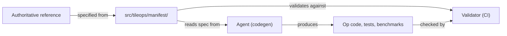

# Op Manifest Specification

The [`src/tileops/manifest/`](../../src/tileops/manifest/) package is the **source of truth** for op interfaces, benchmark workloads, and roofline metadata.

## Layout

One or more YAML files per family (single file by default; large families may shard). Each file is a flat top-level mapping `op_name → entry`. The `tileops.manifest` package merges all files at load; duplicate op names across files are an error.

- **Add or edit an op**: edit the family file matching the op's `family` field. Use `ruamel.yaml` for round-trip edits.
- **Read programmatically**: `from tileops.manifest import load_manifest, load_workloads, manifest_files`. `load_manifest()` returns the merged `ops` dict.
- **Read for inspection**: `yaml.safe_load` the relevant family file. No aggregate file on disk.

## Trust Model



- The manifest is written against an authoritative reference, never derived from current TileOps code.
- Ops, tests and benchmarks are generated from the manifest, not the other way round.
- **Validator** — [`scripts/validate_manifest.py`](../../scripts/validate_manifest.py) in CI. Enforces manifest ↔ code consistency.

**Invariants:**

1. The manifest is the sole source of truth for op interfaces.
1. Validation is derived from the manifest, not from the generating agent.
1. `workloads` define benchmark shapes/dtypes, not unit-test coverage.
1. `signature.params` ⊆ Op's `__init__()` + `forward()` param names. `forward()` params must match manifest inputs in order. CI enforces this.
1. Benchmarks must use declared workloads via `load_workloads`. No hardcoded shapes.

## Rules

**R1. Ordered dict.** `inputs`, `outputs`, `params` are keyed by name, and key order is signature position, so reordering is a breaking change and consumers read the file with an order-preserving parser.

**R2. Full interface.** Params include all PyTorch-supported parameters, even if the kernel only supports the default.

**R3. Param placement.** Default: `__init__` kwarg — architecture-decided and lifetime-fixed. `forward()` only when the reference API puts it there or the value is per-batch. The schema does not encode the distinction.

**R4. `dtype` syntax.** `|` separates alternatives. `same_as(ref)` is a dtype-only identity: the tensor's dtype equals `ref`'s at runtime, it adds no axis to R6's product, and it never speaks about shape.

**R5. `promote_int_to_float(ref)`.** An output dtype that resolves to `float32` when `ref`'s runtime dtype is integral and to `same_as(ref)` otherwise, for ops PyTorch promotes (`torch.reciprocal`). `ref` names a `signature.inputs` tensor. Allowed only in `signature.outputs[*].dtype`, and never inside a `|` union (R23).

Worked example — `torch.reciprocal` accepts integral inputs and returns `float32`, while floating inputs round-trip:

```yaml
ReciprocalFwdOp:
  ref_api: "torch.reciprocal"
  signature:
    inputs:
      input: {dtype: "float16 | bfloat16 | float32 | int8 | int16 | int32 | int64 | uint8"}
    outputs:
      # int8/int16/int32/int64/uint8 -> float32; float16/bfloat16/float32 unchanged.
      output: {dtype: "promote_int_to_float(input)"}
```

The op layer mirrors it: integral inputs are cast to `float32` before the float kernel runs, and `output_dtype` is `float32`. The validator expands the resolved set when it checks `_validate_dtypes` and `dtype_combos`.

**R6. `dtype_combos`.** The exhaustive list of supported cross-tensor dtype combinations. Absent means every combination of the declared unions is valid; declare it only when the supported set is a strict subset.

```yaml
dtype_combos:
  - {x: float16, weight: float16}
  - {x: float16, weight: float8_e4m3}
  - {x: bfloat16, weight: bfloat16}
```

**R7. Explicit shape.** Every output tensor's shape must be fully specified via `shape` and/or `shape_rules`. Input tensors may omit `shape` (→ arbitrary rank per R9).

**R8. `shape` = fixed rank.** Declares exact dimensions (e.g., `"[M, K]"`). One declaration: no ellipsis, no wildcards, no `|` alternatives. A tensor whose rank or axis order varies omits `shape` (R9). Roofline variable binding is defined in [roofline.md](roofline.md).

**R9. No `shape` = arbitrary rank.** Constraints go in `params` + `shape_rules`. Optionally, `static_dims` declares values the user commits to at Op construction time (R20).

**R10. No shape aliasing.** Each tensor declares its own shape. Use shared dimension names (R11) or `shape_rules` (R13) to express shape relationships.

**R11. Shared dimension names = equality.** `K` in two tensors means their sizes must match.

**R12. `constraints`.** Restricts dimensions: `"64 | 128 | 256"` (enumerated) or `"power_of_2"`, `"divisible_by(k)"`, `"even"`, `"positive"` (predicates). Requires `shape`.

**R13. `shape_rules`.** Python expressions for shape relationships. Required when `shape` alone cannot fully specify output shape.

**R14. Reduction `dim` semantics.** Live in `shape_rules`, written with the helpers in [`shape_rules.py`](../../src/tileops/manifest/shape_rules.py) — `dim_range_validity`, `dim_uniqueness`, `reduced_axes`, `reduced_shape` — which the op layer calls too, so the two cannot disagree. What an empty `dim` sequence means is per-op and named in the call.

**R15. Status gating.** `status: spec-only` → L0 only. `status: implemented` → all levels. `--check-op <name>` forces L0-L4 on the targeted entry.

**R16. Roofline metadata.** See [roofline.md](roofline.md). That document is the source of truth for roofline modes, variable binding, formula syntax, consumers, and codegen behavior.

**R17. PyTorch API alignment.** Op signatures match PyTorch's public API (names, parameter set, semantics). Do not invent parameters.

**R18. Optional tensor inputs.** A tensor input the op *reads* may declare `optional: true`, under `signature.inputs` only; params express optionality with `default`. Not passed means bound to `None`, and whether it was passed is a fact kernel dispatch may read — the tensor's contents are not. A caller-supplied output buffer (`out=`) is a param, not this. Authoring rules: [Optional Inputs](#optional-inputs).

**R18.1. Outputs are fixed per entry.** The names and the number of outputs are the same on every call. An op whose return changes with a switch is two entries, because the caller cannot unpack a return whose shape it does not know.

**R19. Tensor layout.** Default: contiguous row-major and no `layout` field. Otherwise `layout` names the order and `shape` names the axes in it. One entry, one memory order: an op serving two is two entries, since the order changes what an axis means. A param may size a dimension, never select which shape a tensor has.

**R20. `static_dims`.** For arbitrary-rank ops (no `shape` declaration), `static_dims` declares values the user commits to at Op construction time. Each entry maps an `__init__` keyword name to a single-axis shape expression `<tensor>.shape[<const_or_param>]`. See [`static_dims`](#static_dims) for full semantics, rules, and examples.

**R21. Workload keys derive from the signature.** In a single-tensor-input op's workloads, the shape key MUST be `{input}_shape` and every other key MUST be a `signature.params` name or one of the reserved `dtype` / `dtypes` / `label`. `dtype` is the row's element type, which a `roofline.func` formula reads to size its tensors; `dtypes` is the dtype axis a row expands over. Multi-input aggregate keys (`kv_shape`) are family bench conventions, out of scope.

**R22. Mutated inputs.** A tensor input the op may write declares `mutated: true`. An operator lists its tensor arguments in `signature.inputs` order; the inputs its `mutates_args` names, across every operator the op registers, are exactly the ones marked. A mutated input stays an input: output arity does not change and the return does not alias it. If contiguity normalization had to copy one, the op writes the result back after the launch.

**R23. Output dtype origin.** An output's `dtype` resolves to exactly one dtype — a constant, `same_as(ref)` or `promote_int_to_float(ref)` — and never names a set. An output the caller may restate declares `caller_stated: true`, and the value travels in a `signature.params` entry named `out_dtype` whose `type` is the set the caller may ask for; the output's own declaration is then the fallback taken when the caller states none. The two declarations imply each other: the param without a marked output states nothing, and a marked output without the param has no one to state it. An unmarked output keeps its declared dtype whatever the caller asked for, which is how an op that returns an auxiliary tensor beside its result keeps that one its own. An entry declaring the param names an `__init__` parameter of the same name, because the generated fake reads the output dtype off the attribute of that name.

## `static_dims`

`static_dims` declares what becomes statically known at the moment the user constructs the Op instance. It is **per-op**, not per-family.

```yaml
static_dims:
  N: "x.shape[dim]"
```

### Semantics

The shape expression is a **forward-time validation rule**, not an init-time derivation. Two time points, one contract:

- `__init__` — **commitment point**. User-supplied value stored on `self`. Expression NOT evaluated (no tensor yet).
- `forward` — **validation point**. Expression evaluated against the actual tensor; must equal the committed value.

```python
# __init__ — commitment point. No tensor; expression not evaluated.
def __init__(self, *, N: int, dim: int = -1, ...):
    self.N = N
    self.dim = dim
    # ...

# forward — validation point. Expression evaluated against the actual tensor.
def forward(self, x: torch.Tensor):
    if x.shape[self.dim] != self.N:
        raise ValueError(
            f"static_dim mismatch: expected x.shape[{self.dim}] == {self.N}, "
            f"got {x.shape[self.dim]}"
        )
    # ... rest of forward
```

### Rules

- Every `static_dims` entry's key is a required `__init__` keyword parameter. **No defaults**; the user must supply every committed value at ctor.
- The expression MUST be a **single-axis reference** of the form `<tensor>.shape[<const_or_param>]`. Multi-axis forms (e.g., `product(x.shape[i] for i in ...)`, comprehensions, arithmetic over shape) are forbidden.
- Referenced tensor names must be in `signature.inputs`. Referenced axis names (when not integer literals) must be in `signature.params`.
- Key order determines the order those kwargs appear in the generated `__init__`, consistent with R1.
- `static_dims` is only for arbitrary-rank ops. Fixed-rank ops get dimensions from `shape` (R8).

### Evaluation context

Shared with `shape_rules`: all `signature.inputs` tensor names (with `.shape` accessor) and all `signature.params` names.

### Multi-input example — LinearFwdOp

The expression may reference any tensor in `signature.inputs`, not just the primary one. For `torch.nn.functional.linear(input, weight, bias)` with arbitrary-rank `input`:

```yaml
LinearFwdOp:
  signature:
    inputs:
      input:  {dtype: "float16 | bfloat16"}
      weight: {dtype: "same_as(input)"}
      bias:   {dtype: "same_as(input)"}
    outputs:
      output: {dtype: "same_as(input)"}
    static_dims:
      in_features:  "input.shape[-1]"
      out_features: "weight.shape[0]"
    shape_rules:
      - "weight.shape == (out_features, in_features)"
      - "bias.shape == (out_features,)"
      - "output.shape == input.shape[:-1] + (out_features,)"
```

`out_features` is intrinsically a property of `weight`, not `input` — there is no equivalent expression in terms of `input.shape`. Binding to `weight.shape[0]` is the only faithful declaration.

### Generated `__init__` kwarg block order

Three blocks in order:

1. `static_dims` — manifest key order
1. `params` — manifest key order

An input dtype is no block: the tensors carry it. A caller-stated output dtype is a `params` entry like any other, named `out_dtype` (R23).

Parameters are positional-or-keyword in that order. A param the caller must name declares `kw_only: true`, and the validator holds `__init__` to it. `target`, `kernel_map` and `tune` are keyword-only in every op and are not manifest params.

### Empty `static_dims`

Empty (`static_dims: {}` or absent) is legal. Typical case: PyTorch-aligned reductions that accept `dim=None`, where the reduction extent depends on the entire input shape and is not a user-provided hyperparameter:

```yaml
SumFwdOp:
  signature:
    inputs:  {x: {dtype: "..."}}
    outputs: {y: {dtype: "same_as(x)"}}
    params:
      dim:     {type: "int | list[int] | tuple[int, ...] | None", default: null}
      keepdim: {type: bool, default: false}
    # static_dims absent — equivalent to static_dims: {}
    shape_rules: [...]
```

The generated `__init__` has no shape kwargs:

```python
def __init__(self, *, dim=None, keepdim=False, ...):
    # ...
```

**When `static_dims` is empty, the Op author MUST override `_cache_key`.** The default falls back to the full input shape tuple — correct but pathological under dynamic shapes (every distinct input shape recompiles). Typical full-reduce override:

```python
class SumFwdOp(Op):
    def _cache_key(self, x_shape):
        return (
            math.prod(x_shape),
        )  # all full-reductions with same numel share a kernel
```

The base class emits a once-per-type runtime warning when the default `_cache_key` is invoked with empty `static_dims` and no subclass override. See [ops-design-reference.md § `_cache_key` override](ops-design-reference.md#optional-hooks-appendix).

## Manifest Key Format

Each top-level entry is keyed by the **Python class name** of the Op — PascalCase with an `Op` suffix and an optional direction suffix:

```
{PascalCaseName}[{Direction}]Op
```

- **PascalCaseName** — descriptive name in PascalCase (`RMSNorm`, `BatchNorm`, `Softmax`). Author chooses; no abbreviation rules. A qualifier is part of this name and always precedes `{Direction}Op` (`MaxPool2dIndicesFwdOp`, never `MaxPool2dFwdOpIndices`).
- **Direction** — `Fwd` or `Bwd`. REQUIRED when the manifest carries both directions of the same op (a direction sibling exists); single-direction ops MAY omit it.
- **Op** — literal suffix.

Examples: `RMSNormFwdOp`, `BatchNormFwdOp`, `SoftmaxFwdOp`, `DropoutFwdOp`.

Validator enforces `cls.__name__ == manifest_key` exactly — no heuristic resolution or case conversion.

## Entry Structure

| Field                     | Required | Description                                                            |
| ------------------------- | -------- | ---------------------------------------------------------------------- |
| `family`                  | yes      | Op family. See [below](#family).                                       |
| `ref_api`                 | yes      | External API reference, or `"none"` if no direct counterpart.          |
| `status`                  | yes      | `spec-only` or `implemented`.                                          |
| `torch_compile_fullgraph` | no       | Literal `true` only. See [below](#torch_compile_fullgraph).            |
| `signature`               | yes      | Op interface. See [Signature](#signature).                             |
| `composition`             | no       | Internal structure of a composite op. See [Composition](#composition). |
| `resources`               | no       | Execution resources. See [Resources](#resources).                      |
| `workloads`               | yes      | Benchmark shapes/dtypes.                                               |
| `roofline`                | yes      | Performance model.                                                     |
| `source`                  | yes      | Implementation paths.                                                  |

### `family`

Lowercase snake_case family name. Determines which family file owns the entry (see [Layout](#layout)). Introducing a new family means adding a new family file — human-reviewed like any manifest change. The validator checks presence only.

### `torch_compile_fullgraph`

Optional; literal `true` only. Omit for "no promise" — `false` is invalid. Invalid on `status: spec-only`.

`true` declares: for each manifest-supported configuration, the first call through `torch.compile(op, fullgraph=True)` succeeds with no prior eager call and is correct under the op's tolerance policy. Not promised: dynamic shapes, `dynamic=True`, absence of recompilation. Warm-up-dependent capture does not qualify.

Every declared op MUST have a compile test registered in `tests/compile_contract.py`; CI holds declarations and registered evidence in exact set equality.

### `ref_api`

Fully qualified external API name (typically PyTorch), or `"none"`. Informational — validator checks presence only.

```yaml
RMSNormFwdOp:
  ref_api: "torch.nn.functional.rms_norm"
NSAFwdOp:
  ref_api: "none"
```

### Signature

```yaml
signature:
  inputs:       # tensor name → {dtype, shape?, constraints?}
  outputs:      # tensor name → {dtype, shape?, constraints?}
  params:       # param name → {type, default?}
  static_dims:  # kwarg → "<tensor>.shape[<axis>]" — arbitrary-rank only (R20)
  shape_rules:  # Python expressions for shape inference
  dtype_combos: # valid cross-tensor dtype combinations
```

**Tensor fields:**

| Field           | Required | Description                                                                                                                              |
| --------------- | -------- | ---------------------------------------------------------------------------------------------------------------------------------------- |
| `dtype`         | yes      | `\|` for alternatives, `same_as(ref)` = same dtype as ref, `promote_int_to_float(ref)` = `float32` for integral ref else `same_as(ref)`. |
| `caller_stated` | no       | Outputs only. `true` when `out_dtype` states this output's dtype and the declaration is the fallback (R23).                              |
| `shape`         | no       | Dimension names (e.g., `"[M, K]"`). Present = fixed rank.                                                                                |
| `constraints`   | no       | Dimension restrictions (requires `shape`).                                                                                               |
| `layout`        | no       | Memory format when non-default (R19).                                                                                                    |
| `optional`      | no       | `true` when the op may be called without this input (R18). Inputs only.                                                                  |
| `mutated`       | no       | `true` when the op may write this input (R22). Inputs only.                                                                              |

**Param fields:** `type`, plus optional `default` and `kw_only`.
A param that omits `default` MUST have no `__init__` default either: a
constructor that accepts a placeholder and rejects it later states a contract
the signature does not.

`type` is a Python type expression: `int`, `float | None`, `torch.dtype`.

The declared type and the implementation's annotation must agree on one point — whether
`None` is admitted. Spelling stays the author's: `Number` and `bool | int | float` name one
domain. `None` is the exception because admitting it decides whether a caller may withhold
the value. A type that does not admit `None` may not carry `default: null`.

#### Shape Decision Tree

```
Fixed rank, expressible with dimension names?
├─ YES → shape: "[D1, D2, ...]"                           [R8]
│   Relationships beyond shared names?
│   └─ YES → add shape_rules                              [R13]
└─ NO (arbitrary rank)
   ├─ write shape_rules                                   [R13]
   └─ Values committed at Op construction time?
      └─ YES → add static_dims                            [R20]
```

#### Optional Inputs

A tensor input the op reads may be optional (R18). One entry then covers passing it and
omitting it. Optional inputs are the trailing inputs: `forward` takes each with a `None`
default in the declared order, and a defaulted parameter cannot precede a required one.

```yaml
signature:
  inputs:
    x:      {dtype: "float32 | float16 | bfloat16"}
    weight: {dtype: "same_as(x)", optional: true}
    bias:   {dtype: "same_as(x)", optional: true}
  shape_rules:
  - "(weight is None) == (bias is None)"                # one switch, two tensors
  - "weight is None or weight.shape == (x.shape[1],)"   # guard precedes the use
  - "bias is None or bias.shape == (x.shape[1],)"
workloads:
- {label: image-g32, x_shape: [8, 128, 32, 32], num_groups: 32, dtypes: [float16]}
- {label: image-g32-affine, x_shape: [8, 128, 32, 32], num_groups: 32,
   dtypes: [float16], weight_shape: [128], bias_shape: [128]}
```

Optional inputs that share one switch state that relation in `shape_rules`, as the first
rule above does. The rules are ordinary conjuncts — no new field, no separate list.

The op branches on whether an argument was supplied — which kernel it builds, which
buffers it allocates. It does not branch on what the argument contains: that would be a
device read at dispatch time, and the fact read is not in the signature. A fact that
selects a kernel is a `params` entry.

**Where the name may appear.** In three places: `X`'s own `dtype` / `shape` declaration; a
bare presence test `X is None` / `X is not None`; and a use already guarded by `X is None`
earlier in the same expression. Every other position states something that must hold on
every call, and absence is not a value — it is the name having no referent — so an
unconditional declaration that depends on it means nothing on the call that omits it.

| position                             | rule                                                                                                                                            |
| ------------------------------------ | ----------------------------------------------------------------------------------------------------------------------------------------------- |
| `shape_rules`                        | every occurrence of `X` that is not itself a presence test needs a disjunct `X is None` among the leading operands of the rule's top-level `or` |
| `roofline` `vars`                    | `X` may appear only as `X is None` or `X is not None`; `X.shape`, `X.ndim`, `X[...]` are rejected even under a guard                            |
| `roofline` `flops` / `bytes`         | no `X` at all — the arithmetic layer reads `vars`, params and `elem_bytes`, so a presence test reaches it through a `vars` entry                |
| `dtype_combos` row                   | no column keyed by `X` — a row assigns a dtype on every call it covers, and an absent input has none                                            |
| any `dtype` expression               | `same_as(X)` is rejected — an absent input has no dtype to resolve to                                                                           |
| required input's or output's `shape` | may not use a symbol first bound in `X`'s `shape`                                                                                               |

The guard is `X is None or <condition>`, never `X is not None and <condition>`:
`shape_rules` entries are conjuncts, so the second form reports a legal absent call as a
violation. It must precede the use but need not sit leftmost —
`min is None or max is None or output.shape == broadcast_shapes(input.shape, min.shape, max.shape)`
is well formed. A formula that needs an optional tensor's own shape uses
`roofline: {func: ...}`, where the function sees the actual call.

**Workload coverage.** Every optional input needs at least one row that passes it and at
least one that omits it, counted per input rather than per combination: n optional inputs
are 2n states, not 2ⁿ. A row passes `X` by carrying `<X>_shape`, whatever else it writes —
a row is sample call data, not a contract expression, so the position rules above do not
reach it. `status: spec-only` entries are exempt (R15 runs them at L0 only).

Coverage reaches optional inputs and nothing else. Which value a param takes is benchmark
completeness, tracked on its own; which shape range picks which kernel is a branch only the
kernel knows, and [testing.md](testing.md) already makes the op author cover it with the
smallest shape that triggers each branch.

**Roofline describes the call that ran.** A formula whose cost varies with an optional
input reads that input's presence — inline through a `vars` presence test, or `func` mode,
which sees the call. "Everything passed" is not an upper bound to fall back on. How much of
a call's traffic a formula models at all is [roofline.md](roofline.md)'s matter.

**What the validator does not check.** Five things, deliberately:

- It does not solve `shape_rules` for the set of legal ways to call the op.
- It does not sort rules into presence rules and shape rules; both kinds may reference shapes, params and whitelisted helpers.
- It does not enumerate the 2ⁿ ways to pass n optional inputs.
- It does not ask the manifest for a field declaring which optional inputs go together; `(weight is None) == (bias is None)` stays an ordinary `shape_rules` string.
- It does not stop a call that passes half of a co-occurring group. The op's own check in `forward` does, the same way every other shape constraint is caught, and the error names which group was given in part.

What runtime can never report — a contract position no workload row covers — is what the
coverage rule checks statically.

**What stays separate.** `optional: true` does not merge everything. Three shapes keep
their own entries: an op whose outputs change with a switch (R18.1), an op that puts the
same concept in `params` in one form and in `inputs` in another (`LerpFwdOp` versus
`LerpTensorFwdOp`), and one signature served by genuinely different algorithms (the `Rope*`
family), which produce different values from the same inputs and so carry a `ref_api` and a
roofline each. There is no field linking them: each writes the same `source.op`, which is
where a reader sees they come from one implementation.

### Workloads

Shape keys use `<tensor_name>_shape`. Op-specific parameters can be added per entry.

```yaml
- {x_shape: [2048, 4096], dtypes: [float16, bfloat16], label: "llama-8b"}
```

`workloads` are for benchmark parametrization only, not unit-test coverage.

### Composition

An entry's external contract — `signature`, `shape_rules`, `workloads`, `roofline`, `source` — is
always present. `composition` adds the internal structure of a composite op and `resources` its
execution resources; each appears only where the op has one.

`composition` states that one call to the public op is carried out by several stages. It is a
contract and a validation unit, not a scheduler IR: it generates no forward, takes no part in
dispatch, and does not require one stage per kernel launch. A phase internal to a single kernel is
not a stage.

| Field    | Required | Description                         |
| -------- | -------- | ----------------------------------- |
| `kind`   | yes      | `composite` — the only value.       |
| `stages` | yes      | Non-empty list, in execution order. |

Each stage:

| Field       | Required | Description                                                                          |
| ----------- | -------- | ------------------------------------------------------------------------------------ |
| `name`      | yes      | Unique within the `composition`. Workspaces and `roofline.composition` cite it.      |
| `op`        | \*       | Manifest entry name, or a dotted path importing to a class. Exclusive with `kernel`. |
| `kernel`    | \*       | A key of this entry's `source.kernel_map`. Exclusive with `op`.                      |
| `delegates` | no       | Ops the stage builds, mirroring the op's `kernel_delegates()`.                       |
| `variants`  | no       | Mutually exclusive performance paths. Top-level stages only.                         |
| `optional`  | no       | The stage runs only in some configurations.                                          |

A stage names what runs only through `op` or `kernel`, so the name always resolves: an
implementation worth naming as a stage is registered as a manifest op.

A `variant` is a performance-relevant branch; its `condition` is prose, as the executable condition
stays in the op. A workload row declares no variant — which one a call takes is a runtime dispatch
fact, not a static property of the row. Where one branch covers a whole pipeline, its variants hang
off the stage referencing that op and the `condition` names the stages they replace.

```yaml
composition:
  kind: composite
  stages:
  - name: prepare
    op: PrepareFwdOp
  - name: compute
    op: ComputeFwdOp
    delegates: [InnerFwdOp]
    variants:
    - name: tight
      stages: [{op: InnerFwdOp}]
    - name: fused
      condition: "aligned shapes below the small-batch threshold; replaces prepare"
      stages: [{kernel: fused_compute}]
```

### Resources

A workspace is scratch the op needs in order to run. What separates it from an input is the value:
an input's changes the result and the reference API takes it too, while a workspace holds nothing
meaningful before the call, nothing to rely on after it, and may change shape or layout with the
backend or the variant.

| Field      | Required | Description                                                     |
| ---------- | -------- | --------------------------------------------------------------- |
| `name`     | yes      | Unique, and not also an input name.                             |
| `dtype`    | yes      | Same syntax as an input's dtype, `same_as(ref)` included.       |
| `owner`    | \*       | A stage name. Required when the entry declares a `composition`. |
| `kind`     | no       | `scratch` — the only value.                                     |
| `optional` | no       | The workspace is not passed in every configuration.             |
| `note`     | no       | Free text.                                                      |

A workspace is still a `forward()` argument. Everything that builds that argument list from the
manifest — parameter order, shape inference, dtype validation, the empty-input guard — reads
`signature.inputs` followed by `resources.workspaces`, in declaration order. Workspace shape stays
with the op (`workspace_shapes()` or a runtime check); there is no `shape` key here.

Two consumers read `signature.inputs` alone. A `dtype_combos` row is the value contract a caller
writes against, so it carries no column for a workspace. An inline `roofline` expression resolves
only over inputs and params, so it cannot name a workspace — the manifest declares no shape for one,
and that shape may change with the backend or the variant.

```yaml
resources:
  workspaces:
  - name: workspace1
    dtype: float16 | bfloat16
    owner: compute
    kind: scratch
```

### Nullable outputs

Output names and count are fixed per entry. A return position that always exists but may hold
`None` declares `nullable: true`; a return whose *number* of values changes with a parameter is two
entries instead. `nullable` is valid on outputs only — an input that may be omitted uses `optional`.

```yaml
outputs:
  aux_output: {dtype: "same_as(x)", nullable: true}
  main_output: {dtype: "same_as(x)"}
```

### Roofline

Roofline metadata is required on every manifest entry. Its modes,
variable binding rules, formula syntax, consumers, and codegen behavior
are defined in [roofline.md](roofline.md).

A composite op declares what its cost is made of under `roofline.composition`, alongside either
roofline mode. An entry with a `composition` must have one. The parent's cost is still computed by its own `flops`/`bytes` or `func`;
`composition` records the relationship so a missing or double-counted stage is rejected rather than
silently mispriced. Each row names a `stage` and gives exactly one of `source` (dotted path to the
formula that stage's cost comes from, resolved as `func` is) or `formula` (prose where no separate
function exists). Every stage not marked `optional` must appear, and none may appear twice.

`roofline.func` resolves as `module.attribute`, so it names a module-level function; a class method
path does not import. A composite's formula belongs in `tileops.perf.formulas` alongside those of
the ops it composes, and the op's `eval_roofline()` calls that same function — two copies of one
cost drift apart.

```yaml
roofline:
  func: "tileops.perf.formulas.composite_fwd_bytes"
  composition:
  - stage: compute
    source: "tileops.perf.formulas.inner_fwd_bytes"
  - stage: epilogue
    formula: "2 * num_tokens * hidden_size"
    optional: true
```

### Source

| Field                   | Required | Description                                                            |
| ----------------------- | -------- | ---------------------------------------------------------------------- |
| `kernel`                | yes      | Kernel file path(s).                                                   |
| `kernel_map`            | \*       | Dispatch key → Kernel class name. Required when `status: implemented`. |
| `op`                    | yes      | Op class file path.                                                    |
| `test`                  | yes      | Test file path.                                                        |
| `bench`                 | yes      | Benchmark file path.                                                   |
| `bench_manifest_driven` | \*       | Required `true` when `status: implemented`; makes L4 a hard CI error.  |

#### kernel_map

Op→Kernel dispatch registration table. Declares which Kernels an Op uses so agents know what to implement, and which slots a caller's `kernel_map=` replaces. Does not describe dispatch strategy (runtime concern). Format: `dispatch_key: KernelClassName`. The validator holds it equal to the op's `default_kernel_map`; a composite op installs none of its own and declares its sub-ops' kernels, which is not checked. See [op-slot-rules.md § Slot S14 `default_kernel_map`](op-slot-rules.md#slot-s14).

```yaml
# Single-kernel op
source:
  kernel: src/tileops/kernels/norm/rms_norm.py
  kernel_map:
    rms_norm: RMSNormKernel
  op: src/tileops/ops/norm/rms_norm.py

# Multi-kernel op
source:
  kernel: src/tileops/kernels/attention/gqa_bwd.py
  kernel_map:
    gqa_bwd_preprocess_kernel: FlashAttnBwdPreprocessKernel
    gqa_bwd_kernel: GQABwdWgmmaPipelinedKernel
  op: src/tileops/ops/attention/gqa.py
```

- Optional when `status: spec-only`. Required when `status: implemented`.

## Entry Examples

**Fixed rank — GEMM** \[R8, R11\]:

```yaml
inputs:
  a: {dtype: "float16 | bfloat16", shape: "[M, K]"}
  b: {dtype: "same_as(a)", shape: "[K, N]"}
outputs:
  c: {dtype: "same_as(a)", shape: "[M, N]"}
```

**Fixed rank + constraints — FFT** \[R8, R12\]:

```yaml
inputs:
  x: {dtype: "complex64", shape: "[M, N]", constraints: {N: "power_of_2"}}
outputs:
  y: {dtype: "same_as(x)", shape: "[M, N]"}
```

**Arbitrary rank — RMSNorm** \[R9, R13, R17\]:

```yaml
inputs:
  x: {dtype: "float16 | bfloat16"}
  weight: {dtype: "same_as(x)"}
outputs:
  output: {dtype: "same_as(x)"}
params:
  normalized_shape: {type: "list[int] | tuple[int, ...]"}
  eps: {type: "float | None", default: null}
shape_rules:
  - "len(normalized_shape) > 0"
  - "tuple(x.shape[-len(normalized_shape):]) == tuple(normalized_shape)"
  - "weight.shape == tuple(normalized_shape)"
  - "output.shape == x.shape"
```

**Arbitrary rank — Reduce** \[R9, R13\]:

```yaml
inputs:
  x: {dtype: "float16 | bfloat16 | float32"}
outputs:
  output: {dtype: "same_as(x)"}
params:
  dim: {type: "int | list[int] | tuple[int, ...] | None", default: null}
  keepdim: {type: bool, default: false}
shape_rules:
  - "dim is None or all(-x.ndim <= d < x.ndim for d in ([dim] if isinstance(dim, int) else dim))"
  - "isinstance(dim, (int, type(None))) or len({d % x.ndim for d in dim}) == len(dim)"
  - "output.shape == reduced_shape(x.shape, dim, keepdim)"
```

All reduction ops include `dim` + `keepdim`. **Exception:** softmax/log_softmax preserve the input shape and take no `keepdim`; count_nonzero has no `keepdim` either (R17). What an empty `dim` sequence means is per-op: see R14 and [domain-rules/manifest-spec.md](../../.claude/domain-rules/manifest-spec.md).

**Full entry — RMSNorm:**

```yaml
RMSNormFwdOp:
  family: normalization
  ref_api: "torch.nn.functional.rms_norm"
  status: implemented

  signature:
    inputs:
      x: {dtype: "float16 | bfloat16"}
      weight: {dtype: "same_as(x)"}
    outputs:
      output: {dtype: "same_as(x)"}
    params:
      normalized_shape: {type: "list[int] | tuple[int, ...]"}
      eps: {type: "float | None", default: null}
    shape_rules:
      - "len(normalized_shape) > 0"
      - "tuple(x.shape[-len(normalized_shape):]) == tuple(normalized_shape)"
      - "weight.shape == tuple(normalized_shape)"
      - "output.shape == x.shape"

  workloads:
    - {x_shape: [2048, 4096], normalized_shape: [4096], dtypes: [float16, bfloat16], label: "llama-8b-prefill"}
    - {x_shape: [1, 4096], normalized_shape: [4096], dtypes: [bfloat16], label: "llama-8b-decode"}

  roofline:
    vars:
      M: "product(x.shape[:x.ndim - len(normalized_shape)])"
      N: "product(normalized_shape)"
    flops: "4 * M * N"
    bytes: "(2 * M * N + N) * elem_bytes"

  source:
    kernel: src/tileops/kernels/norm/rms_norm.py
    kernel_map:
      rms_norm: RMSNormKernel
    op: src/tileops/ops/norm/rms_norm.py
    test: tests/ops/test_rms_norm.py
    bench: benchmarks/ops/bench_norm.py
```

## Benchmark Pattern

Benchmarks must use manifest-driven workloads. See [testing.md](testing.md)
for benchmark structure and [roofline.md](roofline.md) for roofline
consumption.

### Workload entry schema

Each entry under `workloads:` is a mapping. `dtypes` and `label` are
reserved. Key rules: R21.

| Key             | Required | Meaning                                                                                                                                                                                               |
| --------------- | -------- | ----------------------------------------------------------------------------------------------------------------------------------------------------------------------------------------------------- |
| `{input}_shape` | yes\*    | Shape for the single tensor input (list of ints), named per R21. \*Multi-input families define their own aggregate shape keys (e.g. `q_shape`/`kv_shape`) in their family bench files.                |
| `dtypes`        | yes      | List of dtype strings (`["float16", "bfloat16"]`).                                                                                                                                                    |
| `label`         | no       | Human-readable id used in the pytest param id and report tables. MUST NOT name a dtype the row's `dtypes` already lists: the case id ends with the dtype it runs, so the label would render it twice. |
| *any other key* | no       | Op param value (`dim`, `keepdim`, …). MUST be a declared `signature.params` name (R21); overrides its default.                                                                                        |

Example — parametrizing a reduction workload over a non-last `dim`:

```yaml
workloads:
  - {x_shape: [2048, 4096], dtypes: [bfloat16], dim: -1, label: "reduce-last"}
  - {x_shape: [2048, 4096], dtypes: [bfloat16], dim:  0, label: "reduce-first"}
```

## Manifest Validation

[`scripts/validate_manifest.py`](../../scripts/validate_manifest.py) runs five levels:

| Level | Check     | Description                                                                                                                                                                                                                                                                  |
| ----- | --------- | ---------------------------------------------------------------------------------------------------------------------------------------------------------------------------------------------------------------------------------------------------------------------------- |
| L0    | Schema    | Required fields exist, correct types                                                                                                                                                                                                                                         |
| L1    | Signature | Params ⊆ `__init__()` ∪ `forward()` names; `forward()` order matches                                                                                                                                                                                                         |
| L2    | Shape     | `shape_rules` are valid Python expressions                                                                                                                                                                                                                                   |
| L3    | Dtype     | dtype strings are valid torch types, `same_as()` refs, or `promote_int_to_float()` refs                                                                                                                                                                                      |
| L4    | Benchmark | Bench file calls `load_workloads` / `workloads_to_params` and takes its roofline off an Op — `eval_roofline()` or a `ManifestBenchmark`. It matches no op name: which entry a file benchmarks is settled by a run, see [trust-model.md §Benchmark](trust-model.md#benchmark) |

`spec-only` ops → L0 only. `implemented` ops → all levels. `--check-op <name>` forces L0-L4 on the targeted entry. L2 and L3 additionally run parity extensions against the implemented Op's `_infer_output_shapes` / `_validate_dtypes` methods; see [ops-design.md](ops-design.md).

Those parity extensions block only under `--strict`, which is how CI runs the validator. A default run reports them as warnings and says so — its first lines name the `parity-mode:` in force, so a green default run is not the same claim as a green CI run.

```bash
python scripts/validate_manifest.py
python scripts/validate_manifest.py --check-op SoftmaxFwdOp
```

## Exclusions

The manifest does NOT describe: multi-kernel execution ordering, accumulator dtypes, persistent state, tile sizes, or autotuning config.
