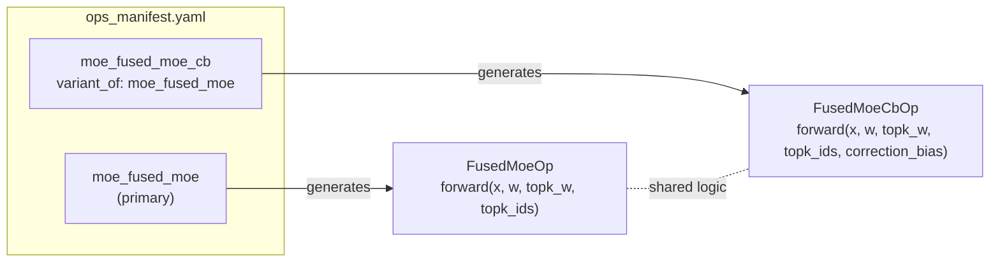

# Op Manifest Specification

[`ops_manifest.yaml`](../tileops/ops_manifest.yaml) is the **source of truth** for op interfaces, benchmark workloads, and benchmark roofline metadata.

## Trust Model


Three roles govern the manifest lifecycle:

- **Human reviewer** — the only actor that can modify [`ops_manifest.yaml`](../tileops/ops_manifest.yaml). All changes require PR review.
- **Agent** — generates Op implementations, tests, and benchmarks from the manifest. The agent reads the manifest but never modifies it.
- **Validator** — [`scripts/validate_manifest.py`](../scripts/validate_manifest.py), running in CI as the [`validate-manifest`](../.github/workflows/preflight.yml) job. Enforces consistency between the manifest and generated code.

**Rules:**

1. [`ops_manifest.yaml`](../tileops/ops_manifest.yaml) is the sole source of truth for op interfaces.
1. Programmatic validation ([`scripts/validate_manifest.py`](../scripts/validate_manifest.py)) is derived from the manifest, not from the generating agent.
1. `workloads` define benchmark shapes and dtypes for nightly/performance coverage, not unit-test coverage.
1. `Op.forward()` signature must match the manifest. The validator's L1 check enforces this.
1. Benchmarks must use declared workloads. No hardcoded shapes. The validator's L4 check enforces this.

## Rules

**R1. Ordered dict.** `inputs`, `outputs`, and `params` are dicts keyed by name. Key order is significant — it defines the function signature position.

> **Implementation constraint:** YAML spec does not guarantee mapping order. This project relies on Python 3.7+ `dict` insertion-order preservation via PyYAML `yaml.safe_load()`. All manifest consumers (validators, codegen, agents) MUST use an order-preserving parser.
>
> **Agent rule:** When generating `Op.forward()`, `Op.infer_shape()`, or test code from the manifest, the agent MUST preserve the key order as the positional argument order. Reordering is a breaking change.

**R2. Full interface.** Params include all mathematically supported parameters, even if the current kernel only supports the default.

**R3. `dtype` syntax.** `|` for alternatives, `same_as(ref)` for dependent types.

**R4. `dtype_combos`.** Enumerates the actually supported cross-tensor dtype combinations.

- **When present:** Exhaustive source of truth. Only listed combinations are valid. Validator and test generator use this list, not the Cartesian product.
- **When absent:** All combinations from the Cartesian product of per-tensor `dtype` fields are assumed supported. Validator must verify all of them.

Use `dtype_combos` when the supported set is a strict subset of the Cartesian product (e.g., mixed-precision GEMM supports 3 of 4 possible combinations). Omit when all combinations are valid (e.g., all inputs are `same_as(x)`).

```yaml
# Mixed-precision GEMM: 3 of 4 combos supported (not all Cartesian products)
dtype_combos:
  - {x: float16, weight: float16}
  - {x: float16, weight: float8_e4m3}
  - {x: bfloat16, weight: bfloat16}
```

**R5. Output shape completeness.** Every output's shape must be fully specified via `shape`, `same_as(ref)`, and/or `shape_rules`. The manifest must be sufficient for generating `Op.infer_shape()`. See [Signature](#signature) for field definitions and [Shape Decision Tree](#shape-decision-tree) for the declaration flow.

**R6. `shape` present = fixed rank.** Declares exact dimensions (e.g., `"[M, K]"`). Names become variables in `roofline` and `constraints`. No ellipsis or wildcards.

**R7. `shape` absent = arbitrary rank.** Any number of dimensions. Axis constraints go in `params` + `shape_rules`.

**R8. `same_as(ref)`.** Output has identical shape to the referenced tensor. Works for both fixed and arbitrary rank.

**R9. Shared dimension names = equality.** `K` in two tensors means their sizes must match.

**R10. `constraints`.** Restricts dimensions on tensors with `shape`. Values: `"64 | 128 | 256"` (enumerated) or `"power_of_2"`, `"divisible_by(k)"`, `"even"`, `"positive"` (predicates).

**R11. `shape_rules`.** Python expressions describing shape relationships. Agent generates `Op.infer_shape()` from these. Required when `shape` + `same_as` cannot fully specify output shape.

**R12. Shape derivation.** `shape`, `same_as(ref)`, and `shape_rules` fully specify how output shape is derived from inputs. Agent generates shape computation code from these declarations. Manifest and implementation must be consistent.

**R13. Status gating.** `status` declares whether an op is a forward-looking spec or a shipped implementation. When `status: spec-only`, the validator applies schema checks (L0) only — signature, shape, dtype, and benchmark checks (L1-L4) are skipped. `source` paths declare intended locations. When `status: implemented`, all validation levels apply and all `source` paths must resolve to existing files. **Default:** When `status` is absent, it defaults to `implemented`. New entries SHOULD include `status` explicitly. See [Manifest Validation](#manifest-validation) for L0-L4 definitions.

**R14. Roofline variable binding.** See [Roofline](#roofline) section.

**R15. PyTorch interface alignment.** Op signatures must match PyTorch's public API conventions (parameter names, parameter set, semantics). Do not invent parameters that PyTorch does not expose. When PyTorch has no direct equivalent, follow the closest community convention (numpy, scipy). Consequence: spatial-norm ops (batchnorm, groupnorm, instancenorm) do NOT get a `dim` parameter — matching PyTorch's `nn.BatchNorm2d`, `nn.GroupNorm`, `nn.InstanceNorm2d`.

**R16. No Optional[Tensor] in manifest.** Each entry has a fixed set of required tensor inputs. Ops with conditional inputs are split into variant entries linked by `variant_of`. See [Entry Examples](#entry-examples) for the variant codegen pattern.

> **R17.** `variant_of` is one level only. A variant points to a primary entry. The primary must not itself have `variant_of`. Chaining is not allowed.
>
> **R18.** Variants share `source.kernel` and `source.op`. Each has its own `signature`, `workloads`, and `roofline`.

**R19. Tensor layout.**

- **Default:** contiguous, row-major (C-contiguous). Last dimension is fastest-varying in memory. No `layout` field needed. The Op layer handles `.contiguous()` conversion (see [ops-design.md](ops-design.md) Principle 4).
- **Non-default:** when an op requires a different memory format (e.g., `channels_last` for spatial ops), the tensor declaration MUST include a `layout` field. `shape` dimension names reflect actual memory order.

```yaml
# Default: no layout field
x: {dtype: "float16 | bfloat16"}

# Non-default: layout explicit
x: {dtype: "float16", shape: "[N, H, W, C]", layout: "channels_last"}
```

## Entry Structure

Each entry lives under `ops:`:

| Field       | Required | Description                                                                        |
| ----------- | -------- | ---------------------------------------------------------------------------------- |
| `family`    | yes      | Op family (e.g., `norm`, `attention`).                                             |
| `status`    | no       | `spec-only` or `implemented`. Defaults to `implemented`. See R13.                  |
| `signature` | yes      | Op interface. See [Signature](#signature).                                         |
| `workloads` | yes      | Benchmark shapes/dtypes for nightly/performance runs. See [Workloads](#workloads). |
| `roofline`  | yes      | Performance model. See [Roofline](#roofline).                                      |
| `source`    | yes      | Implementation paths. See [Source](#source).                                       |

### Signature

```yaml
signature:
  inputs:       # dict — tensor name → {dtype, shape?, constraints?}
  outputs:      # dict — tensor name → {dtype, shape?, constraints?}
  params:       # ordered dict — param name → {type, default?}
  shape_rules:  # list — Python expressions for shape inference
  dtype_combos: # list — valid cross-tensor dtype combinations
```

**Tensor fields** (`inputs`/`outputs`): key = tensor name, value = dict with:

| Field         | Required | Description                                                     |
| ------------- | -------- | --------------------------------------------------------------- |
| `dtype`       | yes      | `\|` for alternatives, `same_as(ref)` for dependent types.      |
| `shape`       | no       | Dimension names or `same_as(ref)`. Present = fixed rank.        |
| `constraints` | no       | Dimension restrictions (requires `shape`).                      |
| `layout`      | no       | Memory format when non-default. E.g., `channels_last`. See R19. |

**Param fields**: key = param name, value = dict with `type` (string: `int`, `float`, `bool`, `"list[int]"`) and optional `default`.

#### Shape Decision Tree

Step 1 — declare output shape in the manifest. Step 2 — generate `Op.infer_shape()` from that declaration.

**Step 1 — Declare:**

```
Output shape identical to an input?
├─ YES → shape: "same_as(ref)"                            [R8]
└─ NO
   Fixed rank, expressible with dimension names?
   ├─ YES → shape: "[D1, D2, ...]"                        [R6]
   │   Inter-tensor relationships beyond shared names?
   │   └─ YES → add shape_rules                           [R11]
   └─ NO (arbitrary rank, depends on params)
      └─ write shape_rules                                [R11]
```

Every leaf is a complete spec — no "omit and fallback" path.

**Step 2 — Generate `Op.infer_shape()`:**

| Declaration                             | Generated logic                                     |
| --------------------------------------- | --------------------------------------------------- |
| `shape: "same_as(ref)"`                 | `return ref.shape`                                  |
| `shape: "[D1, D2, ...]"` + shared names | Return shape with matched dimensions from inputs    |
| `shape_rules`                           | Translate expressions into Python shape computation |

#### Optional Inputs

Some ops accept conditional tensor inputs (e.g., `correction_bias` only when `with_correction_bias=True`). The manifest does not support `Optional[Tensor]` — this is a deliberate design choice to keep the schema, validator, and codegen simple (R16).

**Problem:** If the manifest allowed optional tensors, every downstream consumer (validator, shape rules, roofline, codegen) would need conditional logic — shape rules that reference a tensor that might be None, roofline expressions that change based on tensor presence, and validators that check partial signatures. This complexity cascades.

**Solution:** Split into variant entries with fixed signatures, linked by `variant_of` (R16-R18). Each variant is a complete, self-contained interface contract. The implementation shares logic via a base class — the manifest declares the interface, [ops-design.md](ops-design.md) governs the implementation structure.

**Decision tree:**

```
Op has Optional[Tensor] inputs?
├─ NO → single manifest entry
└─ YES
   How many optional tensors?
   ├─ 1 → 2 entries (primary + variant), linked by variant_of
   ├─ 2 → evaluate: do they appear independently or always together?
   │   ├─ Always together → 2 entries (without both / with both)
   │   └─ Independent → up to 4 entries; consider if the op should be decomposed
   └─ 3+ → decompose the op into smaller ops first
```

**Naming convention:** Variant entries append a short suffix describing the additional input: `{op_name}_{suffix}`. The suffix should be descriptive, not generic (e.g., `moe_fused_moe_cb` for correction_bias, not `moe_fused_moe_v2`).

**`variant_of` field:**

| Field        | Required | Description                                              |
| ------------ | -------- | -------------------------------------------------------- |
| `variant_of` | no       | Name of the primary entry. Only one level — no chaining. |

**Codegen rules:**

1. Each manifest entry generates exactly one Op class.
1. Primary entry (no `variant_of`) → Op class with full forward logic.
1. Variant entry (has `variant_of`) → Op class sharing internal logic with primary; only `forward()` signature differs.
1. Primary and variant Op classes live in the same module (`source.op` is identical per R18).
1. How shared logic is structured (base class, delegation, composition) is an implementation decision governed by [ops-design.md](ops-design.md).



### Workloads

Each entry is a dict. Shape keys use `<tensor_name>_shape` convention.

| Field    | Required | Description                  |
| -------- | -------- | ---------------------------- |
| `dtypes` | yes      | List of dtypes to benchmark. |
| `label`  | no       | Human-readable tag.          |

```yaml
# Single primary input:
- {x_shape: [2048, 4096], dtypes: [float16, bfloat16], label: "llama-3.1-8b"}
# Multiple inputs:
- {q_shape: [1, 1, 32, 128], kv_shape: [1, 8192, 8, 128], dtypes: [float16], label: "gqa-decode"}
```

Op-specific parameters (e.g., `groups`, `is_causal`) can be added per entry.

`workloads` are for benchmark scheduling and benchmark parametrization only. They do not prescribe unit-test cases or UT branch coverage; unit tests remain developer-owned and should target implementation-critical branches directly.

### Roofline

| Mode             | Format                   | When                                                           |
| ---------------- | ------------------------ | -------------------------------------------------------------- |
| Inline (no vars) | `flops`/`bytes` only     | Fixed-rank ops with `shape` dimension names.                   |
| Inline + vars    | `vars` + `flops`/`bytes` | Arbitrary-rank ops; recommended for self-contained evaluation. |
| Func             | `func: "module.path"`    | Tier 2: complex formulas needing Python code.                  |

Inline expressions are evaluated by `_safe_eval()` — only numeric constants, arithmetic (`+-*//**%`), and `log2`/`ceil`/`floor`. Func-mode functions live in [`tileops/perf/formulas.py`](../tileops/perf/formulas.py), accept kwargs, return `{"flops": int, "bytes": int}`.

**Variable binding (R14):**

**Built-in variables:** `elem_bytes` — byte size of the first input's dtype (the first key in `inputs`). Currently caller-supplied; target behavior is auto-injection.

**Auto-bound from `shape`:** When a tensor declares `shape: "[M, K]"`, dimension names are available as roofline variables. `vars` may be omitted. Currently caller-supplied; target behavior is auto-binding from the manifest.

**Explicit `vars`:** When tensors have arbitrary rank (no `shape` field), roofline SHOULD include a `vars` mapping for self-contained evaluation. Each entry is `name: "Python expression"`. **Backward compatibility:** When `vars` is absent for arbitrary-rank ops, the consumer provides variable bindings at evaluation time (current behavior). New entries SHOULD include `vars` for self-contained evaluation.

**Implementation note:** The `vars` evaluation mechanism is not yet implemented in the current evaluator ([`tileops/manifest.py::eval_roofline`](../tileops/manifest.py)). The evaluator currently accepts caller-supplied scalar variables only. Implementing `vars` evaluation is tracked as a separate task.

**`vars` evaluation context:** tensor shapes (`x.shape`, `x.shape[i]`, `x.shape[start:end]`, `x.ndim`), params by name (`dim`, `groups`), helpers (`product(iterable)`), arithmetic (`+`, `-`, `*`, `//`, `**`, `%`), built-ins (`range()`, `len()`, list comprehensions).

**`flops`/`bytes` evaluation context (unchanged):** Numeric constants, bound variables, arithmetic, `log2`, `ceil`, `floor`. No shape access — all shape-dependent values must come through `vars`.

**Mixed dtype:** `elem_bytes` binds to the primary input. Other dtypes use literal byte counts (e.g., `4` for float32).

#### Roofline Examples

```yaml
# Case 1: Fixed rank — vars omitted, shape names auto-bind
roofline:
  flops: "2 * M * N * K"
  bytes: "(M * K + K * N + M * N) * elem_bytes"

# Case 2: Arbitrary rank, single-dim reduction
roofline:
  vars:
    M: "product(x.shape[:dim])"
    N: "x.shape[dim]"
  flops: "4 * M * N"
  bytes: "(2 * M * N + N) * elem_bytes"

# Case 3: Spatial norm
roofline:
  vars:
    C: "x.shape[1]"
    L: "product(x.shape) // x.shape[1]"
  flops: "10 * C * L"
  bytes: "2 * C * L * elem_bytes + 4 * C * 4"

# Case 4: Multi-dim reduction
roofline:
  vars:
    M: "product(x.shape[i] for i in range(x.ndim) if i not in dim)"
    N: "product(x.shape[i] for i in dim)"
  flops: "M * N"
  bytes: "(M * N + M) * elem_bytes"
```

### Source

| Field                   | Required | Type           | Description                                                                                                                                                                                   |
| ----------------------- | -------- | -------------- | --------------------------------------------------------------------------------------------------------------------------------------------------------------------------------------------- |
| `kernel`                | yes      | string or list | Kernel file path(s).                                                                                                                                                                          |
| `op`                    | yes      | string         | Op class file path.                                                                                                                                                                           |
| `test`                  | yes      | string         | Test file path.                                                                                                                                                                               |
| `bench`                 | yes      | string         | Benchmark file path.                                                                                                                                                                          |
| `bench_manifest_driven` | no       | bool           | Migration flag: `true` = L4 benchmark check is a hard CI error. Introduced for gradual migration from legacy hardcoded benchmarks. Remove this field once all benchmarks are manifest-driven. |

## Entry Examples

**Fixed rank — GEMM** \[R1, R6, R9\]:

```yaml
# Shared K implies a.shape[1] == b.shape[0]
inputs:
  a: {dtype: "float16 | bfloat16", shape: "[M, K]"}
  b: {dtype: "same_as(a)", shape: "[K, N]"}
outputs:
  c: {dtype: "same_as(a)", shape: "[M, N]"}
```

**Fixed rank + constraints — FFT** \[R6, R8, R10\]:

```yaml
inputs:
  x: {dtype: "complex64", shape: "[M, N]", constraints: {N: "power_of_2"}}
outputs:
  y: {dtype: "same_as(x)", shape: "same_as(x)"}
```

**Arbitrary rank + same_as — RMSNorm** \[R7, R8, R11\]:

```yaml
# No shape on x → any rank. dim selects axis. weight is 1-D along that axis.
inputs:
  x: {dtype: "float16 | bfloat16"}
  weight: {dtype: "same_as(x)"}
outputs:
  y: {dtype: "same_as(x)", shape: "same_as(x)"}
params:
  dim: {type: int, default: -1}
  eps: {type: float, default: 1e-6}
shape_rules:
  - "weight.shape == (x.shape[dim],)"
```

**Arbitrary rank + shape_rules — Reduce** \[R7, R11\]:

```yaml
# Output rank depends on dim and keepdim — shape_rules fully describe the logic.
inputs:
  x: {dtype: "float16 | bfloat16"}
outputs:
  y: {dtype: "same_as(x)"}
params:
  dim: {type: "int | list[int]"}
  keepdim: {type: bool, default: false}
shape_rules:
  # dim is normalized to list: dims = [dim] if isinstance(dim, int) else dim
  - "y.ndim == x.ndim if keepdim else x.ndim - len([dim] if isinstance(dim, int) else dim)"
  - "y.shape[i] == (1 if i in ([dim] if isinstance(dim, int) else dim) and keepdim else x.shape[i])"
```

All reduction ops (sum, mean, amax, amin, prod, argmax, argmin, all, any, l1_norm, l2_norm, inf_norm, var, std, var_mean, logsumexp) must include `dim` and `keepdim` params with the shape_rules shown above. **Exception:** softmax and log_softmax always preserve input shape — `keepdim` is not applicable; their output shape is `same_as(x)`. count_nonzero does not support `keepdim` in PyTorch (per R15).

**Full entry — RMSNorm:**

```yaml
ops:
  rmsnorm_fwd:
    family: norm
    status: implemented

    signature:
      inputs:
        x: {dtype: "float16 | bfloat16"}
        weight: {dtype: "same_as(x)"}
      outputs:
        y: {dtype: "same_as(x)", shape: "same_as(x)"}
      params:
        dim: {type: int, default: -1}
        eps: {type: float, default: 1e-6}
      shape_rules:
        - "weight.shape == (x.shape[dim],)"

    workloads:
      - {x_shape: [2048, 4096], dtypes: [float16, bfloat16], label: "llama-3.1-8b-prefill"}
      - {x_shape: [1, 4096], dtypes: [bfloat16], label: "llama-3.1-8b-decode"}

    roofline:
      vars:
        M: "product(x.shape[:dim])"
        N: "x.shape[dim]"
      flops: "4 * M * N"
      bytes: "(2 * M * N + N) * elem_bytes"

    source:
      kernel: tileops/kernels/norm/rms_norm.py
      op: tileops/ops/norm/rms_norm.py
      test: tests/ops/test_rms_norm.py
      bench: benchmarks/ops/bench_rms_norm.py
```

## Benchmark Pattern

Benchmark files must use manifest-driven workloads via `load_workloads` and `eval_roofline` from `tileops.manifest`. This ensures benchmarks always match the declared interface.

### Required imports

```python
from tileops.manifest import eval_roofline, load_workloads
```

### Workload parametrization

Use `load_workloads(op_name)` to generate pytest parameters from the manifest:

```python
_OP_NAME = "rmsnorm_fwd"


def _manifest_params():
    params = []
    for w in load_workloads(_OP_NAME):
        m, n = w["x_shape"]
        label = w.get("label", f"{m}x{n}")
        for dtype_str in w["dtypes"]:
            dtype = getattr(torch, dtype_str)
            params.append(pytest.param(m, n, dtype, True, id=f"{label}-{dtype_str}"))
    return params


@pytest.mark.parametrize("m, n, dtype, tune", _manifest_params())
def test_rms_norm_bench(m, n, dtype, tune): ...
```

### Roofline evaluation

Use `eval_roofline(op_name, **variables)` to compute analytical flops and bytes from the manifest's roofline expressions:

```python
flops, mem_bytes = eval_roofline(_OP_NAME, M=m, N=n, elem_bytes=elem_bytes)
```

The variable names must match those used in the manifest's `roofline.flops` and `roofline.bytes` expressions.

### Hardcoded shapes are not allowed

Benchmark files must not hardcode workload shapes. The L4 check in [`scripts/validate_manifest.py`](../scripts/validate_manifest.py) enforces that every benchmark file listed in the manifest's `source.bench` imports `load_workloads`.

## Manifest Validation

[`scripts/validate_manifest.py`](../scripts/validate_manifest.py) runs five check levels against every entry in [`ops_manifest.yaml`](../tileops/ops_manifest.yaml):

| Level | Check             | Description                                                                                                 |
| ----- | ----------------- | ----------------------------------------------------------------------------------------------------------- |
| L0    | YAML schema       | Required fields exist and have correct types                                                                |
| L1    | Signature         | `Op.forward()` params match manifest inputs, plus any manifest-declared runtime params it accepts, in order |
| L2    | Shape rules       | `shape_rules` entries are valid Python expressions                                                          |
| L3    | Dtype conformance | dtype strings are valid torch types or `same_as()` refs                                                     |
| L4    | Benchmark file    | Bench file imports and calls `load_workloads` / `eval_roofline` with this op name                           |

**Spec-only ops** (`status: spec-only`) receive L0 only; L1-L4 are skipped. Implemented ops are expected to pass all checks in CI.

For L4, strict CI enforcement is enabled per entry by setting `source.bench_manifest_driven: true`. This makes the migration state explicit in the manifest instead of inferring it from benchmark code.

The validator runs in CI as part of the preflight workflow. Run locally:

```bash
python scripts/validate_manifest.py          # normal
python scripts/validate_manifest.py --verbose # per-op progress
```

## Exclusions

The manifest does NOT describe: kernel dispatch logic, multi-kernel pipelines, accumulator dtypes, non-tensor persistent state (`__init__` LUTs/caches), tile sizes, or autotuning config.
